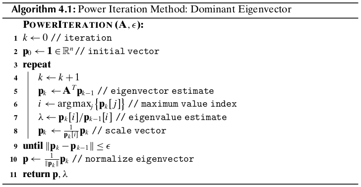

Chapter 4 Graph Data
====================

4.1 Graph Concepts
------------------

**Graph**

A *graph* :math:`G=(V,E)` is a mathematical structure consisting of a finite 
nonempty set :math:`V` of *vertices* or *nodes*, and a set 
:math:`E\seq V\times V` of *edges* consisting of *unordered* pairs of
vertices.
An edge from a node to itself, :math:`(v_i,v_i)`, is called a *loop*.
An undirected graph without loops is called a *simple graph*.
An edge :math:`e=(v_i,v_j)` between :math:`v_i` and :math:`v_j` is said to be 
*incident with* nodes :math:`v_i` and :math:`v_j`l in this case we also say that
:math:`v_i` and :math:`v_j` are *adjacent* to one another, and that they are
*neighbors*.
The number of nodes in the graph :math:`G`, given as :math:`|V|=n` is called the
*order* of the graph, and the number of edges in the graph, given as 
:math:`|E|=m`, is called the *size* of :math:`G`.

A *directed graph* or *digraph* has an edge set :math:`E` consisting of *ordered* pairs of vertices.
A directed edge :math:`(v_i,v_j)` is also called an *arc*, and is said to be *from* :math:`v_i` *to* :math:`v_j`.
We also say that :math:`v_i` is the *tail* and :math:`v_j` the *head* of the arc.

A *weight graph* consists of a graph together with a weight :math:`w_{ij}` for each edge :math:`(v_i,v_j)\in E`.

**Subgraphs**

A graph :math:`H=(V_H,E_H)` is called a *subgraph* of :math:`G=(V,E)` if 
:math:`V_H\seq V` and :math:`E_H\seq E`.
We also say that :math:`G` is a *supergraph* of :math:`H`.
Given a subset of the vertices :math:`V\pr\seq V`, the *induced subgraph* 
:math:`G\pr=(V\pr,E\pr)` consists exactly of all the edges present in :math:`G` 
between vertices in :math:`V\pr`.
A (sub)graph is called *complete* (or a *clique*) if there exists an edge between all pairs of nodes.

**Degree**

The *degree* of a node :math:`v_i\in V` is the number of edges incident with it, 
and is denoted as :math:`d(v_i)` or just :math:`d_i`.
The *degree sequence* of a graph is the list of the degrees of the nodes sorted in non-increasing order.

Let :math:`N_k` denote the number of vertices with degree :math:`k`.
The *degree frequency distribution* of a graph is given as

.. math::

    (N_0,N_1,\cds,N_t)

where :math:`t` is the maximum degree for a node in :math:`G`.
Let :math:`X` be a random variable donoting the degree of a node.
The *degree distribution* of a graph gives the probability mass function :math:`f` for :math:`X`, given as

.. math::

    (f(0),f(1),\cds,f(t))

where :math:`f(k)=P(X=k)=\frac{N_k}{n}` is the probability of a node with degree :math:`k`.

For directed graphs, the *indegree* of node :math:`v_i` denoted as 
:math:`id(v_i)`, is the number of edges with :math:`v_i` as head, that is, the
number of incoming edges at :math:`v_i`.
The *outdegree* of :math:`v_i`, denoted :math:`od(v_i)`, is the number of edges
with :math:`v_i` as the tail, that is, the number of outgoing edges from 
:math:`v_i`.

**Path and Distance**

A *walk* in a graph :math:`G` between nodes :math:`x` and :math:`y` is an 
ordered sequence of vertices, starting at :math:`x` and ending at :math:`y`,

.. math::

    x=v_0,v_1,\cds,v_{t-1},v_t=y

such that there is an edge between every pair of consecutive verices, that is
:math:`(v_{i-1},v_i)\in E` for all :math:`i=1,2,\cds,t`.
The length of the walk, :math:`t`, is measured in terms of *hops*--the number of edges along the walk.
Both the vertices and edges may be repeated in a walk.
A walk starting and ending at the same vertex is called *closed*.
A *trail* is a walk with distinct edges, and a *path* is a walk with *distinct* 
vertices (with the exception of the start and end vertices).
A closed path with length :math:`t\geq 3` is called a *cycle*.

A path of minumum length between nodes :math:`x` and :math:`y` is called a 
*shortest path*, and the length of the shortest path is called the *distance*
between :math:`x` and :math:`y`, denoted as :math:`d(x,y)`.
If no path exists between the two nodes, the distance is assumed to be :math:`d(x,y)=\infty`.

**Connectedness**

Two nodes :math:`v_i` and :math:`v_j` are said to be *connected* if there exists a path between them.
A graph is *connected* if there is a path between all pairs of vertices.
A *connected component*, or just *component*, of a graph is a maximal connected subgraph.
If a graph has only one component it is connected; otherwise it is *disconnected*.

For a directed graph, we say that it is *strongly connected* if there is a 
(directed) path between all ordered pairs of vertices.
We say that it is *weakly connected* if there exists a path between node pairs only by considering edges as undirected.

**Adjacency Matrix**

A graph :math:`G=(V,E)`, with :math:`|V|=n` vertices, can be conveniently 
represented in the form of an :math:`n\times n`, symmetric binary
*adjacency matrix*, :math:`\A`, defined as

.. note::

    :math:`\A(i,j)=\left\{\begin{array}{lr}1\quad\rm{if\ }v_i\rm{\ is\ adjacent\ to\ }v_j\\0\quad\rm{otherwise}\end{array}\right.`

If the graph is directed, then the adjacency matrix :math:`\A` is not symmetric, 
as :math:`(v_i,v_j)\in E` does not imply that :math:`(v_j,v_i)\in E`.

If the graph is weighted, then we obtain an :math:`n\times n` *weighted adjacency matrix*, :math:`\A`, defined as

.. note::

    :math:`\A(i,j)=\left\{\begin{array}{lr}w_{ij}\quad\rm{if\ }v_i\rm{\ is\ adjacent\ to\ }v_j\\0\quad\rm{otherwise}\end{array}\right.`

where :math:`w_{ij}` is the weight on edge :math:`(v_i,v_j)\in E`.
A weighted adjacency matrix can always be converted into a binary one, if 
desired, by using some threshold :math:`\tau` on the edge weights

.. math::

    \A(i,j)=\left\{\begin{array}{lr}1\quad\rm{if\ }w_{ij}\geq\tau\\0\quad\rm{otherwise}\end{array}\right.

**Graph from Data Matrix**

Let :math:`\D` be a dataset consisting of :math:`n` points :math:`\x_i\in\R^d` in a :math:`d`-dimensional space.
We can define a weighted graph :math:`G=(V,E)`, where there exists a node for 
each point in :math:`\D`, and there exists a node for each point in :math:`\D`,
and there exists an edge between each pair of points, with weight

.. math::

    w_{ij}=sim(\x_i,\x_j)

where :math:`sim(\x_i,\x_j)` denotes the similarity between points :math:`\x_i` and :math:`\x_j`.
For instance, similarity can be defined as being inversely related to the 
Euclidean distance between the points via the transformation

.. math::

    w_{ij}=sim(\x_i,\x_j)=\exp\bigg\{-\frac{\lv\x_i-\x_j\rv^2}{2\sg^2}\bigg\}

where :math:`\sg` is the spread parameter.

4.2 Topological Attributes
--------------------------

The topological attributes of graphs are *local* if they apply to only a single 
node, or *global* if they refer to the entire graph.

**Degree**

The degree of a node :math:`\v_i` is defined as the number of its neighbors.

.. note::

    :math:`\dp d_i=\sum_j\A(i,j)`

One of the simplest global attribute is the *average degree*:

.. note::

    :math:`\dp \mu_d=\frac{\sum_id_i}{n}`

**Average Path Length**

The *average path length*, also called the *characteristic path length*, of a connected graph is given as

.. note::

    :math:`\dp\mu_L=\frac{\sum_i\sum_{j>i}d(v_i,v_j)}{\bp n\\2 \ep}=\frac{2}{n(n-1)}\sum_i\sum_{j>i}d(v_i,v_j)`

For a directed graph, the average is over all ordered pairs of vertices:

.. note::

    :math:`\dp\mu_L=\frac{1}{n(n-1)}\sum_i\sum_jd(v_i,v_j)`

For a disconnected graph the average is taken over only the connected pairs of vertices.

**Eccentricity**

The *eccentricity* of a node :math:`v_i` is the maximum distance from :math:`v_i` to any other node in the graph:

.. note::

    :math:`\dp e(v_i)=\max_j\{d(v_i,v_j)\}`

If the graph is disconnected the eccentricity is computed only over pairs of 
vertices with finite distance, that is, only for verticese connected by a path.

**Radius and Diameter**

The *radius* of a connected graph, denoted :math:`r(G)`, is the minimum eccentricity of any node in the graph:

.. note::

    :math:`r(G)=\min_i\{e(v_i)\}=\min_i\{\max_j\{d(v_i,v_j)\}\}`

The *diameter*, denoted :math:`d(G)`, is the maximum eccentricity of any vertex in the graph:

.. note::

    :math:`d(G)=\max_i\{e(v_i)\}=\max_{i,j}\{d(v_i,v_j)\}`

For a disconnected graph, the diameter is the maximum eccentricity over all the connected components of the graph.

The diameter of a graph :math:`G` is sensitive to outliers.
A more robust notion is *effective diameter*, defined as the minimum number of 
hops for which a large fraction, typically :math:`90\%`, of all connected pairs
of nodes can reach each other.

**Clustering Coefficient**

The *clustering coefficient* of a node :math:`v_i` is a measure of the density 
of edges in the neighborhood of :math:`v_i`.
Let :math:`G_i=(V_i,E_i)` be the subgraph induced by the neighbors of vertex :math:`v_i`.
Note that :math:`v_i\notin V_i`, as we assume that :math:`G` is simple.
Let :math:`|V_i|=n_i` be the number of neighbors of :math:`v_i` and 
:math:`|E_i|=m_i` be the number of edges among the neighbors of :math:`v_i`.
The clustering coefficient of :math:`v_i` is defined as

.. note::

    :math:`\dp C(v_i)=\frac{\rm{no.\ of\ edges\ in\ }G_i}{\rm{maximum\ number\ of\ edges\ in\ }G_i}=`
    :math:`\dp\frac{m_i}{\bp n_i\\2 \ep}=\frac{2\cd m_i}{n_i(n_i-1)}`

The *clustering coefficient* of a graph :math:`G` is simply the average 
clustering coefficient over all the nodes, given as

.. note::

    :math:`\dp C(G)=\frac{1}{n}\sum_iC(v_i)`

Because :math:`C(v_i)` is well defined only for nodes with degree 
:math:`d(v_i)\geq 2`, we can define :math:`C(v_i)=0` for nodes with degree less 
than 2.

Define the subgraph composed of the edges :math:`(v_i,v_j)` and :math:`(v_i,v_k)` 
to be a *connected triple* centered at :math:`v_i`.
A connected triple centered at :math:`v_i` that includes :math:`(v_j,v_k)` is called a *triangle*.
The clustering coefficient of node :math:`v_i` can be expressed as

.. math::

    C(v_i)=\frac{\rm{no.\ of\ triangles\ including\ }v_i}{\rm{no.\ of\ connected\ triples\ centered\ at\ }v_i}

The *transitivity* of the graph is defined as

.. math::

    T(G)=\frac{3\times\rm{no.\ of\ triangles\ in\ }G}{\rm{no.\ of\ connected\ triples\ in\ }G}

**Efficiency**

The *efficiency* for a pair of nodes :math:`v_i` and :math:`v_j` is defined as :math:`\frac{1}{d(v_i,v_j)`/
If :math:`v_i` and :math:`v_j` are not connected, then :math:`d(v_i,v_j)=\infty` 
and the efficiency is :math:`1/\infty=0`.
The *efficiency* of a graph :math:`G` is  the average efficiency over all pairs 
of nodes, whether connected or not, given as

.. math::

    \frac{2}{n(n-1)}\sum_i\sum_{j>i}\frac{1}{d(v_i,v_j)}

The maximum efficiency value is 1, which holds for a complete graph.

The *local efficiency* for a node :math:`v_i` is defined as the efficiency of 
the subgraph :math:`G_i` induced by the neighbors of :math:`v_i`.

4.3 Centrality Analysis
-----------------------

4.4 Graph Models
----------------