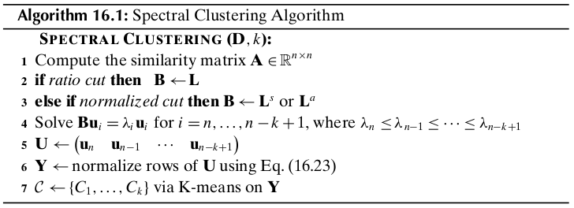

Chapter 16 Spectral and Graph Clustering
========================================

16.1 Graphs and Matrices
------------------------

Given a dataset :math:`\D` comprising :math:`n` points 
:math:`\x_i\in\R^d\ (i=1,2,\cds,n)`, let :math:`\A` denote the :math:`n\times n`
symmetric *similarity matrix* between the points, given as

.. math::

    \A = \left(\begin{array}{cccc}a_{11}&a_{12}&\cds&a_{1n}\\ 
    \a_{21}&a_{22}&\cds&a_{1n}\\\vds&\vds&\dds&\vds\\
    \a_{n1}&a_{n2}&\cds&a_{nn}\end{array}\right)

where :math:`\A(i,j)=a_{ij}` denotes the similarity or affinity between points :math:`\x_i` and :math:`\x_j`.
We require the similarity to be symmetric and non-negative, that is, :math:`a_{ij}=a_{ji}` and :math:`a_{ji}\geq 0`.
The matrix :math:`\A` may be considered to be a *weighted adjacency matrix* of 
the weighted (undirected) graph :math:`G=(V,E)`, where each vertex is a point 
and each edge joins a pair of points, that is,

.. math::

    V&=\{\x_i|i=1,\cds,n\}

    E&=\{(\x_i,\x_j)|1\leq i,j\leq n\}

Further, the similarity matrix :math:`\A` gives the weight on each edge, that 
is, :math:`a_{ij}` denotes the weight of the edge :math:`(\x_i,\x_j)`.
If all affinities are 0 or 1, then :math:`\A` represents the regular adjacency relationship between the vertices.

For a vertex :math:`\x_i`, let :math:`d_j` denote the *degree* of the vertex, defined as

.. math::

    d_i=\sum_{j=1}^n a_{ij}

We define the *degree matrix* :math:`\Delta` of graph :math:`G` as the :math:`n\times n` diagonal matrix:

.. note::

    :math:`\Delta=\left(\begin{array}{cccc}d_1&0&\cds&0\\0&d_2&\cds&0\\\vds&\vds&\dds&\vds\\0&0&\cds&d_n\end{array}\right)`
    :math:`=\left(\begin{array}{cccc}\sum_{j=1}^na_{1j}&0&\cds&0\\0&\sum_{j=1}^na_{2j}&\cds&0\\\vds&\vds&\dds&\vds\\0&0&\cds&\sum_{j=1}^na_{nj}\end{array}\right)`

:math:`\Delta` can be compactly written as :math:`\Delta(i,i)=d_i` for all :math:`1\leq i\leq n`.

**Normalized Adjacency Matrix**

The normalized adjacency matrix is obtained by dividing each row of the 
adjacency matrix by the degree of the corresponding node.

.. note::

    :math:`\bs{\rm{M}}=\Delta\im\A=`
    :math:`\left(\begin{array}{cccc}\frac{a_{11}}{d_1}&\frac{a_{12}}{d_1}&\cds&\frac{a_{1n}}{d_1}\\\frac{a_{21}}{d_2}&\frac{a_{22}}{d_2}&\cds&\frac{a_{2n}}{d_2}\\\vds&\vds&\dds&\vds\\\frac{a_{n1}}{d_n}&\frac{a_{n2}}{d_n}&\cds&\frac{a_{nn}}{d_n}\end{array}\right)`

Each element of :math:`\bs{\rm{M}}`, namely :math:`m_{ij}` is also non-negative, 
as :math:`m_{ij}=\frac{a_{ij}}{d_i}\geq 0`.
Consider the sum of the :math:`i`\ th row in :math:`\bs{\rm{M}}`, we have

.. math::

    \sum_{j=1}^nm_{ij}=\sum_{j=1}^n\frac{a_{ij}}{d_i}=\frac{d_i}{d_i}=1

Thus, each row in :math:`\bs{\rm{M}}` sums to 1.
This implies that 1 is an eigenvalue of :math:`\bs{\rm{M}}`.
In fact, :math:`\ld=1` is the largest eigenvalue of :math:`\bs{\rm{M}}`, and the
other eigenvalues satisfy the property that :math:`|\ld_i|\leq 1`.
Also, if :math:`G` is connected then the eigenvector corresponding to 
:math:`\ld_1` is 
:math:`\u_1=\frac{1}{\sqrt{n}}=(1,1,\cds,1)^T=\frac{1}{\sqrt{n}}\1`.
Because :math:`\bs{\rm{M}}` is not symmetric, its eigenvectors are not necessarily orthogonal.

**Graph Laplacian Matrices**

The *Laplacian matrix* of a graph is defined as

.. math::

    \bs{\rm{L}}=\Delta-\A=\left(\begin{array}{cccc}\sum_{j=1}^na_{1j}&0&\cds&0\\
    0&\sum_{j=1}^na_{2j}&\cds&0\\\vds&\vds&\dds&\vds\\
    0&0&\cds&\sum_{j=1}^na_{nj}\end{array}\right)
    -\left(\begin{array}{cccc}a_{11}&a_{12}&\cds&a_{1n}\\ 
    \a_{21}&a_{22}&\cds&a_{1n}\\\vds&\vds&\dds&\vds\\
    \a_{n1}&a_{n2}&\cds&a_{nn}\end{array}\right)

.. note::

    :math:`=\left(\begin{array}{cccc}\sum_{j\ne 1}^na_{1j}&-a_{12}&\cds&-a_{1n}\\-a{21}&\sum_{j\ne 2}^na_{2j}&\cds&-a_{2n}\\\vds&\vds&\dds&\vds\\-a_{n1}&-a_{n2}&\cds&\sum_{j\ne n}^na_{nj}\end{array}\right)`

:math:`\bs{\rm{L}}` is a symmetric, positive semidefinite matrix, as for any :math:`\c\in\R^n`, we have

.. math::

    \c^T\bs{\rm{L}}\c&=\c^T(\Delta-\A)\c=\c^T\Delta\c-\c^T\A\c

    &=\sum_{i=1}^nd_ic_i^2-\sum_{i=1}^n\sum_{j=1}^nc_ic_ja_{ij}

    &=\frac{1}{2}\bigg(\sum_{i=1}^nd_ic_i^2-2\sum_{i=1}^n\sum_{j=1}^nc_ic_ja_{ij}+\sum_{j=1}^nd_jc_j^2\bigg)

    &=\frac{1}{2}\bigg(\sum_{i=1}^n\sum_{j=1}^na_{ij}c_i^2-2\sum_{i=1}^n
    \sum_{j=1}^nc_ic_ja_{ij}+\sum_{i=j}^n\sum_{i=1}^na_{ij}c_j^2\bigg)

    &=\frac{1}{2}\sum_{i=1}^n\sum_{j=1}^na_{ij}(c_i-c_j)^2

    &\geq 0

This means that :math:`\bs{\rm{L}}` has :math:`n` real, non-negative 
eigenvalues, which can be arranged in decreasing order as follows:
:math:`\ld_1\geq\ld_2\geq\cds\geq\ld_n\geq 0`.
Because :math:`\bs{\rm{L}}` is symmetric, its eigenvectors are orthonormal.
We can observe that the first column (and the first row) is a linear combination of the remaining columns (rows).
This implies that the rank of :math:`\bs{\rm{L}}` is at most :math:`n-1`, and 
the smallest eigenvalue is :math:`\ld_n=0`, with the corresponding eigenvector
given as :math:`\u_n=\frac{1}{\sqrt{n}}=(1,1,\cds,1)^T=\frac{1}{\sqrt{n}}\1`,
provided the graph is connected.
If the graph is disconnected, then the number of eigenvalues equal to zero
specifies the number of connected components in the graph.

The *normalized symmetric Laplacian matrix* of a graph is defined as

.. math::

    \bs{\rm{L}}^S&=\Delta^{-1/2}\bs{\rm{L}}\Delta^{-1/2}

    &=\bs{\rm{L}}^{-1/2}(\Delta-\A)\Delta^{-1/2}=\Delta^{-1/2}\Delta\Delta^{-1/2}-\Delta^{-1/2}\A\Delta^{-1/2}

    &=\I-\Delta^{-1/2}\A\Delta^{-1/2}

.. note::

    :math:`\bs{\rm{L}}^S=\Delta^{-1/2}\bs{\rm{L}}\Delta^{-1/2}`
    :math:`=\left(\begin{array}{cccc} \frac{\sum_{j\ne 1}a_{1j}}{\sqrt{d_1d_1}}&-\frac{a_{12}}{\sqrt{d_1d_2}}&\cds&-\frac{a_{1n}}{\sqrt{d_1d_n}}\\-\frac{a_{21}}{\sqrt{d_2d_1}}&\frac{\sum_{j\ne 2}a_{2j}}{\sqrt{d_2d_2}}&\cds&-\frac{a_{2n}}{\sqrt{d_2d_n}}\\\vds&\vds&\dds&\vds\\-\frac{a_{n1}}{\sqrt{d_nd_1}}&-\frac{a_{n2}}{\sqrt{d_nd_2}}&\cds&\frac{\sum_{j\ne n}a_{nj}}{\sqrt{d_nd_n}}\end{array}\right)`

We can hsow that :math:`\bs{\rm{L}}^S` is also positive semidefinite because for any :math:`\c\in\R^d`, we get

.. math::

    \c^T\bs{\rm{L}}^s\c=\frac{1}{2}\sum_{i=1}^n\sum_{j=1}^na_{ij}
    \bigg(\frac{c_i}{\sqrt{d_i}}-\frac{c_j}{\sqrt{d_j}}\bigg)^2\geq 0

The first column is also a linear combination of the other columns, which means 
that :math:`\bs{\rm{L}}^S` has rank at most :math:`n-1`, with the smallest 
eigenvalue :math:`\ld_n=0`, and the corresponding eigenvector 
:math:`\frac{1}{\sqrt{\sum_id_i}}(\sqrt{d_1},\sqrt{d_2},\cds,\sqrt{d_n})^T=\frac{1}{\sqrt{\sum_id_i}}\Delta^{1/2}\1`.
Combined with the fact that :math:`\bs{\rm{L}}^S` is positive semidefinite, we 
conclude that :math:`\bs{\rm{L}}^S` has :math:`n` (not necessarily distinct) 
real, positive eigenvalues :math:`\ld_1\geq\ld_2\geq\cds\geq\ld_n=0`.

The *normalized asymmetric Laplacian* matrix is defined as

.. note::

    :math:`\bs{\rm{L}}^a=\Delta\im\bs{\rm{L}}=\Delta\im(\Delta-\A)=\I-\Delta\im\A`
    :math:`=\left(\begin{array}{cccc}\frac{\sum_{j\ne 1}a_{1j}}{d_1}&-\frac{a_{12}}{d_1}&\cds&-\frac{a_{1n}}{d_1}\\-\frac{a_{21}}{d_2}&\frac{\sum_{j\ne 2}a_{2j}}{d_2}&\cds&-\frac{a_{2n}}{d_2}\\\vds&\vds&\dds&\vds\\-\frac{a_{n1}}{d_n}&-\frac{a_{n2}}{d_n}&\cds&\frac{\sum_{j\ne n}a_{nj}}{d_n}\end{array}\right)`

Consider the eigenvalue equation for the symmetric Laplacian :math:`\bs{\rm{L}}^S`:

.. math::

    \bs{\rm{L}}^S\u&=\ld\u

    \Delta^{-1/2}\bs{\rm{L}}^S\u&=\ld\Delta^{-1/2}\u

    \Delta^{-1/2}(\Delta^{-1/2}\bs{\rm{L}}\Delta^{-1/2})\u&=\ld\Delta^{-1/2}\u

    \Delta\im\bs{\rm{L}}(\Delta^{-1/2}\u)&=\ld(\Delta^{-1/2}\u)

    \bs{\rm{L}}^a\v=\ld\v

where :math:`\v=\Delta^{-1/2}\u` is an eigenvector of :math:`\bs{\rm{L}}^a`, and 
:math:`\u` is an eigenvector of :math:`\bs{\rm{L}}^S`.

16.2 Clustering as Graph Cuts
-----------------------------

A *k-way cut* in a graph is a partitioning or clustering of the vertex set, 
given as :math:`\cl{C}=\{C_1,\cds,C_k\}`, such that :math:`C_i\ne\emptyset` for
all :math:`i`, :math:`C_i\cap C_j=\emptyset` for all :math:`i, j`, and 
:math:`V=\bigcup_ic_i`.
We require :math:`\cl{C}` to optimize some objective function that cptures the 
intuition that nodes within a cluster should have high similarity, and nodes 
from different clusters should have low similarity.

Given a weighted graph :math:`G` defined by its similarity matrix, let 
:math:`S, T\subseteq V` be any two subsets of the vertices.
We denote by :math:`W(S,T)` the sum of the weights on all edges with one vertex
in :math:`S` and the other in :math:`T`, given as

.. note::

    :math:`\dp W(S,T)=\sum_{v_i\in S}\sum_{v_j\in T}a_{ij}`

Given :math:`S\subseteq V`, we denote by :math:`\bar{S}` the complementary set
of vertices, that is, :math:`\bar{S}=V-S`.
A *（vertex) cut* in a graph is defined as a partitioning of :math:`V` into :math:`S\subset V` and :math:`\bar{S}`.
The *weight of the cut* or *cut weight* is defined as the sum of all the weights 
on edges between vertices in :math:`S` and :math:`\bar{S}`, given as 
:math:`W(S,\bar{S})`.

Given a clustering :math:`\cl{C}=\{C_1,\cds,C_k\}` comprising :math:`k` 
clusters, the *size* of a cluster :math:`C_i` is the number of nodes in the 
cluster, given as :math:`|C_i|`.
The *volume* of a cluster :math:`C_i` is defined as the sum of all the weights 
on edges with one end in cluster :math:`C_i`:

.. note::

    :math:`\dp vol(C_i)=\sum_{v_j\in C_i}d_j=\sum_{v_j\in C_i}\sum_{v_r\in V}a_{jr}=W(C_i,V)`

Let :math:`\c_i=\{0,1\}^n` be the *cluster indicator vector* that records the 
cluster membership for cluster :math:`C_i`, defined as

.. math::

    c_{ij}=\left\{\begin{array}{lr}1\quad\rm{if\ }v_j\in C_i\\0\quad\rm{if\ }v_j\notin C_i\end{array}\right.

Because a clustering creates pairwise disjoint clusters, we immediately have

.. math::

    \c_i^T\c_j=0

The cluster size can be written as

.. note::

    :math:`|C_i|=\c_i^T\c_i=\lv\c_i\rv^2`

.. math::

    vol(C_i)=W(C_i,V)=\sum_{v_r\in C_i}d_r=\sum_{v_r\in C_i}c_{ir}d_rc_{ir}=
    \sum_{r=1}^n\sum_{s=1}^nc_{ir}\Delta_{rs}c_{is}

The volume of the cluster can be written as

.. note::

    :math:`vol(C_i)=\c_i^T\Delta\c_i`

.. math::

    W(C_i,C_i)=\sum_{v_r\in C_i}\sum_{v_s\in C_i}a_{rs}=\sum_{r=1}^n\sum_{s=1}^nc_{ir}a_{rs}c_{is}

The sum of internal weights can be written as

.. note::

    :math:`W(C_i,C_i)=\c_i^T\A\c_i`

.. note::

    :math:`\dp W(C_i,\bar{C_i})=\sum_{v_r\in C_i}\sum_{v_s\in V-C_i}a_{rs}=W(C_i,V)-W(C_i,C_i)`
    :math:`=\c_i(\Delta-\A)\c_i=\c_i^T\bs{\rm{L}}\c_i`

16.2.1 Clustering Objective Functions: Ratio and Normalized Cut
^^^^^^^^^^^^^^^^^^^^^^^^^^^^^^^^^^^^^^^^^^^^^^^^^^^^^^^^^^^^^^^

**Ratio Cut**

.. note::

    :math:`\dp\min_{\cl{C}}J_{rc}(\cl{C})=\sum_{i=1}^k\frac{W(C_i,\bar{C_i})}{|C_i|}`
    :math:`=\dp\sum_{i=1}^k\frac{\c_i^T\bs{\rm{L}}\c_i}{\c_i^T\c_i}`
    :math:`=\dp\sum_{i=1}^k\frac{\c_i^T\bs{\rm{L}}\c_i}{\lv\c_i\rv^2}`

ratio cut tries to minimize the sum of the similarities from a cluster 
:math:`C_i` to other points not in the cluster :math:`\bar{C_i}`, taking into 
account the size of each cluster.

For binary cluster indicator vectors :math:`\c_i`, the ratio cut objective is NP-hard.
An obvious relaxation is to allow :math:`\c_i` to take on any real value.

.. math::

    \min_{\cl{C}}J_{rc}(\cl{C})=
    \sum_{i=1}^k\frac{\c_i^T\bs{\rm{L}}\c_i}{\lv\c_i\rv^2}=
    \sum_{i=1}^k\bigg(\frac{\c_i}{\lv\c_i\rv}\bigg)^T\bs{\rm{L}}
    \bigg(\frac{\c_i}{\lv\c_i\rv}\bigg)=\sum_{i=1}^k\u_i^T\bs{\rm{L}}\u_i

where :math:`\u_i=\frac{\c_i}{\lv\c_i\rv}` is the unit vector in the direction of :math:`\c_i\in\R^n`.

To incorporate the constraint the :math:`\u_i^T\u_i=1`, we introduce the 
Lagrange multiplier :math:`\ld_i` for each cluster :math:`C_i`.
We have

.. math::

    \frac{\pd}{\pd\u_i}\bigg(\sum_{i=1}^k\u_i^T\bs{\rm{L}}\u_i+\sum_{i=1}^n\ld_i(1-\u_i^T\u_i)\bigg)&=\0

    2\bs{\rm{L}}\u_i-2\ld_i\u_i&=\0

    \bs{\rm{L}}\u_i&=\ld_i\u_i

    \u_i^T\bs{\rm{L}}\u_i&=\u_i^T\ld_i\u_i=\ld_i

which in turn implies that to minimize the ratio cut objective, we should choose 
the :math:`k` smallest eigenvalues, and the corresponding eigenvectors, so that

.. math::

    \min_{\cl{C}}J_{rc}(\cl{C})&=\u_n^T\bs{\rm{L}}\u_n+\cds+\u_{n-k+1}^T\bs{\rm{L}}\u_{n-k+1}

    &=\ld_n+\cds+\ld_{n-k+1}

**Normalized Cut**

*Normalized cut* is similar to ratio cut, except that it divides the cut weight 
of each cluster by the volume of a cluster instead of its size.

.. note::

    :math:`\dp\min_{\cl{C}}J_{nc}(\cl{C})=\sum_{i=1}^k\frac{W(C_i,\bar{C_i})}{vol(C_i)}`
    :math:`=\dp\sum_{i=1}^k\frac{\c_i^T\bs{\rm{L}}\c_i}{\c_i^T\Delta\c_i}`

We assume :math:`\c_i` to be an arbitrary real vector, and rewrite the 
normalized cut objective in terms of the normalized symmetrc Laplacian, as 
follows:

.. math::

    \min_{\cl{C}}J_{nc}(\cl{C})
    &=\sum_{i=1}^k\frac{\c_i^T\bs{\rm{L}}\c_i}{\c_i^T\Delta\c_i}
    =\sum_{i=1}^k\frac{\c_i^T(\Delta^{1/2}\Delta^{-1/2})\bs{\rm{L}}
    (\Delta^{-1/2}\Delta^{1/2})\c_i}{\c_i^T(\Delta^{1/2}\Delta^{1/2})\c_i}

    &=\sum_{i=1}^k\frac{(\Delta^{1/2}\c_i)^T(\Delta^{-1/2}\bs{\rm{L}}
    \Delta^{-1/2})(\Delta^{1/2}\c_i)}{(\Delta^{1/2}\c_i)^T(\Delta^{1/2}\c_i)}

    &=\sum_{i=1}^k\bigg(\frac{\Delta^{1/2}\c_i}{\lv\Delta^{1/2}\c_i\rv}\bigg)^T
    \bs{\rm{L}}^S\bigg(\frac{\Delta^{1/2}\c_i}{\lv\Delta^{1/2}\c_i\rv}\bigg)
    =\sum_{i=1}^k\u_i^T\bs{\rm{L}}^S\u_i

The normalized cut objective can also be expressed in terms of the normalized asymmetric Laplacian:

.. math::

    \frac{\pd}{\pd\c_i}\bigg(\sum_{j=1}^k\frac{\c_j^T\bs{\rm{L}}\c_j}
    {\c_j^T\Delta\c_j}\bigg)=\frac{\pd}{\pd\c_i}
    \bigg(\frac{\c_i^T\bs{\rm{L}}\c_i}{\c_i^T\Delta\c_i}\bigg)&=\0

    \frac{\bs{\rm{L}}\c_i(\c_i^T\Delta\c_i)-\Delta\c_i(\c_i^T\bs{\rm{L}}\c_i)}
    {(\c_i^T\Delta\c_i)^2}&=0

    \bs{\rm{L}}\c_i&=\bigg(\frac{\c_i^T\bs{\rm{L}}\c_i}{\c_i^T\Delta\c_i}\bigg)\Delta\c_i

    \Delta\im\bs{\rm{L}}\c_i&=\ld_i\c_i

    \bs{\rm{L}}^a\c_i&=\ld_i\c_i

16.2.2 Spectral Clustering Algorithm
^^^^^^^^^^^^^^^^^^^^^^^^^^^^^^^^^^^^

Eq.(16.23): :math:`\dp\y_i=\frac{1}{\sqrt{\sum_{j=1}^ku_{n-j+1,i}^2}}(u_{n,i},u_{n-1,i},\cds,u_{n-k+1,i})^T`

**Computational Complexity**

The computational complexity of the spectral clustering algorithm is :math:`O(n^3)`.

16.2.3 Maximization Objectives: Average Cut and Modularity
^^^^^^^^^^^^^^^^^^^^^^^^^^^^^^^^^^^^^^^^^^^^^^^^^^^^^^^^^^

**Average Weight**

The *average weight* objective is defined as

.. note::

    :math:`\dp\max_{\cl{C}}J_{aw}(\cl{C})=\sum_{i=1}^k\frac{W(C_i,C_i)}{|C_i|}=\sum_{i=1}^k\frac{\c_i^T\A\c_i}{\c_i^T\c_i}`

Instead of trying to minimize the weights on edges between clusters as in ratio 
cut, average weight tries to maximize the within cluster weights.
The problem of maximizing :math:`J_{aw}` for binary cluster indicator vectors is 
also NP-hard; we can obtain a solution by relaxing the constraint on 
:math:`\c_i`, by assuming that it can take on any real values for its elements.

.. math::

    \max_{\cl{C}}J_{aw}(\cl{C})=\sum_{i=1}^k\u_i^T\A\u_i

We can maximize the objective by selecting the :math:`k` largest eigenvalues of 
:math:`\A`, and the corresponding eigenvectors

.. math::

    \max_{\cl{C}}J_{aw}(\cl{C})=\u_1^T\A\u_1+\cds+\u_k^T\A\u_k=\ld_1+\cds+\ld_k

where :math:`\ld_1\geq\ld_2\geq\cds\ld_n`.

**Average Weight and Kernel K-means**

If the weighted adjacency matrix :math:`\A` represents the kernel value between 
a pair of points, so that :math:`a_{ij}=K(\x_i,\x_j)`, then we may use the sum
of squared errors objective of kernel K-means for graph clustering.

.. math::

    \min_{\cl{C}}J_{sse}(\cl{C})&=\sum_{j=1}^nK(\x_j,\x_j)-\sum_{i=1}^k
    \frac{1}{|C_i|}\sum_{\x_r\in C_i}\sum_{\x_s\in C_i}K(\x_r,\x_s)

    &=\sum_{j=1}^na_{jj}-\sum_{i=1}^k\frac{1}{|C_i|}\sum_{v_r\in C_i}\sum_{v_s\in C_i}a_{rs}

    &=\sum_{j=1}^na_{jj}-\sum_{i=1}^k\frac{\c_i^T\A\c_i}{\c_i^T\c_i}

    &=\sum_{j=1}^na_{jj}-J_{aw}(\cl{C})

We can observe that because :math:`\sum_{j=1}^na_{jj}` is independent of the
clustering, minimizing the SSE objective is the same as maximizing the average 
weight objective.
In particular, if :math:`a_{jj}` represents the linear kernel :math:`\x_i^T\x_j`
between the nodes, then maximizing the average weight objective is equivalent to
minimizing the regular K-means SSE objective.

**Modularity**

Informally, modularity is defined as the difference between the observed and 
expected fraction of edges within a cluster.
It measures the extent to which nodes of the same type are linked to each other.

**Unweighted Graphs**

Let us assume for the moment that the graph :math:`G` is unweighted, and that :math:`\A` is its binary adjacency matrix.
The number of edges within a cluster :math:`C_i` is given as

.. math::

    \frac{1}{2}\sum_{v_r\in C_i}\sum_{v_s\in C_i}a_{rs}

where we divide by :math:`\frac{1}{2}` because each edge is counted twice in the summation.
Over all the clusters, the observed number of edges within the same cluster is given as

.. math::

    \frac{1}{2}\sum_{i=1}^k\sum_{v_r\in C_i}\sum_{v_s\in C_i}a_{rs}

The probability that one end of an edge is :math:`v_r` and the other :math:`v_s` is given as

.. math::

    p_{rs}=\frac{d_r}{2m}\cd\frac{d_s}{2m}=\frac{d_rd_s}{4m^2}

The number of edges between :math:`v_r` and :math:`v_s` follows a binomial 
distribution with success probability :math:`p_{rs}` over :math:`2m` trails 
(because we are selecting the two ends of :math:`m` edges).
The expected number of edges between :math:`v_r` and :math:`v_s` is given as

.. math::

    2m\cd p_{rs}=\frac{d_rd_s}{2m}

The expected number of edges within a cluster :math:`C_i` is then

.. math::

    \frac{1}{2}\sum_{v_r\in C_i}\sum_{v_s\in C_i}\frac{d_rd_s}{2m}

and the expected number of edges within the same cluster, summed over all :math:`k` clusters, is given as

.. math::

    \frac{1}{2}\sum_{i=1}^k\sum_{v_r\in C_i}\sum_{v_s\in C_i}\frac{d_rd_s}{2m}

where we divide by 2 because each edge is counted twice.
The *modularity* of the clustering :math:`\cl{C}` is defined as the difference 
between the observed and expected fraction of edges within the same cluster.

.. math::

    Q&=\frac{1}{2m}\sum_{i=1}^k\sum_{v_r\in C_i}\sum_{v_s\in C_i}\bigg(a_{rs}-\frac{d_rd_s}{2m}\bigg)

    &=\sum_{i=1}^k\sum_{v_r\in C_i}\sum_{v_s\in C_i}\bigg(
        \frac{a_{rs}}{\sum_{j=1}^nd_j}-\frac{d_rd_s}{(\sum_{j=1}^nd_j)^2}\bigg)

**Weighted Graphs**

Assume that :math:`\A` is the weighted adjacency matrix; we interpret the 
modularity of a clustering as the difference between the observed and expected 
fraction of weights on edges within the clusters.

.. math::

    \sum_{v_r\in C_i}\sum_{v_s\in C_i}a_{rs}=W(C_i,C_i)

    \sum_{v_r\in C_i}\sum_{v_s\in C_i}d_rd_s=\bigg(\sum_{v_r\in C_i}d_r\bigg)\bigg(\sum_{v_s\in C_i}d_s\bigg)=W(C_i,V)^2

    \sum_{j=1}^nd_j=W(V,V)

.. note::

    :math:`\dp \max_{\cl{C}}J_Q(\cl{C})=\sum_{i=1}^k\bigg(\frac{W(C_i,C_i)}{W(V,V)}`
    :math:`\dp-\bigg(\frac{W(C_i,V)}{W(V,V)}\bigg)^2\bigg)`

We now express the modularity obejctive in matrix terms.
We have

.. math::

    W(C_i,C_i)=\c_i^T\A\c_i

    W(C_i,V)=\sum_{v_r\in C_i}d_r=\sum_{v_r\in C_i}d_rc_{ir}=\sum_{j=1}^nd_jc_{ij}=\bs{\rm{d}}^T\c_i

    W(V,V)=\sum_{j=1}^nd_j=tr(\Delta)

The clustering objective based on modularity can then be written as

.. math::

    \max_{\cl{C}}J_Q(\cl{C})&=\sum_{i=1}^k\bigg(\frac{\c_i^T\A\c_i}{tr(\Delta)}-
    \frac{(\bs{\rm{d}}^T\c_i)^2}{tr(\Delta)^2}\bigg)

    &=\sum_{i=1}^k\bigg(\c_i^T\bigg(\frac{\A}{tr(\Delta)}\bigg)\c_i-
    \c_i^T\bigg(\frac{\bs{\rm{d}}\cd\bs{\rm{d}}^T}{tr(\Delta)^2}\bigg)\c_i\bigg)

    &=\sum_{i=1}^k\c_i^T\bs{\rm{Q}}\c_i

where :math:`\bs{\rm{Q}}` is the *modularity matrix*:

.. math::

    \bs{\rm{Q}}=\frac{1}{tr(\Delta)}\bigg(\A-\frac{\bs{\rm{d}}\cd\bs{\rm{d}}^T}{tr(\Delta)}\bigg)

We select the :math:`k` largest eigenvalues and the corresponding eigenvectors to obtain

.. math::

    \max_{\cl{C}}=J_Q(\cl{C})=\u_1^T\bs{\rm{Q}}\u_1+\cds+\u_k^T\bs{\rm{Q}}\u_k=\ld_1+\cds+\ld_k

**Modularity as Average Weight**

We know that each row of :math:`\bs{\rm{M}}=\Delta\im\A` sums to 1, that is

.. math::

    \sum_{j=1}^nm_{ij}=d_i=1,\forall i=1,\cds,n

The modularity matrix can then be written as

.. math::

    \bs{\rm{Q}}=\frac{1}{n}\bs{\rm{M}}-\frac{1}{n^2}\1_{n\times n}

For large graphs with many nodes, :math:`n` is large and the second term 
practically vanishes, as :math:`\frac{1}{n^2}` will be very small.
Thus, the modularity matrix can be reasonably approximated as

.. math::

    \bs{\rm{Q}}\simeq\frac{1}{n}\bs{\rm{M}}

.. math::

    \max_{\cl{C}}J_Q(\cl{C})=\sum_{i=1}^k\c_i^T\bs{\rm{Q}}\c_i=\sum_{i=1}^k\c_i^T\bs{\rm{M}}\c_i

where we dropped the :math:`\frac{1}{n}` factor because it is a constant for a 
given graph; it only scales the eigenvalues without effecting the eigenvectors.

In conclusion, if we use the normalized adjacency matrix, maximizing the
modularity is equivalent to selecting the :math:`k` largest eigenvalues and the
corresponding eigenvectors of the normalized adjacency matrix 
:math:`\bs{\rm{M}}`.

**Normalized Modularity as Normalized Cut**

Define the *normalized modularity* objective as follows:

.. note::

    :math:`\dp\max_{\cl{C}}J_{nQ}(\cl{C})=\sum_{i=1}^k\frac{1}{W(C_i,V)}`
    :math:`\dp\bigg(\frac{W(C_i,C_i)}{W(V,V)}-\bigg(\frac{W(C_i,V)}{W(V,V)}\bigg)^2\bigg)`