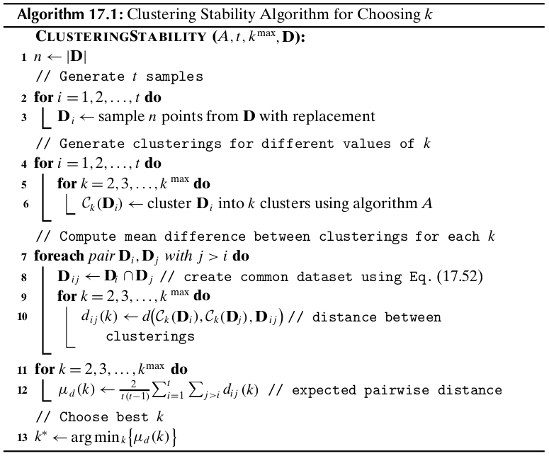

Chapter 17 Clustering Validation
================================

Cluster validation and assessment encompasses three main tasks: *clustering*
*evaluation* seeks to asses the goodness or quality of the clustering,
*clustering stability* seeks to understand the sensitivity of the clustering
result to various algorithmic parameters, and *clustering tendency* assesses the
suitability of applying clustering in the first place.

**External**: external validation measures employ criteria that are not inherent to the dataset.

**Internal**: Internal validation measures employ critieria that are derived from the data itself.

**Relative**: Relative validation measures aim to directly compare different 
clusterings, usually those obtained via different parameter settings for the 
same algorithm.

17.1 External Measures
----------------------

External measures assume that the correct or ground-truth clustering is known a *priori*.
The true cluster labels play the role of external information that is used to evaluate a given clustering.

Let :math:`\D` be a dataset consisting of :math:`n` points :math:`\x_i` in a 
*d*-dimensional space, partitioned into :math:`k` clusters.
Let :math:`y_i\in\{1,2,\cds,k\}` denote the ground-truth cluster membership or label information for each point.
The ground-truth clustering is given as :math:`\cl{T}=\{T_1,T_2,\cds,T_k\}`, 
where the cluster :math:`T_j` consists of all the points with label :math:`j`,
i.e., :math:`T_j=\{\x_i\in\D|y_i=j\}`.
Also, let :math:`\cl{C}=\{C_1,\cds,C_r\}` dentoe a clustering of the same 
dataset into :math:`r` clusters, obtained via some clustering algorithm, and let 
:math:`\hat{y_i}\in\{1,2,\cds,r\}` denote the cluster label for :math:`\x_i`.

External evaluation measures try capture the extent to which points from the 
same partition appear in the same cluster, and the extent to which points from
different partitions are grouped in different clusters.
All of the external measures rely on the :math:`r\times k` *contingency tabel*
:math:`\N` that is induced by a clustering :math:`\cl{C}` and the ground-truth
partitioning :math:`\cl{T}`, defined as follows

.. math::

    \N(i,j)=n_{ij}=|C_i\cap T_j|

In other words, the count :math:`n_{ij}` denotes the number of points that are 
common to cluster :math:`C_i` and ground-truth partition :math:`T_j`.

17.1.1 Matching Based Measures
^^^^^^^^^^^^^^^^^^^^^^^^^^^^^^

**Purity**

.. math::

    purity_i=\frac{1}{n_i}\max_{j=1}^k\{n_{ij}\}

The purity of clustering :math:`\cl{C}` is defined as the weighted sum of the clusterwise purity values:

.. note::

    :math:`\dp purity=\sum_{i=1}^r\frac{n_i}{n}purity_i=\frac{1}{n}\sum_{i=1}^r\max_{j=1}^k\{n_{ij}\}`

The larger the purity of :math:`\cl{C}`, the better the agreement with the groundtruth.
The maximum value of purity is 1, when each cluster comprises points from only one partition.
When :math:`r=k`, a purity value of 1 indicates a perfect clustering, with a 
one-to-one correspondence between the clsuters and partitions.
However, purity can be 1 even for :math:`r>k`, when each of the clusters is a subset of a ground-truth partition.
When :math:`r<k`, purity can never by 1, because at least one cluster must contain points from more than one partition.

**Maximum Matching**

The maximum matching measure selects the mapping between clusters and 
partitions, such that the sum of the number of common points (:math:`n_{ij}`) is 
maximized, provided that onlyl one cluster can match with a given partition.

Formally, we treat the contigency table as a complete weighted bipartite graph 
:math:`G=(V,E)`, where each partition and cluster is a node, that is, 
:math:`V=\cl{C}\cup\cl{T}`, and there exists an edge :math:`(C_i,T_j)\in E`,
with weight :math:`w(C_i,T_i)=n_{ij}`, for all :math:`C_i\in\cl{C}` and 
:math:`T_j\in\cl{T}`.
A *matching* :math:`M` in :math:`G` is a subset of :math:`E`, such that the 
edges in :math:`M` are pairwise nonadjacent, that is, they do not have a common 
vertex.
The maximum matching measure is defined as the *maximum weight matching* in :math:`G`:

.. math::

    match=\arg\max_M\bigg\{\frac{w(M)}{n}\bigg\}

where the weight of a matching :math:`M` is simply the sum of all the edge 
weights in :math:`M`, given as :math:`w(M)=\sum)_{e\in M}w(e)`.
The maximum matching can be computed in time 
:math:`O(|V|^2\cd|E|)=O((r+k)^2rk)`, which is equivalent to :math:`O(k^4)` if 
:math:`r=O(k)`.

**F-Measure**

Given cluster :math:`C_i`, let :math:`j_i` denote the partition that contains 
the maximum number of points from :math:`C_i`, that is, 
:math:`j_i=\max_{j=1}^k\{n_{ij}\}`.
The *precision* of a cluster :math:`C_i` is the same as its purity:

.. note::

    :math:`\dp prec_i=\frac{1}{n_i}\max_{j=1}^k\{n_{ij}\}=\frac{n_{ij_i}}{n_i}`

It measures the fraction of points in :math:`C_i` from the majority partition :math:`T_{j_i}`.

The *recall* of cluster :math:`C_i` is defined as

.. note::

    :math:`\dp recall_i=\frac{n_{ij_i}}{|T_{j_{i}}|}=\frac{n_{ij_i}}{m_{j_i}}`

where :math:`m_{j_i}=|T_{j_i}|`.
It measures the fraction of point in partition :math:`T_{j_i}` shared in common with cluster :math:`C_i`.

The F-measure is the harmonic mean of the precision and recall values for each cluster.
The F-measure for cluster :math:`C_i` is therefore given as

.. note::

    :math:`\dp F_i=\frac{2}{\frac{1}{prec_i}+\frac{1}{recall_i}}=\frac{2\cd prec_i\cd recall_i}{prec_i+recall_i}`
    :math:`\dp=\frac{2n_{ij_i}}{n_i+m_{j_i}}`

The F-measures for the clustering :math:`\cl{C}` is the mean of clusterwise F-measure values:

.. math::

    F=\frac{1}{r}\sum_{i=1}^rF_i

F-measure thus tries to balance the precision and recall values across all the clusters.
For a perfect clustering, when :math:`r=k`, the maximum value of the F-measure is 1.

17.1.2 Entropy-based Measures
^^^^^^^^^^^^^^^^^^^^^^^^^^^^^

**Conditional Entropy**

The entropy of a clustering :math:`\cl{C}` is defined as

.. math::

    H(\cl{C})=-\sum_{i=1}^rp_{C_i}\log p_{C_i}

where :math:`p_{C_i}=\frac{n_i}{n}` is the probability of cluster :math:`C_i`.
The entropy of the partitioning :math:`\cl{T}` is defined as

.. math::

    H(\cl{T})=-\sum_{j=1}^kp_{T_j}\log p_{T_j}

where :math:`p_{T_j}=\frac{m_j}{n}` is the probability of partition :math:`T_j`.

The cluster-specific entropy of :math:`\cl{T}`, that is, the conditional entropy 
of :math:`\cl{T}` with respect to cluster :math:`C_i` is defined as

.. math::

    H(\cl{T}|C_i)=-\sum_{j=1}^k\bigg(\frac{n_{ij}}{n_i}\bigg)\log\bigg(\frac{n_{ij}}{n_i}\bigg)

The conditional entropy of :math:`\cl{T}` given clustering :math:`\cl{C}` is then defined as the weighted sum:

.. math::

    H(\cl{T}|\cl{C})=\sum_{i=1}^r\frac{n_i}{n}H(\cl{T}|C_i)=
    \sum_{i=1}^r\sum_{j=1}^k\frac{n_{ij}}{n}\log\bigg(\frac{n_{ij}}{n_i}\bigg)

.. note::

    :math:`\dp=-\sum_{i=1}^r\sum_{j=1}^kp_{ij}\log\bigg(\frac{p_{ij}}{p_{C_i}}\bigg)`

where :math:`p_{ij}=\frac{n_{ij}}{n}` is the probability that a point in cluster 
:math:`i` also belongs to partition :math:`j`.
For a perfect clustering, the conditional entropy value is zero, whereas the 
worst possible conditional entropy value is :math:`\log k`.

.. math::

    H(\cl{T}|\cl{C})&=-\sum_{i=1}^r\sum_{j=1}^kp_{ij}(\log p_{ij}-\log p_{C_i})

    &=-\bigg(\sum_{i=1}^r\sum_{j=1}^kp_{ij}\log p_{ij}\bigg)+\sum_{i=1}^r\bigg(\log p_{C_i}\sum_{j=1}^kp_{ij}\bigg)

    &=-\sum_{i=1}^r\sum_{j=1}^kp_{ij}\log p_{ij}+\sum_{i=1}^rp_{C_i}\log p_{C_i}

    &=H(\cl{C},\cl{T})-H(\cl{C})

where :math:`H(\cl{C},\cl{T})=-\sum_{i=1}^r\sum_{j=1}^kp_{ij}\log p_{ij}` is the 
joint entropy of :math:`\cl{C}` and :math:`\cl{T}`.
The conditional entropy :math:`H(\cl{T}|\cl{C})` thus measures the remaining 
entropy of :math:`\cl{T}` given the clustering :math:`\cl{C}`.
In particular, :math:`H(\cl{T}|\cl{C})=0` if and only if :math:`\cl{T}` is 
completely determined by :math:`\cl{C}`, corresponding to the ideal clustering.
On the other hand, if :math:`\cl{C}` and :math:`\cl{T}` are independent of each
other, then :math:`H(\cl{T}|\cl{C})=H(\cl{T})`, which means that :math:`\cl{C}`
provides no information about :math:`\cl{T}`.

**Normalized Mutual Information**

The *mutual information* tries to quantify the amount of shared information 
between the clustering :math:`\cl{C}` and partitioning :math:`\cl{T}`, and it is
defined as

.. note::

    :math:`\dp I(\cl{C},\cl{T})=\sum_{i=1}^r\sum_{j=1}^kp_{ij}\log\bigg(\frac{p_{ij}}{p_{C_i}\cd p_{T_j}}\bigg)`

It measures the dependence between the observed joint probability :math:`p_{ij}` 
of :math:`\cl{C}` and :math:`\cl{T}`, and the expected joint probability 
:math:`p_{C_i}\cd p_{T_j}` under the independence assumption.
When :math:`\cl{C}` and :math:`\cl{T}` are independent then 
:math:`p_{ij}=p_{C_i}\cd p_{T_j}`, and thus :math:`T(\cl{C},\cl{T})=0`.

.. math::

    I(\cl{C},\cl{T})=H(\cl{T})-H(\cl{T}|\cl{C})

    I(\cl{C},\cl{T})=H(\cl{C})-H(\cl{C}|\cl{T})

Finally, because :math:`H(\CC,\TT)\geq 0` and :math:`H(\TT|\CC)\geq 0`, we have
the inequalities :math:`I(\CC,\TT)\leq H(\CC)` and 
:math:`I(\CC,\TT)\leq H(\TT)`.

The *normalized mutual information* (NMI) is defined as the geometric mean of two ratios:

.. note::

    :math:`\dp NMI(\CC,\TT)=\sqrt{\frac{I(\CC,\TT)}{H(\CC)}\cd\frac{I(\CC,\TT)}{H(\TT)}}=`
    :math:`\dp\frac{I(\CC,\TT)}{\sqrt{H(\CC)\cd H(\TT)}}`

The NMI value lies in the range :math:`[0, 1]`.
Values close to 1 indicate a good clustering.

**Variation of Information**

.. math::

    VI(\CC,\TT)&=(H(\TT)-I(\CC,\TT))+(H(\CC)-I(\CC,\TT))

    &=H(\TT)+H(\CC)-2I(\CC,\TT)

Variation of information (VI) is zero only when :math:`\CC` and :math:`\TT` are identical.
Thus the lower the VI value the better the clustering :math:`\CC`.

.. math::

    VI(\CC,\TT)=H(\TT|\CC)+H(\CC|\TT)

.. note::

    :math:`VI(\CC,\TT)=2H(\TT,\CC)-H(\TT)-H(\CC)`

17.1.3 Pairwise Measures
^^^^^^^^^^^^^^^^^^^^^^^^

Let :math:`\x_i,\x_j\in\D` be any two points, with :math:`i\neq j`.
Let :math:`y_i` denote the true partition label and let :math:`\hat{y_i}` denote 
the cluster label for point :math:`\x_i`.
If both :math:`\x_i` and :math:`\x_j` belong to the same cluster, that is, 
:math:`\hat{y_i}=\hat{y_j}`, we call it a *positive* event, and if they do not 
belong to the same cluster, we call that a *negative* event.

.. note::

    :math:`True\ Positives=|\{(\x_i,\x_j):y_i=y_j\ \rm{and}\ \hat{y_i}=\hat{y_j}\}|`

.. note::

    :math:`False\ Negatives=|\{(\x_i,\x_j):y_i=y_j\ \rm{and}\ \hat{y_i}\neq\hat{y_j}\}|`

.. note::

    :math:`False\ Positives=|\{(\x_i,\x_j):y_i\neq y_j\ \rm{and}\ \hat{y_i}=\hat{y_j}\}|`

.. note::

    :math:`True\ Negatives=|\{(\x_i,\x_j):y_i\neq y_j\ \rm{and}\ \hat{y_i}\neq\hat{y_j}\}|`        

.. math::

    N=\bp n\\2 \ep=\frac{n(n-1)}{2}=TP+FN+FP+TN

.. math::

    TP=\sum_{i=1}^r\sum_{j=1}^k\bp n_{ij}\\2 \ep=
    \sum_{i=1}^r\sum_{j=1}^k\frac{n_{ij}(n_{ij}-1)}{2}=
    \frac{1}{2}\bigg(\sum_{i=1}^r\sum_{j=1}^kn_{ij}^2-
    \sum_{i=1}^r\sum_{j=1}^kn_{ij}\bigg)
    
    =\frac{1}{2}\bigg(\bigg(\sum_{i=1}^r\sum_{j=1}^kn_{ij}^2\bigg)-n\bigg)

.. math::

    FN=\sum_{j=1}^k\bp m_j\\2 \ep-TP=\frac{1}{2}\bigg(\sum_{j=1}^km_j^2-
    \sum_{j=1}^km_j-\sum_{i=1}^r\sum_{j=1}^kn_{ij}^2+n\bigg)

    =\frac{1}{2}\bigg(\sum_{j=1}^km_j^2-\sum_{i=1}^r\sum_{j=1}^kn_{jj}^2\bigg)

.. math::

    FP=\sum_{i=1}^r\bp n_i\\2 \ep-TP=\frac{1}{2}\bigg(\sum_{i=1}^rn_i^2-\sum_{i=1}^r\sum_{j=1}^kn_{ij}^2\bigg)

.. math::

    TN=N-(TP+FN+FP)=\frac{1}{2}\bigg(n^2-\sum_{i=1}^rn_i^2-\sum_{j=1}^km_j^2+\sum_{i=1}^r\sum_{j=1}^kn_{ij}^2\bigg)

Each of the four values can be computed in :math:`O(rk)` time.
Because the contingency table can be obtained in linear time, the total time to 
compute the four values is :math:`O(n+rk)`, which is much better than the negative
:math:`O(n^2)` bound.

**Jaccard Coefficient**

.. note::

    :math:`\dp Jaccard=\frac{TP}{TP+FN+FP}`

For a perfect clustering :math:`\CC`, the Jaccard Coefficient has value 1, as in 
that case there are no false positives or false negatives.
The Jaccard coefficient is asymmetric in terms of the true positives and 
negatives because it ignores the true negatives.

**Rand Statistic**

.. note::

    :math:`\dp Rand=\frac{TP+TN}{N}`

The Rand statistic, which is symmetric, measures the fraction of point pairs 
where both :math:`\CC` and :math:`\TT` agree.
A perfect clustering has a value of 1 for the statistic.

**Fowlkes-Mallows Measure**

Define the overall *pairwise precision* and *pairwise recall* values for a clustering :math:`\CC`, as follows:

.. math::

    prec=\frac{TP}{TP+FP}\quad\quad recall=\frac{TP}{TP+FN}

The Fowlkes-Mallows (FM) measure is defined as the geometric mean of the pairwise precision and recall

.. note::

    :math:`\dp FM=\sqrt{prec\cd recall}=\frac{TP}{\sqrt{(TP+FN)(TP+FP)}}`

17.1.4 Correlation Measures
^^^^^^^^^^^^^^^^^^^^^^^^^^^

Let :math:`\X` and :math:`\bs{\rm{Y}}` be two symmetric :math:`n\times n` matrics, and let :math:`N=\bp n\\2 \ep`.
Let :math:`\x,\y\in\R^N` denote the vectors obtained by linearizing the upper
triangular elements (excluding the main diagonal) of :math:`X` and :math:`Y`,
respectively.
Let :math:`\mu_X` denote the element-wise mean of :math:`\x`, given as

.. math::

    \mu_X=\frac{1}{N}\sum_{i=1}^{n-1}\sum_{j=i+1}^n\X(i,j)=\frac{1}{N}\x^T\x

and let :math:`\bar{\x}` denote the centered :math:`\x` vector, defined as

.. math::

    \bar{\x}=\x-\1\cd\mu_X

The Hubert statistic is defined as the averaged element-wise product between :math:`\X` and :math:`\bs{\rm{Y}}`

.. note::

    :math:`\dp\Gamma=\frac{1}{N}\sum_{i=1}^{n-1}\sum_{j=i+1}^n\X(i,j)\cd\bs{\rm{Y}}(i,j)=\frac{1}{N}\x^T\y`

The normalized Hubert statistic is defined as the element-wise correlation between :math:`\X` and :math:`\bs{\rm{Y}}`

.. math::

    \Gamma_n=\frac{\sum_{i=1}^{n-1}\sum_{j=i+1}^{n}(\X(i,j)-\mu_X)\cd
    (\bs{\rm{Y}}(i,j)-\mu_Y)}{\sqrt{\sum_{i=1}^{n-1}\sum_{j=i+1}^{n}
    (\X(i,j)-\mu_X)^2\sum_{i=1}^{n-1}\sum_{j=i+1}^{n}(\bs{\rm{Y}}[i]-\mu_Y)^2}}
    =\frac{\sg_{XY}}{\sqrt{\sg_X^2\sg_Y^2}}

.. math::

    \sg_X^2=\frac{1}{N}\sum_{i=1}^{n-1}\sum_{j=i+1}^{n}(\X(i,j)-\mu_X)^2=
    \frac{1}{N}\bar{\x}^T\bar{\x}=\frac{1}{N}\lv\bar{\x}\rv^2

    \sg_Y^2=\frac{1}{N}\sum_{i=1}^{n-1}\sum_{j=i+1}^{n}(\bs{\rm{Y}}(i,j)-
    \mu_Y)^2=\frac{1}{N}\bar{\y}^T\bar{\y}=\frac{1}{N}\lv\bar{\y}\rv^2

    \sg_{XY}=\frac{1}{N}\sum_{i=1}^{n-1}\sum_{j=i+1}^{n}(\X(i,j)-\mu_x)
    (\bs{\rm{Y}}(i,j)-\mu_Y)=\frac{1}{N}\bar{\x}^T\bar{\y}

.. note::

    :math:`\dp\Gamma_n=\frac{\bar{\x}^T\bar{\y}}{\lv\bar{\x}\rv\cd\lv\bar{\y}\rv}=\cos\th`

**Discretized Hubert Statistic**

Let :math:`\bs{\rm{T}}` and :math:`\bs{\rm{C}}` be the :math:`n\times n` matrices defined as

.. math::

    \bs{\rm{T}}(i,j)=\left\{\begin{array}{lr}1\quad\rm{if\ }y_i=y_j,i\neq j\\
    0\quad\rm{otherwise}\end{array}\right.\quad\quad
    \bs{\rm{C}}(i,j)=\left\{\begin{array}{lr}1\quad\rm{if\ }
    \hat{y_i}=\hat{y_j},i\neq j\\0\quad\rm{otherwise}\end{array}\right.

.. math::

    \Gamma=\frac{1}{N}\rm{\bs{t}}^T\c=\frac{TP}{N}

**Normalized Discretized Hubert Statistic**

.. math::

    \Gamma_n=\frac{\bar{\rm{\bs{t}}}^T\bar{\c}}{\lv\bar{\rm{\bs{t}}}\rv\cd\lv\bar{\c}\rv}=\cos\th

    \mu_T=\frac{\rm{\bs{t}}^T\rm{\bs{t}}}{N}=\frac{TP+FN}{N}

    \mu_C=\frac{\c^T\c}{N}=\frac{TP+FP}{N}

.. math::

    \bar{\rm{\bs{t}}}^T\bar{\c}&=(\rm{\bs{t}}-\1\cd\mu_T)^T(\c-\1\cd\mu_C)

    &=\rm{\bs{t}}^T\c-\mu_C\rm{\bs{t}}^T\1-\mu_T\c^T\1+\1^T\1\mu_T\mu_C

    &=\rm{\bs{t}}^T\c-N\mu_C\mu_T-N\mu_T\mu_C+N\mu_T\mu_C

    &=\rm{\bs{t}}^T\c-N\mu_T\mu_C

    &=TP-N\mu_T\mu_C

.. math::

    \lv\bar{\rm{\bs{t}}}\rv^2=\bar{\rm{\bs{t}}}^T\bar{\rm{\bs{t}}}=
    \rm{\bs{t}}^T\rm{\bs{t}}-N\mu_T^2=N\mu_T-N\mu_T^2=N\mu_T(1-\mu_T)

    \lv\bar{\c}\rv^2=\bar{\c}^T\bar{\c}=\c^T\c-N\mu_C^2=N\mu_C-N\mu_C^2=N\mu_C(1-\mu_C)

Discretized Hubert statistic can be written as

.. math::

    \Gamma_n=\frac{\frac{TP}{N}-\mu_T\mu_C}{\sqrt{\mu_T\mu_C(1-\mu_T)(1-\mu_C)}}

17.2 Internal Measures
----------------------

Internal evaluation measures do not have recourse to the ground-truth 
partitioning, which is the typical scenario when clustering a dataset.
The internal measures are based on the :math:`n\times n` *distance matrix*, also
called the *proximity matrix*, of all pairwise distances among the :math:`n`
points:

.. note::

    :math:`\bs{\rm{W}}=\{\lv\x_i-\x_j\rv\}_{i,j=1}^n`

The proximity matrix :math:`\bs{\rm{W}}` can also be considered as the adjacency 
matrix of the weighted complete graph :math:`G` over the :math:`n` points, that
is, with nodes :math:`V=\{\x_i|\x_i\in\D\}`, edges 
:math:`E=\{(\x_i,\x_j)|\x_i,\x_j\in\D\}` and edge weights 
:math:`w_{ij}=\bs{\rm{W}}(i,j)` for all :math:`\x_i,\x_j\in\D`.

For internal measures, we assume that we are given a clustering 
:math:`\CC=\{C_1,\cds,C_k\}` comprising :math:`r=k` clusteres, with cluster 
:math:`C_i` containing :math:`n_i=|C_i|` points.
Let :math:`\hat{y_i}\in\{1,2,\cds,k\}` denote the clsuter label for point :math:`\x_i`.
The clustering :math:`\CC` can be considered as a :math:`k`-way cut in :math:`G`
because :math:`C_i\neq\emptyset` for all :math:`i`, 
:math:`C_i\cap C_j=\emptyset` for all :math:`i,j`, and :math:`\bigcup_iC_i=V`.
Given any subsets :math:`S,R\subset V`, define :math:`W(S,R)` as the sum of the 
weights on all edges with one vertex in :math:`S` and the other in :math:`R`, given as

.. math::

    W(S,R)=\sum_{\x_i\in S}\sum_{\x_j\in R}w_{ij}

Also, given :math:`S\subseteq V`, we denote by :math:`\bar{S}` the complementary 
set of vertices, that is, :math:`\bar{S}=V-S`.

The sum of all the intracluster weights, denoted :math:`W_{in}`, and 
intercluster weights, denoted :math:`W_{out}` are given as

.. math::

    W_{in}=\frac{1}{2}\sum_{i=1}^kW(C_i,C_i)

.. math::

    W_{out}=\frac{1}{2}\sum_{i=1}^kW(C_i,\bar{C_i})=\sum_{i=1}^{k-1}\sum_{j>i}W(C_i,C_j)

The number of distinct intracluster edges, denoted :math:`N_{in}`, and 
intercluster edges, denoted :math:`N_{out}`, are given as

.. math::

    N_{in}=\sum_{i=1}^k\bp n_i\\2 \ep=\frac{1}{2}\sum_{i=1}^kn_i(n_i-1)

.. math::

    N_{out}=\sum_{i=1}^{k-1}\sum_{j=i+1}^kn_i\cd n_j=\frac{1}{2}\sum_{i=1}^k\sum_{j=1,j\neq i}^kn_i\cd n_j

.. math::

    N=N_{in}+N_{out}=\bp n\\2 \ep=\frac{1}{2}n(n-1)

The total number of distinct pairs of points :math:`N` satisfies the identity

.. math::

    N=N_{in}+N_{out}=\bp n\\2 \ep=\frac{1}{2}n(n-1)

**BetaCV Measure**

.. note::

    :math:`\dp BetaCV=\frac{W_{in}/N_{in}}{W_{out}/N_{out}}=\frac{N_{out}}{N_{in}}\cd\frac{W_{in}}{W_{out}}`
    :math:`\dp\frac{N_{out}}{N_{in}}\frac{\sum_{i=1}^kW(C_i,C_i)}{\sum_{i=1}^kW(C_i,\bar{C_i})}`

The smaller the BetaCV ratio, the better the clustering, as it indicates that 
intracluster distances are on average smaller than intercluster distances.

**C-index**

Let :math:`W_\min(N_{in})` be the sum of the smallest :math:`N_{in}` distances 
in the proximity matrix :math:`\bs{\rm{W}}`, where :math:`N_{in}` is the total
number of intracluster edges, or point pairs.
Let :math:`W_\max(N_{in})` be the sum of the largest :math:`N_{in}` distaces in
:math:`\bs{\rm{W}}`.

The C-index measures to what extent the clustering puts together the 
:math:`N_{in}` points that are the closest across the :math:`k` clusters.

.. note::

    :math:`\dp C-index=\frac{W_{in}-W_\min(N_{in})}{W_\max(N_{in})-W_\min(N_{in})}`

The C-index lies in the range :math:`[0,1]`.
The smaller the C-index, the better the clustering, as it indicates more compact 
clusters with relatively smaller distances with clusters rather than between 
clusters.

**Normalized Cut Measure**

.. note::

    :math:`\dp NC=\sum_{i=1}^k\frac{W(C_i,\bar{C_i})}{vol(C_i)}=\sum_{i=1}^k\frac{W(C_i,\bar{C_i})}{W(C_i,V)}`

where :math:`vol(C_i)=W(C_i,V)` is the volume of cluster :math:`C_i`, that is, 
the total weights on edges with at least one end in the cluster.

.. math::

    NC=\sum_{i=1}^k\frac{W(C_i,\bar{C_i})}{W(C_i,C_i)+W(C_i,\bar{C_i})}=
    \sum_{i=1}^k\frac{1}{\frac{W(C_i,C_i)}{W(C_i,\bar{C_i})}+1}

We can see that :math:`NC` is maximized when the ratio 
:math:`\frac{W(C_i,C_i)}{W(C_i,\bar{C_i})}` (across the :math:`k` clusters) are
as small as possible, which happens when the intracluster distances are much
smaller compared to intercluster distances, that is, when the clustering is 
good.
The maximum possible value of :math:`NC` is :math:`k`.

**Modularity**

.. note::

    :math:`\dp Q=\sum_{i=1}^k\bigg(\frac{W(C_i,C_i)}{W(V,V)}-\bigg(\frac{W(C_i,V)}{W(V,V)}\bigg)^2\bigg)`

where

.. math::

    W(V,V)&=\sum_{i=1}^kW(C_i,V)

    &=\sum_{i=1}^kW(C_i,C_i)+\sum_{i=1}^kW(C_i,\bar{C_i})

    &=2(W_{in}+W_{out})

Modularity measures the difference between the observed and expected fraction of weights on edges within the clusters.
Since we are using the distance matrix, the smaller the modularity measure the
better the clustering, which indicates that the intracluster distaces are lower
than expected.

**Dunn Index**

.. note::

    :math:`\dp Dunn=\frac{W_{out}^\min}{W_{in}^\max}`

where :math:`W_{out}^\min` is the minimum intercluster distance:

.. math::
    
    W_{out}^\min=\min_{i,j>i}\{w_{ab}|\x_a\in C_i,\x_b\in C_j\}

and :math:`W_{in}^\max` is the maximum intracluster distance:

.. math::

    W_{in}^\max=\max_i\{w_{ab}|\x_a,\x_b\in C_i\}

The larger the Dunn index the better the clustering because it means even the 
closest distance between points in different clusters is much larger than the 
farthest distance between points in the same cluster. 
However, the Dunn index may be insensitive because the minimum intercluster and 
maximum intracluster distances do not capture all the information about a 
clustering.

**Davies-Bouldin index**

Let :math:`\mu_i` denote the cluster mean, given as

.. math::

    \mmu_i=\frac{1}{n_i}\sum_{\x_i\in C_i}\x_j

Further, let :math:`\sg_{\mu_i}` denote the dispersion or spread of the points around the cluster mean, given as

.. math::

    \sg_{\mu_i}=\sqrt{\frac{\sum_{\x_j\in C_i}\lv\x_j-\mmu_i\rv^2}{n_i}}=\sqrt{\rm{var}(C_i)}

.. note::

    :math:`\dp DB_{ij}=\frac{\sg_{\mu_i}+\sg_{\mu_j}}{\lv\mmu_i-\mmu_j\rv}`

:math:`DB_{ij}` measures how compact the clsuters are compared to the distance between the cluster means.
The Davies-Bouldin index is then defined as

.. math::

    DB=\frac{1}{k}\sum_{i=1}^k\max_{j\ne i}\{DB_{ij}\}

The smaller the DB value the better the clustering, as it means that the 
clusters are well separated (i.e., the distance between cluster means is large), 
and each cluster is well represented by its mean (i.e., has a small spread).

**Silhouette Coefficient**

.. note::

    :math:`\dp s_i=\frac{\mu_{out}^\min(\x_i)-\mu_{in}(\x_i)}{\max\{\mu_{out}^\min(\x_i),\mu_{in}(\x_i)\}}`

where :math:`\mu_{in}(\x_i)` is the mean distance from :math:`\x_i` to points in its own cluster :math:`\hat{y_i}`:

.. math::

    \mu_{in}(\x_i)=\frac{\sum_{\x_j\in C_{\hat{y_i}},j\ne i}\lv\x_i-\x_j\rv}{n_{\hat{y_i}}-1}

and :math:`\mu_{out}^\min(\x_i)` is the mean of the distance from :math:`\x_i` to points in the closest cluster:

.. math::

    \mu_{out}^\min(\x_i)=\min_{j\ne\hat{y_i}}\bigg\{\frac{\sum_{\y\in C_j}\lv\x_i-\y\rv}{n_j}\bigg\}

The silhouette coefficient is defined as the mean :math:`s_i` value across all the points:

.. math::

    SC=\frac{1}{n}\sum_{i=1}^ns_i

A value close to 1 indicates a good clustering.

**Hubert Statistic**

The Hubert :math:`\Gamma` statistic, and its normalized version 
:math:`\Gamma_n`, can both be used as internal evaluation measures by letting 
:math:`\X=\bs{\rm{W}}` be the pairwise distance matrix, and by defining 
:math:`\bs{\rm{Y}}` as the matrix of distances between the cluster means.

.. math::

    \bs{\rm{Y}}=\{\lv\mmu_i-\mmu_j\rv\}_{i,j=1}^N

where :math:`\mmu_i` is the mean for cluster :math:`C_i`.

17.3 Relative Measures
----------------------

Relative measures are used to compare different cluesterings obtained by varying
different parameters for the same algorithm, for example, to choose the number
of cluster :math:`k`.

**Silhouette Coefficient**

.. math::

    SC_i=\frac{1}{n_i}\sum_{\x_j\in C_i}s_j

We can pick the value :math:`k` that yields the best clustering, with many 
points having high :math:`s_j` values within each cluster, as well as high 
values for :math:`SC` and :math:`SC_i(1\leq i\leq k)`.

**Calinski-Harabasz Index**

Given the dataset :math:`\D` comprising :math:`n` points :math:`\x_j`, the scatter matrix for :math:`\D` is given as

.. math::

    \bs{\rm{S}}=n\Sg=\sum_{j=1}^n(\x_j-\mmu)(\x_j-\mmu)^T

The scatter matrix can be decomposed into two matrices 
:math:`\bs{\rm{S}}=\bs{\rm{S}}_W+\bs{\rm{S}}_B`, where :math:`\bs{\rm{S}}_W` is
the within-cluster scatter matrix and :math:`\bs{\rm{S}}_B` is the 
between-cluster matrix, given as

.. math::

    \bs{\rm{S}}_W=\sum_{i=1}^k\sum_{\x_j\in C_i}(\x_j-\mmu_i)(\x_j-\mmu_i)^T

    \bs{\rm{S}}_B=\sum_{i=1}^kn_i(\mmu_i-\mmu)(\mmu_i-\mmu)^T

.. note::

    :math:`\dp CH(k)=\frac{tr(\bs{\rm{S}}_B)/(k-1)}{tr(\bs{\rm{S}}_W)/(n-k)}=`
    :math:`\dp\frac{n-k}{n-1}\cd\frac{tr(\bs{\rm{S}}_B)}{tr(\bs{\rm{S}}_W)}`

For a good value of :math:`k`, we expect the within-cluster scatter to be 
smaller relative to the between-cluster scatter, which should result in a higher
:math:`CH(k)` value.
On the other hand, we do not desire a very large value of :math:`k`; thus the
term :math:`\frac{n-k}{k-1}` panalizes larger values of :math:`k`.
We could choose a value of :math:`k` that maximizes :math:`CH(k)`.
Alternatively, we can plot the :math:`CH` values and look for a large increase
in the value followed by little or no gain.
For instance, we can choose the value that minimizes the term

.. math::

    \Delta(k)=(CH(k+1)-CH(k))-(CH(k)-CH(k-1))

The intuition is that we want to find the value of :math:`k` for which 
:math:`CH(k)` is much higher than :math:`CH(k-1)` and there is only a little
improvement or a decrease in the :math:`CH(k+1)` value.

**Gap Statistic**

The gap statistic compares the sum of intracluster weights :math:`W_{in}` for
different values of :math:`k` with their expected values assuming no apparent
clustering structure, which forms the null hypothesis.

Let :math:`\CC_k` be the clustering obtained for a specified value of :math:`k`, using a chosen clustering algorithm.
Let :math:`W_{in}^k(\D)` denote the sum of intracluster weights (over all 
clsuters) for :math:`\CC_k` on the input dataset :math:`\D`.
We would like to compute the probability of the observed :math:`W_{in}^k` value
under the null hypothesis that the points are randomly placed in the same data
space as :math:`\D`.

We resort to Monte Carlo simulations to obtain an empirical distribution for :math:`W_{in}`.
We generate :math:`t` random samples comprising :math:`n` randomly distributed 
points within the same :math:`d`-dimensional data space as the input dataset
:math:`\D`.
That is, for each dimension of :math:`\D`, say :math:`X_j`, we compute its range
:math:`[\min(X_j),\max(X_j)]` and generate values for the :math:`n` points (for
the :math:`j`\th dimension) uniformly at random within the given range.
Let :math:`\bs{\rm{R}}_i\in\R^{n\times d}`, :math:`1\leq i\leq t` denote the :math:`i`\ th sample.
Let :math:`W_{in}^k(\bs{\rm{R}}_i)` denote the sum of intracluster weights for a 
given clustering of :math:`\bs{\rm{R}}_i` into :math:`k` clusters.
From each sample dataset :math:`\bs{\rm{R}}_i`, we generate clusterings for
different values of :math:`k` using the same algorithm and record the 
intraclsuter values :math:`W_{in}^k(\bs{\rm{R}}_i)`.
Let :math:`\mu_W(k)` and :math:`\sg_W(k)` denote the mean and standard deviation 
of these intracluster weights for each value of :math:`k`, given as

.. math::

    \mu_W(k)=\frac{1}{t}\sum_{i=1}^t\log W_{in}^k(\bs{\rm{R}}_i)

.. math::

    \sg_W(k)=\sqrt{\frac{1}{t}\sum_{i=1}^t(\log W_{in}^k(\bs{\rm{R}}_i)-\mu_W(k))^2}

where we use the logarithm of the :math:`W_{in}` values, as they can be quite large.

.. note::

    :math:`gap(k)=\mu_W(k)-\log W_{in}^k(\D)`

It measures the deviation of the observed :math:`W_{in}^k` value from its expected value under the null hypothesis.
We can select the value of :math:`k` that yields the largest gap statistic 
because that indicates a clustering structure far away from the uniform 
distribution of points.
A more robust approach is to choose :math:`k` as follows:

.. math::

    k^*=\arg\min_k\{gap(k)\geq gap(k+1)-\sg_W(k+1)\}

That is, we select the least value of :math:`k` such that the gap statistic 
exceeds one standard deviation of the gap at :math:`k+1`.

17.3.1 Cluster stability
^^^^^^^^^^^^^^^^^^^^^^^^

The main idea behind cluster stability is that the clusterings obtained from
several datasets sampled from the same underlying distribution as :math:`\D`
should be similar or "stable".

Considering the bootstrapping approach, we generate :math:`t` samples of size
:math:`n` by sampling from :math:`\D` with replacement, which allows the same
point to be chosen possibly multiple times, and thus each sample :math:`\D_i`
will be different.
Next, for each sample :math:`\D_i` we run the same clustering algorithm with
different cluster values :math:`k` ranging from 2 to :math:`k^\max`.

Let :math:`\CC_k(\D_i)` denote the clustering obtained from sample :math:`\D_i`, for a given value of :math:`k`.
Next, the method compares the distance between all pairs of clustering 
:math:`\CC_k(\D_i)` and :math:`\CC_k(\D_j)` via some distance function.
We compute the expected pairwise distance for each value of :math:`k`.
Finally, the value :math:`k^*` that exhibits the least deviation between the 
clusterings obtained from the resampled datasets is the best choice for 
:math:`k` because it exhibits the most stability.

Before computing the distance between the two clusterings, we have to restrict 
the clusterings only to the points common to both :math:`\D_i` and :math:`\D_j`,
denoted as :math:`\D_{ij}`.
Because sampling with replacement allows multiple instances of the same point,
we also have to acoount for this when creating :math:`D_{ij}`.
For each point :math:`\x_a` in the input dataset :math:`\D`, let :math:`m_i^a`
and :math:`m_j^a` denote the number of occurrences of :math:`\x_a` in 
:math:`\D_i` and :math:`\D_j`, respectively.

.. math::

    \D_{ij}=\D_i\cap\D_j=\{m^a\ \rm{instances\ of}\ \x_a|\x_a\in\D,m^a=\min\{m_i^a,m_j^a\}\}

In general, those external measures that yield lower values for better agreement 
between :math:`\CC_k(\D_i)` and :math:`\CC_k(\D_j)` can be used as distance
functions, whereas those that yield higher values for better agreement can be
used as similarity functions.

17.3.2 Clustering Tendency
^^^^^^^^^^^^^^^^^^^^^^^^^^

Clustering tendency or clusterability aims to determine whether the dataset 
:math:`\D` has any meaningful groups to begin with.

**Spatial Histogram**

Let :math:`X_1,X_2,\cds,X_d` denote the :math:`d` dimensions.
Given :math:`b`, the number of bins for each dimension, we divide each dimension
:math:`X_j` into :math:`b` equi-width bins, and simply count how many points lie 
in each of the :math:`b^d` :math:`d`-dimensional cells.
From this spatial histogram, we can obtain the empirical joint probability mass 
function (EPMF) for the dataset :math:`\D`, which is an approximation of the
unknown joint probability density function.
The EPMF is givne as

.. math::

    f(\i)=P(\x_j\in\ \rm{cell}\ \i)=\frac{|\{\x_j\in\ \rm{cell}\ \i\}|}{n}

where :math:`\i=(i_1,i_2,\cds,i_d)` denotes a cell index, with :math:`i_j` 
denoting the bin index along dimension :math:`X_j`.

Next, we generate :math:`t` random samples, each comprising :math:`n` points
within the same :math:`d`-dimensional space as the input dataset :math:`\D`.
That is, for each dimension :math:`X_j`, we compute its range 
:math:`[\min(X_j),\max(X_j)]`, and generate values uniformly at random within 
the givne range.
Let :math:`\bs{\rm{R}}_j` denote the :math:`j`\ th such random smaple.
We can then compute the corresponding EPMF :math:`g_j(\i)` for each :math:`\bs{\rm{R}}_j, 1\leq j\leq t`.

Finally, we can compute how much the distribution :math:`f` differs from 
:math:`g_j` (for :math:`j=1,\cds,t`), using the Kullback-Leibler (KL) divergence
from :math:`f` to :math:`g_j`, defined as

.. math::

    KL(f|g_j)=\sum_\i f(\i)\log\bigg(\frac{f(\i)}{g_j(\i)}\bigg)

The KL divergence is zero only when :math:`f` and :math:`g_j` are the same distributions.

The main limitation of this approach is that as dmensionality increases, the 
number of cells :math:`(b^d)` increases exponentially, and with a fixed sample 
size :math:`n`, most of the cells will be empty, or will have only one point,
making it hard to estimate the divergence.
The method is also sensitive to the choice of parameter :math:`b`.
Instead of histograms, and the corresponding EPMF, we can also use density 
estimation methods to determine the joint probability density function (PDF) for
the dataset :math:`\D`, and see how it differs from the PDF for the random 
datasets.
However, the curse of dimensionality also causes problems for density estimation.

**Distance Distribution**

We create the EPMF from the proximity matrix :math:`\bs{\rm{W}}` for 
:math:`\bs{\rm{D}}` by binning the distances into :math:`b` bins:

.. math::

    f(i)=P(w_{pq}\in\ \rm{bin}\ i|\x_p,\x_q\in\D,p<q)=\frac{|\{w_{pq}\in\ \rm{bin}\ i\}|}{n(n-1)/2}

**Hopkins Statistic**

Given a dataset :math:`\D` comprising :math:`n` points, we generate :math:`t` 
random subsamples :math:`\bs{rm{R}}_i` of :math:`m` points each, where 
:math:`m\ll n`.
These samples are drawn from the same data space as :math:`\D`, generated uniformly at random along each dimension.
Futher, we also generate :math:`t` subsamples of :math:`m` points directly from 
:math:`\D`, using sampling without replacement.
Let :math:`\D_i` denote the :math:`i`\ th direct subsample.
Next, we compute the minimum distance between each point :math:`\x_j\in\D_i` and points in :math:`\D`

.. math::

    \delta_\min(\x_j)=\min_{\x_i\in\D,\x_i\ne\x_j}\{\lv\x_j-\x_i\rv\}

Likewise, we compute the minimum distance :math:`\delta_\min(\y_i)` between a 
point :math:`\y_i\in\bs{\rm{R}}_i` and points in :math:`\D`.

The Hopkins statistic for the :math:`i`\ th pair of samples :math:`\bs{\rm{R}}_i` and :math:`\D_i` is then defined as

.. math::

    HS_i=\frac{\sum_{\y_j\in\bs{\rm{R}}_i}(\delta_\min(\y_j))^d}
    {\sum_{\y_j\in\bs{\rm{R}}_i}(\delta_\min(\y_j))^d+
    +sum_{\x_j\in\bs{\rm{R}}_i}(\delta_\min(\x_j))^d}

If the data is well clusterd we expect :math:`\delta_\min(\x_j)` values to be
smaller compared to the :math:`\delta_\min(\y_j)` values, and in this case 
:math:`HS_i` tends to 1.
If both nearest-neighbor distances are similar, then :math:`HS_i` takes on 
values close to 0.5, which indicates that the data is essentially random, and 
there is no apparent clustering.
Finally, if :math:`\delta_\min(\x_j)` values are larger compared to 
:math:`\delta_\min(\y_j)` values, then :math:`HS_i` tends to 0, and it indicates
point repulsion, with no clustering.