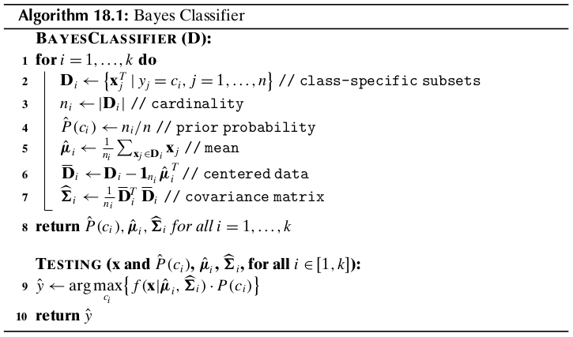
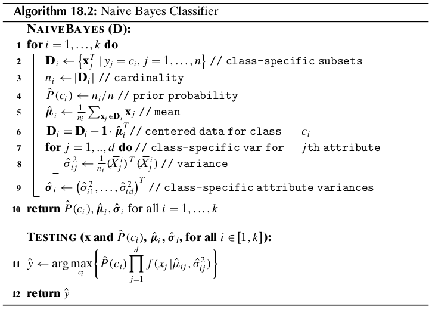

Chapter 18 Probabilistic Classification
=======================================

18.1 Bayes Classifier
---------------------

Let the training dataset :math:`\D` consist of :math:`n` points :math:`\x_i` in 
a :math:`d`-dimensional space, and let :math:`y_i` denote the class for each 
point, with :math:`y_i\in\{c_1,c_2,\cds,c_k\}`.
The Bayes classifier directly uses the Bayes theorem to predict the class for a new test instance, :math:`\x`.
It estimates the posterior probability :math:`P(c_i|\x)` for each class 
:math:`c_i`, and chooses the class that has the largest probability.
The predicted class for :math:`\x` is given as

.. math::

    \hat{y}=\arg\max_{c_i}\{P(c_i|\x)\}

The Bayes theorem allows us to invert the posterior probability in terms of the 
likelihood and prior probability, as follows:

.. note::

    :math:`\dp P(c_i|\x)=\frac{P(\x|c_i)\cd P(c_i)}{P(\x)}`

where :math:`P(\x|c_i)` is the *likelihood*, defined as the probability of 
observing :math:`\x` assuming that the true class is :math:`c_i`, :math:`P(c_i)`
is the *prior probability* of class :math:`c_i`, and :math:`P(\x)` is the 
probability of observing :math:`\x` from any of the :math:`k` classes, given as

.. math::

    P(\x)=\sum_{j=1}^kP(\x|c_j)\cd P(c_j)

Because :math:`P(\x)` is fixed for a given point, Bayes rule can be rewritten as

.. math::

    \hat{y}=\arg\max_{c_i}\{P(c_i|\x)\}=\arg\max_{c_i}\bigg\{\frac{P(\x|c_i)\cd P(c_i)}{P(\x)}\bigg\}

.. note::

    :math:`\dp =\arg\max_{c_i}\{P(\x|c_i)P(c_i)\}`

In other words, the predicted class essentially depends on the likelihood of 
that class taking its prior probability into account.

18.1.1 Estimating the Prior Probability
^^^^^^^^^^^^^^^^^^^^^^^^^^^^^^^^^^^^^^^

Let :math:`\D_i` denote the subset of points in :math:`\D` that are labeled with class :math:`c_i`:

.. math::

    \D_i=\{\x_j^T|\x_j\ rm{has\ class}\ y_i=c_i\}

Let the size of the dataset :math:`\D` be given as :math:`|\D|=n`, and let the 
size of each class-specific subset :math:`\D_i` be given as :math:`|D_i|=n_i`.
The prior probability for class :math:`c_i` can be estimated as follows:

.. note::

    :math:`\dp\hat{P}(c_i)=\frac{n_i}{n}`

18.1.2 Estimating the Likelihood
^^^^^^^^^^^^^^^^^^^^^^^^^^^^^^^^

To estimate the likelihood :math:`P(\x|c_i)`, we have to estimate the joint 
probability of :math:`\x` across all the :math:`d` dimensions, that is, we have 
to estimate :math:`P(\x=(x_1,x_2,\cds,x_d)|c_i)`.

**Numeric Attributes**

In the parametric approach we typically assume that each class :math:`c_i` is 
normally distributed around some mean :math:`\mmu_i` with a corresponding
covariance matrix :math:`\Sg_i`, both of which are estimated from :math:`\D_i`.
For class :math:`c_i`, the probability density at :math:`\x` is thus given as

.. note::

    :math:`\dp f_i(\x)=f(\x|\mmu_i,\Sg_i)=\frac{1}{(\sqrt{2\pi})^d\sqrt{|\Sg_i|}}`
    :math:`\dp\exp\bigg\{-\frac{(\x-\mmu_i)^T\Sg_i\im(\x-\mmu_i)}{2}\bigg\}`

We can compute the likelihood by considiering a small interval :math:`\epsilon>0` centered at :math:`\x`:

.. math::

    P(\x|c_i)=2\epsilon\cd f_i(\x)

The posterior probability is then given as

.. note::

    :math:`\dp P(c_i|\x)=\frac{2\epsilon\cd f_i(\x)P(c_i)}{\Sg_{j=1}^k2\epsilon\cd f_j(\x)P(c_j)}`
    :math:`\dp=\frac{f_i(\x)P(c_i)}{\Sg_{j=1}^kf_j(\x)P(c_j)}`

Because :math:`\Sg_{j=1}^kf_j(\x)P(c_j)` remain fixed for :math:`\x`, we can predict the class for :math:`\x` by

.. math::

    \hat{y}=\arg\max_{c_i}\{f_i(\x)P(c_i)\}

The sample mean for the class :math:`c_i` can be estimated as

.. math::

    \hat{\mmu_i}=\frac{1}{n_i}\Sg_{\x_j\in\D_i}\x_j

and the sample covariance matrix for each class can be estimated as

.. math::

    \hat{\Sg_i}=\frac{1}{n_i}\bar{\D_i}^T\bar{\D_i}

where :math:`\bar{\D_i}` is the centered data matrix for class :math:`c_i` given 
as :math:`\bar{\D_i}=\D_i-\1\cd\hat{\mmu_i}^T`.
These values can be used to estimate the probability density as :math:`\hat{f_i}(\x)=f(\x|\hat{\mmu_i},\hat{\Sg_i})`.

The cost of training is dominated by the covariance matrix computation step which takes :math:`O(nd^2)` time.

**Categorical Attributes**

Let :math:`X_j` be a categorical attribute over the domain :math:`dom(X_j)=\{a_{j1},a_{j2},\cds,a_{jm_j}\}`.
Each categorical attributes :math:`X_j` is modeled as an :math:`m_j`-dimensional 
multivariate Bernoulli random variable :math:`\X_j` that takes on :math:`m_j`
distinct vector values :math:`\e_{j1},\e_{j2},\cds,\e_{jm_j}`, where 
:math:`\e_{jr}` is the :math:`r`\ th standard basis vector in :math:`\R^{m_j}`
and corresponds to the :math:`r`\ th value or symbol :math:`a_{jr}\in dom(X_j)`.
The entire :math:`d`-dimensional dataset is modeled as the vector random variable :math:`\X=(\X_1,\X_2,\cds,\X_d)^T`.
Let :math:`d\pr=\sum_{j=1}^dm_j`; a categorical point 
:math:`\x=(x_1,x_2,\cds,x_d)^T` is therefore represented as the 
:math:`d\pr`-dimensional binary vector

.. math::

    \v=\bp \v_1\\\vds\\\v_d \ep=\bp \e_{1r_1}\\\vds\\\e_{dr_d} \ep

where :math:`\v_j=\e_{jr_j}` provided :math:`x_j=a_{jr_j}` is the :math:`r_j`\ th value in the domain of :math:`X_j`.
The probability of the categorical point :math:`\x` is obtained from the joint 
probability mass function (PMF) for the vector random variable :math:`\X`:

.. note::

    :math:`P(\x|c_i)=f(\v|c_i)=f(\X_1=\e_1{r_1},\cds,\X_d=\e_{dr_d}|c_i)`

The above joint PMF can be estimated directly from the data :math:`\D_i` for each class :math:`c_i` as follows:

.. math::

    \hat{f}(\v|c_i)=\frac{n_i(\v)}{n_i}

where :math:`n_i(\v)` is the number of times the value :math:`\v` occurs in class :math:`c_i`.
Unfortuantely, if the probability mass at the point :math:`\v` is zero for one 
or both classes, it would lead to a zero value for the posterior probability.
One simple solution is to assume a *pseudo-count* 1 for each value, that is, to 
assume that each value of :math:`\X` occurs at least one time, and to augment 
this base count of 1 with the actual number of occurrences of the observed value 
:math:`\v` in class :math:`c_i`.
The adjusted probability mass at :math:`\v` is then given as

.. note::

    :math:`\dp\hat{f}(\v|c_i)=\frac{n_i(\v)+1}{n_i+\prod_{j=1}^dm_j}`

**Challenges**

The main problem with the Bayes classifier is the lack of enough data to 
reliably estimate the joint probability density or mass function, especially for 
high-dimensional data.

18.2 Naive Bayes Classifier
---------------------------

The naive Bayes approach makes the simple assumption that all the attributes are independent.

.. note::

    :math:`\dp P(\x|c_i)=P(x_1,x_2,\cds,x_d|c_i)=\prod_{j=1}^dP(x_j|c_i)`

**Numeric Attributes**

For numeric attributes we make the default assumption that each of them is 
normally distributed for each class :math:`c_i`.
Let :math:`\mu_{ij}` and :math:`\sg_{ij}^2` denote the mean and variance for 
attribute :math:`X_j`, for class :math:`c_i`.
The likelihood for class :math:`c_i`, for dimension :math:`X_j`, is given as

.. math::

    p(x_j|c_i)\varpropto f(x_j|\mu_{ij},\sg_{ij}^2)=\frac{1}
    {\sqrt{2\pi}\sg_{ij}}\exp\bigg\{-\frac{(x_j-\mu_{ij})^2}{2\sg_{ij}^2}\bigg\}

Incidentallly, the naive assumption corresponds to setting all the covariances to zero in :math:`\Sg_i`, that is,

.. math::

    \Sg_i=\bp\sg_{i1}^2&0&\cds&0\\0&\sg_{12}^2&\cds&0\\\vds&\vds&\dds&\vds\\0&0&\cds&\sg_{id}^2\ep

This yields

.. math::
    
    |\Sg_i|=\det(\Sg_i)=\sg_{i1}^2\sg_{i2}^2\cds\sg_{id}^2=\prod_{j=1}^d\sg_{ij}^2

.. math::

    (\x-\mmu_i)^T\Sg_i\im(\x-\mmu_i)=\sum_{j=1}^d\frac{(x_j-\mu_{ij})^2}{\sg_{ij}^2}

.. math::

    P(\x|c_i)&=\frac{1}{(\sqrt{2\pi})^d\sqrt{\prod_{j=1}^d\sg_{ij}^2}}
    \exp\bigg\{-\sum_{j=1}^d\frac{(x_j-\mu_{ij})^2}{2\sg_{ij}^2}\bigg\}

    &=\prod_{j=1}^d\bigg(\frac{1}{\sqrt{2\pi}\sg_{ij}}\exp\bigg\{-\frac{x_i-\mu_{ij})^2}{2\sg_{ij}^2}\bigg\}\bigg)

    &=\prod_{j=1}^dP(\x_j|c_i)

The naive Bayes classifier uses the sample mean 
:math:`\hat{\mmu_i}=(\hat{\mu_{i1}},\cds,\hat{\mu_{id}})^T` and a *diagonal*
sample covariance matrix :math:`\hat{\Sg_i}=diag(\sg_{i1}^2,\cds,\sg_{id}^2)` 
for each class :math:`c_i`.
Thus, in total :math:`2d` parameters have to be estimated, corresponding to the 
sample mean and sample variance for each dimension :math:`X_j`.

Training the naive Bayes classifier is very fast, with :math:`O(nd)` computational complexity.

**Categorical Attributes**

.. note::

    :math:`\dp P(\x|c_i)=\prod_{j=1}^dP(x_j|c_i)=\prod_{j=1}^df(\X_j=\e_{jr_j}|c_i)`

where :math:`f(\X_j=\e_{jr_j}|c_i)` is the probability mass function for 
:math:`\X_j`, which can be estimated from :math:`\D_i` as follows:

.. math::

    \hat{f}(\v_j|c_i)=\frac{n_i(\v_j)}{n_i}

where :math:`n_i(\v_j)` is the observed frequency of the value 
:math:`\v_j=\e_{jr_j}` corresponding to the :math:`r_j`\ th categorical value 
:math:`a_{jr_j}` for the attribute :math:`X_j` for class :math:`c_i`.
The adjusted estimates with pseudo-counts are given as

.. note::

    :math:`\dp\hat{f}(\v_j|c_i)=\frac{n_i(\v_j)+1}{n_i+m_j}`

where :math:`m_j=|dom(X_j)|`.

18.3 :math:`K` Nearest Neighbors Classifier
-------------------------------------------

We illustrate the non-parameteric approach using nearest neighbors density 
estimation from Section 15.2.3, which leads to the *K nearest neighbors* (KNN)
classifier.

Let :math:`\D` be a training dataset comprising :math:`n` points 
:math:`\x_i\in\R^d`, and let :math:`\D_i` denote the subset of points in 
:math:`\D` that are labeled with class :math:`c_i`, with :math:`n_i=|\D_i|`.
Given a test point :math:`\x\in\R^d`, and :math:`K`, the number of neighbors to 
consider, let :math:`r` denote the distance from :math:`\x` to its :math:`K`\ th
nearest neighbor in :math:`\D`.

Consider the :math:`d`-dimensional hyperball of radius :math:`r` around the test point :math:`\x`, defined as

.. math::

    B_d(\x,r)=\{\x_i\in\D|\lv\x-\x_i\rv\leq r\}

We assume that :math:`|B_d(\x,r)|=K`.

Let :math:`K_i` denote the number of points among the :math:`K` nearest 
neighbors of :math:`\x` that are labeled with class :math:`c_i`, that is

.. math::

    K_i=\{\x_j\in B_d(\x,r)|y_i=c_i\}

The class conditional probability density at :math:`\x` can be estimated as the 
fraction of points from class :math:`c_i` that lie within the hyperball divided by its volume, that is

.. note::

    :math:`\dp\hat{f}(\x|c_i)=\frac{K_i/n_i}{V}=\frac{K_i}{n_iV}`

where :math:`V=vol(B_d(\x,r))` is the volume of the :math:`d`-dimensional hyperball.

.. math::

    P(c_i|\x)=\frac{\hat{f}(\x|c_i)\hat{P}(c_i)}{\sum_{j=1}^k\hat{f}(\x|c_j)\hat{P}(c_j)}

.. math::

    \hat{f}(\x|c_i)\hat{P}(c_i)=\frac{K_i}{n_iV}\cd\frac{n_i}{n}=\frac{K_i}{nV}

.. math::

    P(c_i|\x)=\frac{\frac{K_i}{nV}}{\sum_{j=1}^k\frac{K_j}{nV}}=\frac{K_i}{K}

.. note::

    :math:`\dp\hat{y}=\arg\max_{c_i}\{P(c_i|\x)\}=\arg\max_{c_i}\bigg\{\frac{K_i}{K}\bigg\}=\arg\max_{c_i}\{K_i\}`

Beceause :math:`K` is fixed, the KNN classifier predicts the class of :math:`\x` 
as the majority class among its :math:`K` nearest neighbors.