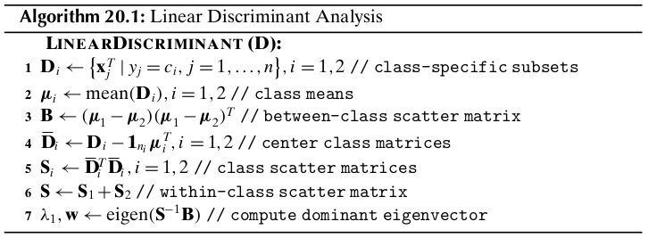
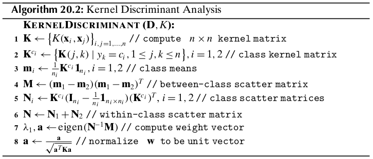

Chapter 20 Linear Discriminant Analysis
=======================================

Given labeled data consisting of :math:`d`-dimensional points :math:`\x_i` along 
with their classes :math:`y_i`, the goal of linear discriminant analysis (LDA) 
is to find a vector :math:`\w` that maximizes the separation between the classes
after projection onto :math:`\w`.

20.1 Optimal Linear Discriminant
--------------------------------

Let us assume that the dataset :math:`\D` consists of :math:`n` points 
:math:`\x_i\in\R^d`, with the corresponding class label 
:math:`y_i\in\{c_1,c_2,\cds,c_k\}`.
Let :math:`\D_i` denote the subset of points labeled with class :math:`c_i`,
i.e., :math:`\D_i=\{\x_j^T|y_j=c_i\}`, and let :math:`|\D_i|=n_i` denote the 
number of points with class :math:`c_i`.
We assume that there are only :math:`k=2` classes.
Thus, the dataset :math:`\D` can be partitioned into :math:`\D_1` and :math:`\D_2`.

Let :math:`\w` be a unit vector, that is, :math:`\w^T\w=1`.
The projection of any :math:`d`-dimensional point :math:`\x_i` onto the vector :math:`\w` is given as

.. math::

    \x_i\pr=\bigg(\frac{\w^T\x_i}{\w^T\w}\bigg)\w=(\w^T\x_i)\w=a_i\w

where :math:`a_i` is the offset or scalar projection of :math:`\x_i` on the line :math:`\w`:

.. math::

    a_i=\w^T\x_i

We also call :math:`a_i` a *projected point*.
Thus the set of :math:`n` projected points :math:`\{a_1,a_2,\cds,a_n\}` 
represents a mapping from :math:`\R^d` to :math:`\R`, that is, from the original
:math:`d`-dimensional space to a 1-dimensional space of offsets along 
:math:`\w`.

Each projected point :math:`a_i` has associated with it the original class label 
:math:`y_i`, and thus we can compute, for each of the two classes, the mean of
the projected points ,called the *projected mean*, as follows:

.. math::

    m_1&=\frac{1}{n_1}\sum_{\x_i\in\D_1}a_i

    &=\frac{1}{n_1}\sum_{\x_i\in\D_1}\w^T\x_i

    &=\w^T\bigg(\frac{1}{n_1}\sum_{\x_i\in\D_1}\x_i\bigg)

    &=\w^T\mmu_1

where :math:`\mmu_1` is the mean of all point in :math:`\D_1`.
Likewise, we can obtain

.. math::

    m_2=\w^T\mmu_2

To maximize the separation between the classes, it seems reasonable to maximize 
the difference between the projected means, :math:`|m_1-m_2|`.
For good separation, the variance of the projected points for each class should also not be too large.
LDA maximizes the separation by ensuring that the *scatter* :math:`s_i^2` for 
the projected points within each class is small

.. math::

    s_i^2=\sum_{\x_j\in\D_i}(a_j-m_i)^2=n_i\sg_i^2

We can incorporate the two LDA criteria, namely, maximizing the distance between 
projected means and minimizing the sum of projected scatter, into a single
maximization criterion called the *Fisher LDA objective*:

.. note::

    :math:`\dp\max_\w J(\w)\frac{(m_1-m_2)^2}{s_1^2+s_2^2}`

The vector :math:`\w` is also called the *optimal linear discriminant (LD)*.

We can rewrite :math:`(m_1-m_2)^2` as follows:

.. math::

    (m_1-m_2)^2&=(\w^T(\mmu_1-\mmu_2))^2
    
    &=\w^T((\mmu_1-\mmu_2)(\mmu_1-\mmu_2)^T)\w
    
    &=\w^T\B\w

where :math:`\B=(\mmu_1-\mmu_2)(\mmu_1-\mmu_2)^T` is a :math:`d\times d` 
rank-one matrix called the *between-class scatter matrix*.

As for the projected scatter for class :math:`c_1`, we can compute it as follows:

.. math::

    s_1^2&=\sum_{\x_i\in\D_1}(a_i-m_1)^2

    &=\sum_{\x_i\in\D_1}(\w^T\x_i-\w^T\mmu_1)^2

    &=\sum_{\x_i\in\D_1}(\w^T(\x_i-\mmu_1))^2

    &=\w^T\bigg(\sum_{\x_i\in\D_1}(\x_i-\mmu_1)(\x_i-\mmu_1)^T\bigg)\w

    &=\w^T\S_1\w

where :math:`\S_1` is the *scatter matrix* for :math:`\D_1`.
Likewise, we can obtain

.. math::

    s_2^2=\w^T\S_2\w

Notice again that the scatter matrix is essentially the same as the covariance 
matrix, but instead of recording the average deviation from the mean, it records 
the total deviation, that is,

.. math::

    \S_i=n_i\Sg_i

.. math::

    s_1^2+s_2^2=\w^T\S_1\w+\w^T\S_2\w=\w^T(\S_1+\S_2)\w=\w^T\S\w

where :math:`\S=\S_1+\S_2` denote the *within-class scatter matrix* for the pooled data.

.. note::

    :math:`\dp\max_\w J(\w)=\frac{\w^T\B\w}{\w^T\S\w}`

.. math::

    \frac{d}{d\w}J(\w)=\frac{2\B\w(\w^T\S\w)-2\B\w(\w^T\B\w)}{(\w^T\S\w)^2}=\0

.. math::

    \B\w(\w^T\S\w)&=\S\w(\w^T\B\w)

    \B\w&=\S\w\bigg(\frac{\w^T\B\w}{\w^T\S\w}\bigg)

    \B\w&=J(\w)\S\w

    \B\w&=\ld\S\w

where :math:`\ld=J(\w)`.
If :math:`\S` is *nonsingular*, that is, if :math:`\S\im` exists

.. math::

    \S\im\B\w=\ld\S\im\S\w

.. note::

    :math:`(\S\im\B)\w=\ld\w`

Thus, if :math:`\S\im` exists, then :math:`\ld=J(\w)` is an eigenvalue, and 
:math:`\w` is an eigenvector of the matrix :math:`\S\im\B`.
To maximize :math:`J(\w)` we look for the largest eigenvalue :math:`\ld`, and
the coresponding dominant eigenvector :math:`\w` specifies the best linear 
discriminant vector.

The total time complexity is :math:`O(d^3+nd^2)`.

For the two class scenario, if :math:`\S` is nonsingular, we can directly solve 
for :math:`\w` without computing the eigenvalues and eigenvectors.

.. math::

    \B\w&=((\mmu_1-\mmu_2)(\mmu_1-\mmu_2)^T)\w

    &=(\mmu_1-\mmu_2)((\mmu_1-\mmu_2)^T\w)

    &=b(\mmu_1-\mmu_2)

where :math:`n=(\mmu_1-\mmu_2)^T\w` is just a scalar multiplier.

.. math::

    \B\w&=\ld\S\w

    b(\mmu_1-\mmu_2)&=\ld\S\w

    \w&=\frac{b}{\ld}\S\im(\mmu_1-\mmu_2)

Because :math:`\frac{b}{\ld}` is just a scalar, we can solve for the best linear discriminant as

.. note::

    :math:`\w=\S\im(\mmu_1-\mmu_2)`

20.2 Kernel Discriminant Analysis
---------------------------------

The goal of kernel LDA is to find the direction vector :math:`\w` in feature space that maximizes

.. math::

    \max_\w J(\w)=\frac{(m_1-m_2)^2}{s_1^2+s_2^2}

**Optimal LD: Linear Combination of Feature Points**

The mean for class :math:`c_i` in feature space is given as

.. math::

    \mmu_i^\phi=\frac{1}{n_i}\sum_{\x_j\in\D_i}\phi(\x_j)

and the covariance matrix for class :math:`c_i` in feature space is

.. math::

    \Sg_i^\phi=\frac{1}{n_i}\sum_{\x_j\in\D_i}(\phi(\x_j)-\mmu_i^\phi)(\phi(\x_j)-\mmu_I^\phi)^T

The between-class and within-class scatter matrices are defined as

.. math::

    \B_\phi=(\mmu_1^\phi-\mmu_2^\phi)(\mmu_1^\phi-\mmu_2^\phi)^T=\d_\phi\d_\phi^T

    \S_\phi=n_1\Sg_1^\phi+n_2\Sg_2^\phi

.. note::
    
    :math:`(\S_\phi\im\B_\phi)\w=\ld\w`

where we assume that :math:`\S_\phi` is non-singular.
Let :math:`\delta_i` denote the :math:`i`\ th eigenvalue and :math:`\u_i` the 
:math:`i`\ th eigenvector of :math:`\S_\phi`, for :math:`i=1,\cds,d`.
The eigen-decomposition of :math:`\S_\phi` yields :math:`\S_\phi=\U\Delta\U^T`,
with the inverse of :math:`\S_\phi` given as :math:`\S_\phi\im=\U\Delta\im\U^T`.
Here :math:`\U` is the matrix whose columns are the eigenvectors of 
:math:`\S_\phi` and :math:`\Delta` is the diagonal matrix of eigenvalues of 
:math:`\S_\phi`.
The inverse :math:`\S_\phi\im` can thus be expressed as the spectral sum

.. math::

    \S_\phi\im=\sum_{r=1}^d\frac{1}{\delta_r}\u_r\u_r^T

.. math::

    \ld\w=\bigg(\sum_{r=1}^d\frac{1}{\delta_r}\u_r\u_r^T\bigg)\d_\phi\d_\phi^T\w
    =\sum_{r=1}^d\frac{1}{\delta_r}(\u_r(\u_r^T\d_\phi)(\d_\phi^T\w))=
    \sum_{r=1}^db_r\u_r

where :math:`b_r=\frac{1}{\delta_r}(\u_r^T\d_\phi)(\d_\phi^T\w)` is a scalar value.

.. math::

    \w&=\frac{1}{\ld}\sum_{r=1}^db_r\bigg(\sum_{j=1}^nc_{rj}\phi(\x_j)\bigg)

    &=\sum_{j=1}^n\phi(\x_j)\bigg(\sum_{r=1}^d\frac{b_rc_{rj}}{\ld}\bigg)

    &=\sum_{j=1}^na_j\phi(\x_j)

where :math:`a_j=\sum_{r=1}^db_rc_{rj}/\ld` is a scalar value for the feature point :math:`\phi(\x_j)`.
Therefore, the direction vector :math:`\w` can be expressed as a linear combination of the points in feature space.

**LDA Objective via Kernel Matrix**

.. math::

    m_i=\w^T\mmu_i^\phi&=\bigg(\sum_{j=1}^na_j\phi(\x_j)\bigg)^T\bigg(\frac{1}{n_i}\sum_{\x_k\in\D_i}\phi(\x_k)\bigg)

    &=\frac{1}{n_i}\sum_{j=1}^n\sum_{\x_k\in\D_i}a_j\phi(\x_j)^T\phi(\x_k)

    &=\frac{1}{n_i}\sum_{j=1}^n\sum_{\x_k\in\D_i}a_jK(\x_j,\x_k)

    &=\a^T\m_i

where :math:`\a=(a_1,a_2,\cds,a_m)^T` is the weight vector, and

.. math::

    \m_i=\frac{1}{n_i}\bp \sum_{\x_k\in\D_i}K(\x_1,\x_k)\\
    \sum_{\x_k\in\D_i}K(\x_2,\x_k)\\\vds\\\sum_{\x_k\in\D_i}K(\x_n,\x_k)\ep=
    \frac{1}{n_i}\K^{c_i}\1_{n_i}

.. math::

    (m_1-m_2)^2&=(\w^T\mmu_1^\phi-\w^T\mmu_2^\phi)^2

    &=(\a^T\m_1-\a^T\m_2)^2

    &=\a^T(\m_1-\m_2)(\m_1-\m_2)^T\a

    &=\a^T\M\a

.. math::

    s_1^2&=\sum_{\x_i\in\D_1}\lv\w^T\phi(\x_i)-\w^T\mmu_1^\phi\rv^2

    &=\sum_{\x_i\in\D_1}\lv\w^T\phi(\x_i)\rv^2-2\sum_{\x_i\in\D_1}
    \w^T\phi(\x_i)\cd\w^T\mmu_1^\phi+\sum_{\x_i\in\D_1}\lv\w^T\mmu_1^\phi\rv^2

    &=\bigg(\sum_{\x_i\in\D_1}\lv\sum_{j=1}^na_j\phi(\x_j)^T
    \phi(\x_i)\rv^2\bigg)-2\cd n_1\cd\lv\w^T\mmu_1^\phi\rv^2+
    n_1\cd\lv\w^T\mmu_1^\phi\rv^2

    &=\bigg(\sum_{\x_i\in\D_1}\a^T\K_i\K_i^T\a\bigg)-n_1\cd\a^T\m_1\m_1^T\a

    &=\a^T\bigg(\bigg(\sum_{\x_i\in\D_1}\K_i\K_i^T\bigg)-n_1\m_1\m_1^T\bigg)\a

    &=\a^T\N_1\a

.. math::

    \N_1&=\bigg(\sum_{\x_i\in\D_1}\K_i\K_i^T\bigg)-n_1\m_1\m_1^T

    &=(\K^{c_1})\bigg(\I_{n_1}-\frac{1}{n_1}\1_{n_1\times n_1}\bigg)(\K^{c_1})^T

In a similar manner we get :math:`s_2^2=\a^T\N_2\a`.

.. math::

    s_1^2+s_2^2=\a^T(\N_1+\N_2)\a=\a^T\N\a

.. note::

    :math:`\dp\max_\w J(\w)=\max_\a J(\a)=\frac{\a^T\M\a}{\a^\N\a}`

The weight vector :math:`\a` is the eigenvector corresponding to the largest 
eigenvalue of the generalized eigenvalue problem:

.. math::

    \M\a=\ld_1\N\a

If :math:`\N` is nonsingular, :math:`\a` is the dominant eigenvetor 
corresponding to the largest eigenvalue for the system

.. math::

    (\N\im\M)\a=\ld_1\a

As in the case of linear discriminant analysis, when there are only two classes 
we do not have to solve for the eigenvector because :math:`\a` can be obtained 
directly:

.. math::

    \a=\N\im(\m_1-\m_2)

we can ensure that :math:`\w` is a unit vector if we scale :math:`\a` by :math:`\frac{1}{\sqrt{\a^T\K\a}}`

.. note::

    :math:`\dp\w^T\phi(\x)=\sum_{j=1}^na_j\phi(\x_j)^T\phi(\x)=\sum_{j=1}^na_jK(\x_j,\x)`

The complexity of kernel discriminant analysis is :math:`O(n^3`.