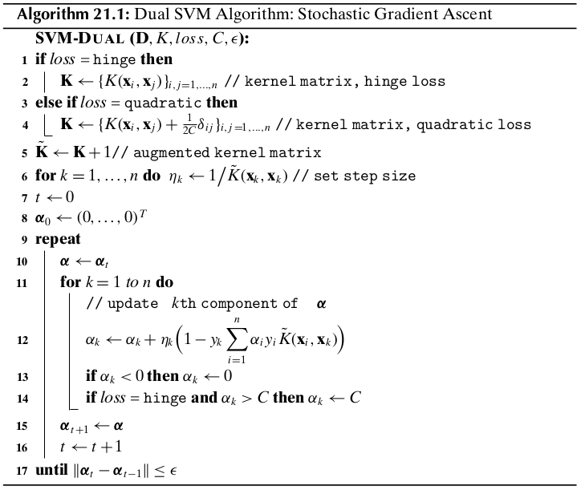

Chapter 21 Support Vector Machines
==================================

The goal of Support Vector Machines (SVMs) is to find the optimal hyperplane 
that maximizes the gap or margin between the classes.

21.1 Support Vectors and Margins
--------------------------------

Let :math:`\D` be a classification dataset, with :math:`n` points :math:`\x_i` in a :math:`d`-dimensional space.
Let us assume that there are only two class labels, that is, 
:math:`y_i\in\{+1,-1\}`, denoting the positive and negative classes.

**Hyperplane**

A hyperplane in :math:`d` dimensions is given as the set of all points 
:math:`\x\in\R^d` that satisfy the equation :math:`h(\x)=0`, where :math:`h(\x)`
is the *hyperplane function*, defined as follows:

.. math::

    h(\x)=\w^T\x+b=w_1x_1+w_2x_2+\cds+w_dx_d+b

:math:`\w` is a :math:`d` dimeniosnal *weight vector* and :math:`b` is a scalar, called the *bias*.
For points that lie on the hyperplane, we have

.. math::

    h(\x)=\w^T\x+b=0

The hyperplane is thus defined as the set of all points such that :math:`\w^T\x=-b`.

**Separating Hyperplane**

A hyperplane splits the original :math:`d`-dimensional space into two *half-spaces*.
A dataset is said to be *linearly separable* if each half-space has points only from a single class.
The hyperplane function :math:`h(\x)` serves as a linear classifier or a linear 
discriminant, which predicts the class :math:`y` for any given point :math:`\x`, 
according to the decision rule:

.. math::

    \left\{\begin{array}{lr}+1\quad\rm{if\ }h(\x)>0\\-1\quad\rm{if\ }h(\x)<0\end{array}\right.

**Distance of a Point to the Hyperplane**

Consider a point :math:`\x\in\R^d`, such that :math:`\x` does not lie on the hyperplane.
Let :math:`\x_p` be the orthogonal projection of :math:`\x` on the hyperplane, and let :math:`\r=\x-\x_p`, then

.. math::

    \x&=\x_p+\r

    \x&=\x_p+r\frac{\w}{\lv\w\rv}

wherer :math:`r` is the *directed distance* of the point :math:`\x` from 
:math:`\x_p`, that is, :math:`r` gives the offset of :math:`\x` from 
:math:`\x_p` in terms of the unit weight vector :math:`\frac{\w}{\lv\w\rv}`.

.. math::

    h(\x)&=h\bigg(\x_p+r\frac{w}{\lv\w\rv}\bigg)

    &=\w^T\bigg(\x_p+r\frac{\w}{\lv\w\rv}\bigg)+b

    &=\w^T\x_p+b+r\frac{\w^T\w}{\lv\w\rv}

    &=h(\x_p)+r\lv\w\rv

    &=r\lv\w\rv

Using the result above, we obtain an expression for the directed distance of a point to the hyperplane:

.. math::

    r=\frac{h(\x)}{\lv\w\rv}

To obatain distance, which must be non-negative, we can conveniently multiply 
:math:`r` by the class label :math:`y` of the point.

.. note::

    :math:`\dp\delta=yr=\frac{yh(\x)}{\lv\w\rv}`

In particular, for the origin :math:`\x=\0`, the directed distance is

.. math::

    r=\frac{h(\0)}{\lv\w\rv}=\frac{\w^T\0+b}{\lv\w\rv}=\frac{b}{\lv\w\rv}

**Margin and Support Vectors of a Hyperplane**

.. math::

    \delta_i=\frac{y_ih(\x_i)}{\lv\w\rv}=\frac{y_i(\w^T\x_i+b)}{\lv\w\rv}

Over all the :math:`n` points, we define the *margin* of the linear classifier 
as the minimum distance of a point from the separating hyperplane, given as

 .. note::

    :math:`\dp\delta^*=\min_{\x_i}\bigg\{\frac{y_i(\w^T\w_i+b)}{\lv\w\rv}\bigg\}`.

Note that :math:`\delta^*\ne 0`, since :math:`h(\x)` is assumed to be a separating hyperplane.

All the points (or vectors) that achieve this minimum distance are called *support vectors* for the hyperplane.
In other words, a support vector :math:`\x^*` is a point that lies precisely on 
the margin of the classifier, and thus satisfies the condition

.. math::

    \delta^*=\frac{y^*(\w^T\x^*+b)}{\lv\w\rv}

**Canonical Hyperplane**

.. math::

    sh(\x)=s\w^T\x+sb=(s\w)^T\x+(sb)=0

To obtain the unique or *canonical* hyperplane, we choose the scalar :math:`s`
such that the absolute distance of a support vector from the hyperplane is 1.

.. math::

    sy^*(\w^T\x^*+b)=1

which implies

.. math::

    s=\frac{1}{y^*(\w^T\x^*+b)}=\frac{1}{y^*h(\x^*)}

Henceforth, we will assume that any separating hyperplane is canonical.
That is, it has already been suitably rescaled so that :math:`y^*h(\x^*)=1` for
a support vector :math:`\x^*`, and the margin is given as

.. math::

    \delta^*=\frac{y^*h(\x^*)}{\lv\w\rv}=\frac{1}{\lv\w\rv}

.. note::

    :math:`y_i(\w^T\x_i+b)\geq 1`, for all points :math:`\x_i\in\D`.

21.2 SVM: Linear and Separable Case
-----------------------------------

Let us assume for the moment that the points are linearly separable, that is, 
there exists a separating hyperplane that perfectly classifies each point.

**Maximum Margin Hyperplane**

The fundamental idea behind SVMs is to choose the canonical hyperplane, 
specified by the weight vector :math:`\w` and the bias :math:`b`, that yields
the maximum margin among all possible separating hyperplanes.
If :math:`\delta_h^*` represents the margin for hyperplane :math:`h(\x)=0`, then
the goal is to find the optimal hyperplane :math:`h^*`:

.. math::

    h^*=\arg\max_h\{\delta_h^*\}=\arg\max_{\w,b}\bigg\{\frac{1}{\lv\w\rv}\bigg\}

The SVM task is to find the hyperplane that maximizes the margin 
:math:`\frac{1}{\lv\w\rv}`, subject to the :math:`n` constraints,
:math:`\y_i(\w^T\x_i+b)\geq 1`, for all points :math:`\x_i\in\D`.
Instead of maximizing the margin :math:`\frac{1}{\lv\w\rv}`, we can minimize :math:`\lv\w\rv`.

.. note::

    **Objective Functions:** :math:`\dp\min_{\w,b}\bigg\{\frac{\lv\w\rv^2}{2}\bigg\}`

    **Linear Constraints:** :math:`y_i(\w^T\x_i+b)\geq 1,\forall\x_i\in\D`

We can solve the *dual* problem via the use of *Lagrange multipliers*.
The main idea is to introduce a Lagrange multiplier :math:`\alpha_i` for each 
constraint, which satisfies the Karush-Kuhn-Tucker (KKT) conditions at the
optimal solution:

.. math::

    \alpha_i(y_i(\w^T\x_i+b)-1)=0

    \rm{and}\ \alpha_i\geq 0

Incorporating all the :math:`n` constraints, the new objective function, called the *Lagrangian*, then becomes

.. math::

    \min L=\frac{1}{2}\lv\w\rv^2-\sum_{i=1}^n\alpha_i(y_i(\w^T\x_i+b)-1)

:math:`L` should be minimized with respect to :math:`\w` and :math:`b`, and it 
should be maximized with respect to :math:`\alpha_i`.

.. math::

    \frac{\pd}{\pd\w}L=\w-\sum_{i=1}^n\alpha_iy_i\x_i=\0\ \rm{or}\ \w=\sum_{i=1}^n\alpha_iy_i\x_i

    \frac{\pd}{\pd b}L=\sum_{i=1}^n\alpha_iy_i=0

We obtain the *dual Lagrangian* objective funtion, which is specified purely in terms of the lagrange multipliers:

.. math::

    L_{dual}&=\frac{1}{2}\w^T\w-\w^T\bigg(\sum_{i=1}^n\alpha_iy_i\x_i\bigg)
    -b\sum_{i=1}^n\alpha_iy_i+\sum_{i=1}^n\alpha_i

    &=-\frac{1}{2}\w^T\w+\sum_{i=1}^n\alpha_i

    &=\sum_{i=1}^n\alpha_i-\frac{1}{2}\sum_{i=1}^n\sum_{j=1}^n\alpha_i\alpha_jy_iy_j\x_i^Y\x_j

.. note::

    **Objective Function:** :math:`\dp\max_{\bs{\alpha}}L_{dual}=\sum_{i=1}^n\alpha_i`
    :math:`\dp-\frac{1}{2}\sum_{i=1}^n\sum_{j=1}^n\alpha_i\alpha_jy_iy_j\x_i^Y\x_j`

    **Linear Constraints**: :math:`\alpha_i\geq 0,\forall i\in\D` and :math:`\dp\sum_{i=1}^n\alpha_iy_i=0`

**Weight Vector and Bias**

According to the KKT conditions, we have

.. math::

    \alpha_i(y_i(\w^T\x_i+b)-1)=0

which gives rise to two cases:

    #. :math:`\alpha_i=0`, or

    #. :math:`y_i(\w^T\x_i+b)-1=0`, which implies :math:`y_i(\w^T\x_i+b)=1`.

.. note::

    :math:`\dp\w=\sum_{\alpha_i>0}\alpha_iy_i\x_i`

.. note::

    :math:`\dp b_i=\frac{1}{y_i}-\w^T\x_i=y_i-\w^T\x_i`

.. note::

    :math:`\dp b=\rm{avg}_{\alpha_i>0}\{b_i\}`

**SVM Classifier**

.. note::

    :math:`\hat{y}=\rm{sign}(h(\z))=\rm{sign}(\w^T\z+b)`

**Soft Margin SVM: Linear and Nonseparable Case**

Here we consider the case where the classes overlap to some extent so that a perfect separation is not possible.

SVM can handle non-separable points by introducing *slack variable* :math:`\xi_i` as follows:

.. note::

    :math:`y_i(\w^T\x_i+b)\geq 1-\xi_i`

where :math:`\xi_i\geq 0` is the slack variable for point :math:`\x_i`, which
indicates how much the point violates the separability condition, that is, the 
point may no longer be at least :math:`1/\lv\w\rv` away from the hyperplane.
The slack values indicate three types of point.
If :math:`\xi_i=0`, then the corresponding point :math:`\x_i` is at least 
:math:`\frac{1}{\lv\w\rv}` away from the hyperplane.
If :math:`0<\xi_i<1`, then the point is within the margin and still correctly 
classified, that is, it is on the correct side of the hyperplane.
However, if :math:`\xi\geq 1` then the point is misclassified and appears on the wrong side of the hyperplane.

In the nonseparable case, also called the *soft margin* case, the goal of SVM 
classification is to find the hyperplane iwth maximum margin that also minimizes 
the slack terms.
The new objective function is given as

.. note::

    **Objective Function:** :math:`\dp\min_{\w,b,\xi_i}\bigg\{\frac{\lv\w\rv^2}{w}+C\sum_{i=1}^n(\xi_i)^k\bigg\}`

    **Linear Constraints:** :math:`y_i(\w^T\x_i+b)\geq 1-\xi_i,\forall\x_i\in\D\quad\xi_i\geq 0,\forall\x_i\in\D`

where :math:`C` and :math:`k` are constants that incorporate the cost of misclassification.
The term :math:`\sum_{i=1}^n(\xi_i)^k` gives the *loss*, that is, an estimate of the deviation from the separable case.
The scalar :math:`C\geq 0`, which is chosen empirically, is a 
*regularization constant* that controls the trade-off between maximizing the
margin or minimizing the loss.
The constant :math:`k>0` governs the form of the loss.
Typically :math:`k` is set to 1 or 2.
When :math:`k=1`, called *hinge loss*, the goal is to minimize the sum of the 
slack variables, whereas when :math:`k=2`, called *quadratic loss*, the goal is
to minimize the sum of the squared slack variables.

21.3.1 Hinge Loss
^^^^^^^^^^^^^^^^^

.. math::

    \alpha_i(y_i(\w^T\x_i+b)-1+\xi_i)=0\ \rm{with}\ \alpha_i\geq 0

    \beta_i(\xi_i-0)=0\ \rm{with}\ \beta_i\geq 0

The Lagrangian is then given as

.. math::

    L=\frac{1}{2}\lv\w\rv^2+C\sum_{i=1}^n\xi_i-\sum_{i=1}^n\alpha_i(y_i(\w^T\x_i+b)-1+\xi_i)-\sum_{i=1}^n\beta_i\xi_i

.. math::

    \frac{\pd}{\pd\w}L&=\w-\sum_{i=1}^n\alpha_iy_i\x_i=\0\ \rm{or}\ \w=\sum_{i=1}^n\alpha_iy_i\x_i

    \frac{\pd}{\pd b}L&=\sum_{i=1}^n\alpha_iy_i=0

    \frac{\pd}{\pd\xi_i}L&=C-\alpha_i-\beta_i=0\ \rm{or}\ \beta_i=C-\alpha_i

.. math::

    L_{dual}&=\frac{1}{2}\w^T\w-\w^T\bigg(\sum_{i=1}^n\alpha_iy_i\x_i\bigg)
    -b\sum_{i=1}^n\alpha_iy_i+\sum_{i=1}^n\alpha_i+
    \sum_{i=1}^n(C-\alpha_i-\beta_i)\xi_i

    &=\sum_{i=1}^n\alpha_i-\frac{1}{2}\sum_{i=1}^n\sum_{j=1}^n\alpha_i\alpha_jy_iy_j\x_i^T\x_j

.. note::

    **Objective Function:** :math:`\dp\max_{\bs{\alpha}}L_{dual}=\sum_{i=1}^n\alpha_i`
    :math:`\dp-\frac{1}{2}\sum_{i=1}^n\sum_{j=1}^n\alpha_i\alpha_jy_iy_j\x_i^T\x_j`

    **Lienar Constraints:** :math:`0\leq\alpha_i\leq C,\forall i\in\D` and :math:`\dp\sum_{i=1}^n\alpha_iy_i=0`

**Weight Vector and Bias**

Once we solve for :math:`\alpha_i`, we have :math:`\alpha_i=0` for points that 
are not support vectors, and :math:`\alpha_i>0` only for the support vectors, 
which comprise all points :math:`\x_i` for which we have

.. math::

    y_i(\w^T\x_i+b)=1-\xi_i

Notice that the support vectors now include all points that are on the margin, 
which have zero slack, as well as all points with postivie slack.

.. math::

    \w=\sum_{\alpha_i>0}\alpha_iy_i\x_i

    \beta_i=C-\alpha_i

    (C-\alpha_i)\xi_i=0

For the support vectors with :math:`\alpha_i>0`, we have two cases to consider:

    #. :math:`\xi_i>0`, which implies that :math:`C-\alpha_i=0`, that is, :math:`\alpha_i=C`, or`
    
    #. :math:`C-\alpha_i>0`, that is :math:`\alpha_i<C`.
       In this case, we must have :math:`\xi_i=0`.
       In other words, these are precisely those support vectors that are on the margin.

.. math::

    \alpha_i(y_i(\w^T\x_i+b_i)-1)=0

    y_i(\w^T\x_i+b_i)=1

    b_i=\frac{1}{y_i}-\w^T\x_i=y_i-\w^T\x_i

To obtain the final bias :math:`b`, we can take the average over all the :math:`b_i` values.

.. math::

    \hat{y}=\rm{sign}(h(\z))=\rm{sign}(\w^T\z+b)

21.3.2 Quadratic Loss
^^^^^^^^^^^^^^^^^^^^^

In this case we can drop the positivity constraint :math:`\xi_i\geq 0` due to 
the fact that (1) the sum of the slack terms :math:`\sum_{i=1}^n\xi_i^2` is 
always positive, and (2) a potential negative value of slack will be ruled out
during optimization because a choice of :math:`\xi_i=0` leads to a smaller value
of the primary objective, and it still satisfies the constraint 
:math:`y_i(\w^T\x_i+b)\geq 1-\xi_i` whenever :math:`\xi<0`.

.. note::

    **Objective Function:** :math:`\dp\min_{\w,b,\xi_i}\bigg\{\frac{\lv\w\rv^2}{2}+C\sum_{i=1}^n\xi_i^2\bigg\}`

    **Linear Constraints:** :math:`y_i(\w^T\x_i+b)\geq 1-\xi_i,\forall\x_i\in\D`

.. math::

    L=\frac{1}{2}\lv\w\rv^2+C\sum_{i=1}^n\xi_i^2-\sum_{i=1}^n\alpha_i(y_i(\w^T\x_i+b)-1+\xi_i)

.. math::

    \w=\sum_{i=1}^n\alpha_iy_i\x_i

    \sum_{i=1}^n\alpha_iy_i=0

    \xi_i=\frac{1}{2C}\alpha_i

.. math::

    L_{dual}&=\sum_{i=1}^n\alpha_i-\frac{1}{2}\sum_{i=1}^n\sum_{j=1}^n
    \alpha_i\alpha_jy_iy_j\x_i^T\x_j-\frac{1}{4C}\sum_{i=1}^n\alpha_i^2

    &=\sum_{i=1}^n\alpha_i-\frac{1}{2}\sum_{i=1}^n\sum_{j=1}^n\alpha_i\alpha_j
    y_iy_j\bigg(\x_i^T\x_j+\frac{1}{2C}\delta_{ij}\bigg)

where :math:`\delta` is the *Kronecker delta* function, defined as 
:math:`\delta_{ij}=1` if :math:`i=j`, and :math:`\delta_{ij}=0` otherwise.

Thus, the dual objective is given as

.. note::

    :math:`\max_{\bs{\alpha}}=\sum_{i=1}^n\alpha_i-\frac{1}{2}\sum_{i=1}^n\sum_{j=1}^n\alpha_i\alpha_jy_iy_j`
    :math:`\dp\bigg(\x_i^T\x_j+\frac{1}{2C}\delta_{ij}\bigg)`

    subject to the constraints :math:`\alpha_i\geq 0,\forall i\in\D`, and :math:`\dp\sum_{i=1}^n\alpha_iy_i=0`

.. math::

    \w=\sum_{\alpha_i>0}\alpha_iy_i\x_i

    b=\rm{avg}_{\alpha_i>0}\{y_i-\w^T\x_i\}

21.4 Kernel SVM: Nonliear Case
^^^^^^^^^^^^^^^^^^^^^^^^^^^^^^

To apply the kernel trick for nonlinear SVM classification, we have to show that
all operations require only the kernel function:

.. math::

    K(\x_i,\x_j)=\phi(\x_i)^T\phi(\x_j)

Let :math:`\D` be the original dataset with :math:`n` points :math:`\x_i` and their labels :math:`y_i`.
Applying :math:`\phi` to each point, we can obtain the new dataset 
:math:`\D_\phi` in the feature space comprising the transformed points 
:math:`\phi(\x_i)` along with their labels :math:`y_i`, for 
:math:`i=1,2,\cds,n`.

.. note::

    **Objective Function:** :math:`\dp\min_{\w,\b,\xi_i}\bigg\{\frac{\lv\w\rv^2}{2}+C\sum_{i=1}^n(\xi_i)^k\bigg\}`

    **Linear Constraints:** :math:`y_i(\w^T\phi(\x_i)+b)\geq 1-\xi_i`, and :math:`\xi_i\geq 0,\forall\x_i\in\D`.

**Hinge Loss**

.. math::

    \max_{\bs{\alpha}}L_{dual}&=\sum_{i=1}^n\alpha_i-\frac{1}{2}
    \sum_{i=1}^n\sum_{j=1}^n\alpha_i\alpha_jy_iy_j\phi(\x_i)^T\phi(\x_j)

    &=\sum_{i=1}^n\alpha_i-\frac{1}{2}\sum_{i=1}^n\sum_{j=1}^n\alpha_i\alpha_jy_iy_jK(\x_i,\x_j)

Subject to the constraints that :math:`0\leq\alpha_i\leq C`, and :math:`\sum_{i=1}^n\alpha_i y_i=0`.

**Quadratic Loss**

Define a new kernel function :math:`K_q`, as follows:

.. math::

    K_q(\x_i,\x_j)=\x_i^T\x_j+\frac{1}{2C}\delta_{ij}=K(\x_i,\x_j)+\frac{1}{2C}\delta_{ij}

which affects only the diagonal entries of the kernel matrix :math:`\K`, as 
:math:`\delta_{ij}=1` iff :math:`i=j`, and zero otherwise.
Thus, the dual Lagrangian is given as

.. math::

    \max_{\bs{\alpha}}L_{dual}=\sum_{i=1}^n\alpha_i-\frac{1}{2}
    \sum_{i=1}^n\sum_{j=1}^n\alpha_i\alpha_jy_iy_jK_q(\x_i,\x_j)

subject to the constraints that :math:`\alpha_i\geq 0`, and :math:`\sum_{i=1}^n\alpha_iy_i=0`.

**Weight Vector and Bias**

.. math::

    \w=\sum_{\alpha_i>0}\alpha_iy_i\phi(\x_i)

For hinge loss:

.. math::

    b=\underset{0<\alpha_i<C}{\rm{avg}}\{b_i\}=\underset{0<\alpha_i<C}{\rm{avg}}\{y_i-\w^T\phi(\x_i)\}

For quadratic loss:

.. math::

    b_i&=y_i-\sum_{\alpha_j>0}\alpha_jy_j\phi(\x_j)^T\phi(\x_i)

    &=y_i-\sum_{\alpha_j>0}\alpha_jy_jK(\x_j,\x_i)

**Kernel SVM Classifier**

.. math::

    \hat{y}=\rm{sign}(\w^T\phi(\z)+b)=\rm{sign}\bigg(\sum_{\alpha_i>0}\alpha_iy_i\phi(\x_i)^T\phi(\z)+b\bigg)

.. note::

    :math:`\dp\hat{y}=\rm{sign}\bigg(\sum_{\alpha_i>0}\alpha_iy_iK(\x_i,\z)+b\bigg)`

21.5 SVM Training: Stochastic Gradient Ascent
---------------------------------------------

Instead of dealing explicitly with the bias :math:`b`, we map each point 
:math:`\x_i\in\R^d` to the *augmented point* :math:`\td{\x_i}\in\R^{d+1}` by
adding 1 as an additional column value, so that

.. math::

    \td{\x_i}=(x_{i1},\cds,x_{id},1)^T

Furthermore, we also map the weight vector :math:`\w\in\R^d` to an augmented 
weight vector :math:`\td{\w}\in\R^{d+1}`, with :math:`w_{d+1}=b`.
That is

.. math::

    \td{\w}=(w_1,\cds,w_d,b)^T

The equation of the hyperplane is then given as follows:

.. math::

    h(\td{\x})&:\td{\w}^T\td{\x}=0

    h(\td{\x})&:w_1x_1+\cds+w_dx_d+b=0

The new set of constraints is given as

.. math::

    y_i\td{\w}^T\td{\x}_i\geq 1-\xi_i

.. note::

    **Objective Function:** :math:`\min_{\td{\w},\xi_i}`
    :math:`\dp\bigg\{\frac{\lv\td{\w}\rv^2}{2}+C\sum_{i=1}^n(\xi_i)^k\bigg\}`

    **Linear Constraints**: :math:`y_i\td{\w}^T\td{\w}\geq 1-\xi_i` and :math:`\xi_i\geq 0,\forall i=1,2,\cds,n`

The Lagrangian for the hinge loss is given as

.. math::

    L=\frac{1}{2}\lv\td{\w}\rv^2+C\sum_{i=1}^n\xi_i-\sum_{i=1}^n
    \alpha_i(y_i\td{\w}^T\td{\x_i}-1+\xi_i)-\sum_{i=1}^n\beta_i\xi_i

.. math::

    \frac{\pd}{\pd\td{\w}}L&=\td{\w}-\sum_{i=1}^n\alpha_iy_i\td{\x_i}=\0
    \ \rm{or}\ \td{\w}=\sum_{i=1}^n\alpha_iy_i\td{\x_i}

    \frac{\pd}{\pd\xi_i}L&=C-\alpha_i-\beta_i=0\ \rm{or}\ \beta_i=C-\alpha_i

.. math::

    L_{dual}&=\frac{1}{2}\td{\w}^T\td{\w}-\td{\w}^T\bigg(\sum_{i=1}^n\alpha_iy_i
    \td{\x_i}\bigg)-\sum_{i=1}^n\alpha_i+\sum_{i=1}^n(C-\alpha_i-\beta_i)\xi

    &=\sum_{i=1}^n\alpha_i-\frac{1}{2}\sum_{i=1}^n\sum_{j=1}^n\alpha_i\alpha_jy_iy_j\td{\x_i}^T\td{\x_j}

We can generalize the dual objective to the nonlinear case by replacing 
:math:`\td{\x_i}^T\td{\x_j}` with the augmented kernel value

.. math::

    \td{K}(\x_i,\x_j)=\td{\phi}(\x_i)^T\td{\phi}(\x_j)

    \td\phi(\x_i)^T=\bp\phi(\x_i)^T&1\ep

The augmented kernel value is therefore given as

.. math::

    \td{K}(\x_i,\x_j)=\td\phi(\x_i)^T\td\phi(\x_j)=\phi(\x_i)^T\phi(\x_j)+1=K(\x_i,\x_j)+1

.. note::

    **Objective Function:** :math:`\dp\max_{\bs{\alpha}}J(\bs{\alpha})=\sum_{i=1}^n\alpha_i`
    :math:`\dp-\frac{1}{2}\sum_{i=1}^n\sum_{j=1}^n\alpha_i\alpha_jy_iy_j\td{K}(\x_i,\x_j)`

    **Linear Constraints:** :math:`0\leq\alpha_i\leq C,\forall i=1,2,\cds,n`
    
21.5.1 Dual Solution: Stochastic Gradient Ascent
^^^^^^^^^^^^^^^^^^^^^^^^^^^^^^^^^^^^^^^^^^^^^^^^

.. math::

    J(\alpha_k)=\alpha_k-\frac{1}{2}\alpha_k^2y_k^2\td{K}(\x_k,\x_k)-
    \alpha_ky_k\sum_{i=1,i\ne k}^n\alpha_iy_i\td{K}(\x_i,\x_k)

.. math::

    \nabla J(\bs{\alpha})=\bigg(\frac{\pd J(\bs{\alpha})}{\pd\alpha_1},
    \frac{\pd J(\bs{\alpha})}{\pd\alpha_2},\cds,
    \frac{\pd J(\bs{\alpha})}{\pd\alpha_n}\bigg)^T

where the :math:`k`\ th component of the gradient is obtained by differentiating
:math:`J(\alpha_k)` with respect to :math:`\alpha_k`:

.. math::

    \frac{\pd J(\bs{\alpha})}{\pd\alpha_k}=\frac{\pd J(\alpha_k)}{\pd\alpha_k}=
    1-y_k\bigg(\sum_{i=1}^n\alpha_iy_i\td{K}(\x_i,\x_k)\bigg)

Starting from an initial :math:`\bs{\alpha}`, the gradient ascent approach successively updates it as follows:

.. math::

    \bs{\alpha}_{t+1}=\bs{\alpha}_t+\eta_t\nabla J(\bs{\alpha}_t)

The update rule for the :math:`k`\ th component is given as

.. math::

    \alpha_k=\alpha_k+\eta_k\frac{\pd J(\bs{\alpha})}{\pd\alpha_k}=
    \alpha_k+\eta_k\bigg(1-y_k\sum_{i=1}^n\alpha_iy_i\td{K}(\x_i,\x_k)\bigg)

We also have to ensure that the constraints :math:`\alpha_k\in[0,C]` are satisfied.
Thus, in the update step above, if :math:`\alpha_k<0` we reset it to 
:math:`\alpha_k=0`, and if :math:`\alpha_k>C` we reset it to :math:`\alpha_k=C`.

.. math::

    \eta_k=\frac{1}{\td{K}(\x_k,\x_k)}

The method successively updates :math:`\bs{\alpha}` and stops when the change
falls below a given threshold :math:`\epsilon`.
The computational complexity of the method is :math:`O(n^2)` per iteration.

**Testing**

.. note::

    :math:`\hat{y}=\rm{sign}(h(\td\phi(\z)))=\rm{sign}(\td\w^T\td\phi(\z))=`
    :math:`\dp\rm{sign}\bigg(\sum_{\alpha_i>0}\alpha_iy_i\td{K}(\x_i,\z)\bigg)`