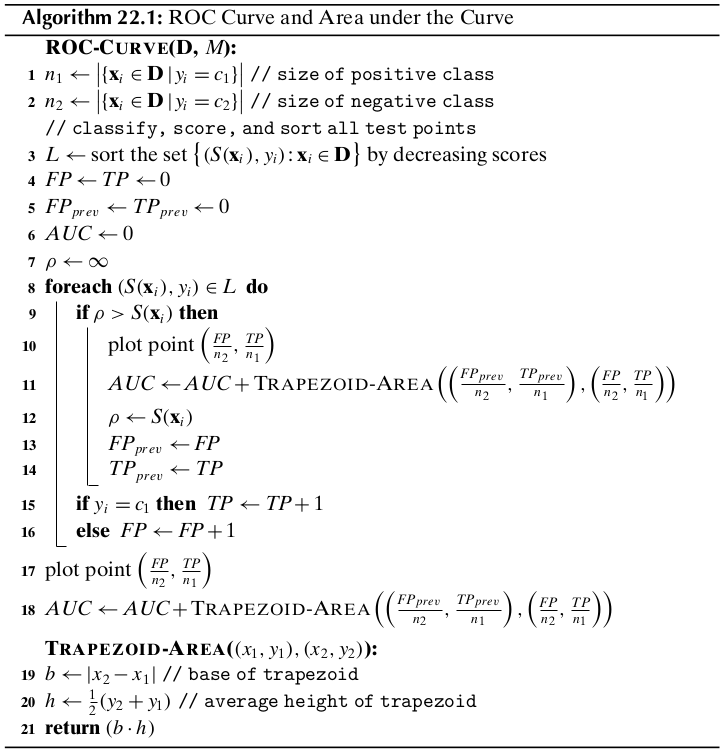
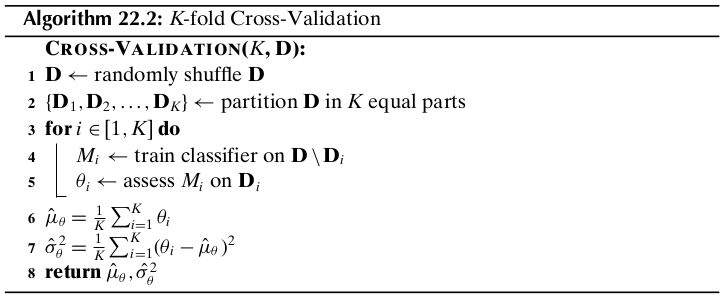
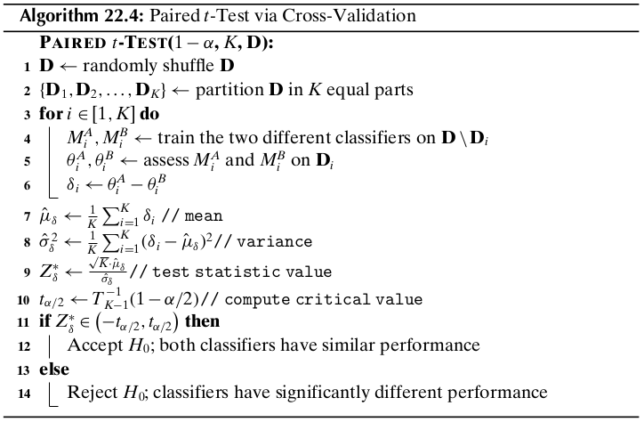
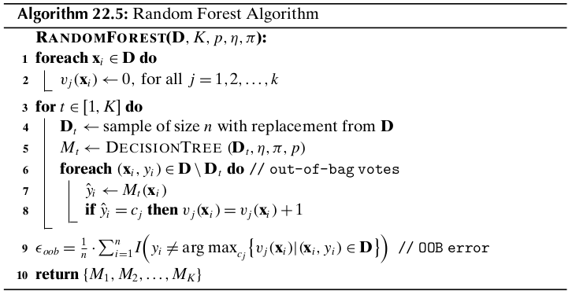
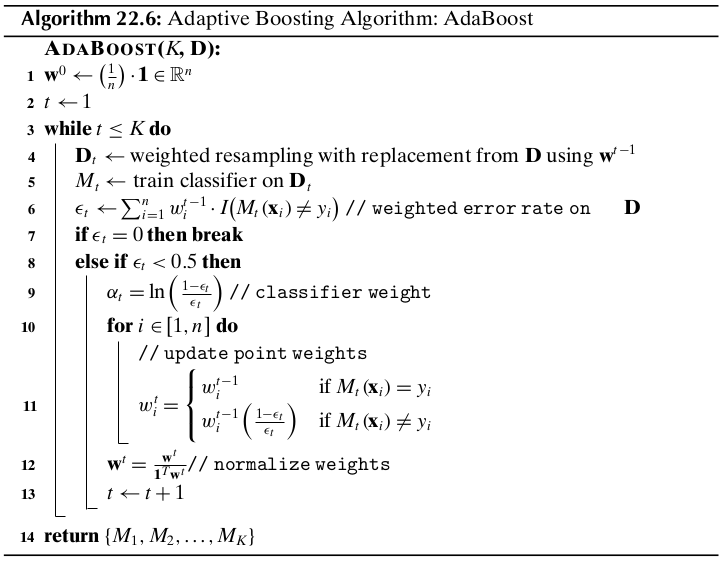
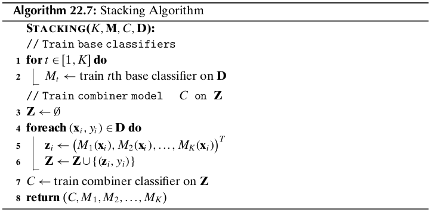

Chapter 22 Classification Assessment
====================================

We may think of the classifier as a model or function :math:`M` that predicts
the class label :math:`\hat{y}` for a given input example :math:`\x`:

.. math::

    \hat{y}=M(\x)

where :math:`\x=(x_1,x_2,\cds,x_d)^T\in\R^d` is a point in :math:`d`-dimensional 
space and :math:`\hat{y}=\{c_1,c_2,\cds,c_k\}` is its predicted class.

To build the classification model :math:`M` we need a *training set* of points along with their known classes.
Different classifiers are obtained depending on the assumptions used to build the model :math:`M`.
Once the model :math:`M` has been trained, we assess its performance over a 
separate *testing set* of points for which we know the true classes.
Finally, the model can be deployed to predict the class for future points whose class we typically do not know.

22.1 Classification Performance Measures
----------------------------------------

Let :math:`\D` be the testing set comprising :math:`n` points in a :math:`d` 
dimensional space, let :math:`\{c_1,c_2,\cds,c_k\}` denote the set of :math:`k`
class labels, and let :math:`M` be a classifier.
For :math:`\x_i\in\D`, let :math:`y_i` denote its true class, and let 
:math:`\hat{y_i}=M(\x_i)` denote its predicted class.

**Error Rate**

.. note::

    :math:`\dp Error\ Rate=\frac{1}{n}\sum_{i=1}^nI(y_i\ne\hat{y_i})`

**Accuracy**

.. note::

    :math:`\dp Accuracy=\frac{1}{n}\sum_{i=1}^nI(y_i=\hat{y_i})=1-Error\ Rate`

22.1.1 Contingency Table-based Measures
^^^^^^^^^^^^^^^^^^^^^^^^^^^^^^^^^^^^^^^

Let :math:`\cl{D}=\{\D_1,\D_2,\cds,\D_k\}` denote a partitioning of the testing 
points based on their true class labels, where

.. math::

    \D_j=\{\x_i^T|y_i=c_j\}\quad\rm{and}\quad n_i=|\D_i|

Let :math:`\cl{R}=\{\bs{R}_1,\bs{R}_2,\cds,\bs{R}_k\}` denote a partitioning of
the testing points based on the predicted labels, that is,

.. math::

    \bs{R}_j=\{\x_i^T|\hat{y_i}=c_j\}\quad\rm{and}\quad m_j=|\bs{R}_j|

The partitionings :math:`\cl{R}` and :math:`\cl{D}` induce a :math:`k\times k` 
contingency table :math:`\N`, also called a *confusion matrix*, defined as 
follows:

.. math::

    \N(i,j)=n_{ij}=|\bs{R}_i\cap\D_j|=|\{\x_a\in\D|\hat{y_a}=c_i\ \rm{and}\ y_a=c_j\}|

where :math:`1\leq i,j\leq k`.

**Accuracy/Precision**

.. note::

    :math:`\dp acc_i=prec_i=\frac{n_{ii}}{m_i}`

where :math:`m_i` is the number of examples predicted as :math:`c_i` by classifier :math:`M`.
The higher the accuracy on class :math:`c_i` the better the classifier.

.. note::

    :math:`\dp Accuracy=Precision=\sum_{i=1}^k\bigg(\frac{m_i}{n}\bigg)acc_i=\frac{1}{n}\sum_{i=1}^kn_{ii}`

**Coverage/Recall**

.. note::

    :math:`\dp coverage_i=recall_i=\frac{n_{ii}}{n_i}`

where :math:`n_i` is the number of points in class :math:`c_i`.
The higher the coverage the better the classifier.

**F-measure**

.. note::

    :math:`\dp F_i=\frac{2}{\frac{1}{prec_i}+\frac{1}{recall_i}}=\frac{2\cd prec_i\cd recall_i}{prec_i+recall_i}`
    :math:`\dp=\frac{2n_{ii}}{n_i+m_i}`

The higher the :math:`F_i` value the better the classifier.

.. note::

    :math:`\dp F=\frac{1}{k}\sum_{i=1}^rF_i`

For a perfect classifier, the maximum value of the F-measure is 1.

22.1.2 Binary Classification: Positive and Negative Class
^^^^^^^^^^^^^^^^^^^^^^^^^^^^^^^^^^^^^^^^^^^^^^^^^^^^^^^^^

When there are only :math:`k=2` classes, we call class :math:`c_i` the positive 
class and :math:`c_2` the negative class.

* *True Positives (TP)*

.. math::

    TP=n_{11}|\{\x_i|\hat{y_1}=y_1=c_1\}|

* *False Positives (FP)*

.. math::

    FP=n_{12}=|\{\x_i|\hat{y_i}=c_1\ \rm{and}\ y_i=c_2\}|

* *False Negatives (FN)*

.. math::

    FN=n_{21}=|\{\x_i|\hat{y_i}=c_2\ \rm{and}\ y_i=c_1\}|

* *True Negatives (TN)*

.. math::

    TN=n_{22}=|\{\x_i|\hat{y_i}=y_i=c_2\}|

**Error Rate**

.. note::

    :math:`\dp Error\ Rate=\frac{FP+FN}{n}`

**Accuracy**

.. note::

    :math:`\dp Accuracy=\frac{TP+TN}{n}`

**Class-specific Precision**

.. note::

    :math:`\dp prec_P=\frac{TP}{TP+FP}=\frac{TP}{m_1}`

    :math:`\dp prec_N=\frac{TN}{TN+FN}=\frac{TN}{m_2}`

where :math:`m_i=|\bs{R}_i|` is the number of points predicted by :math:`M` as having class :math:`c_i`.

**Sensitivity: True Positive Rate**

.. note::

    :math:`\dp TPR=recall_P=\frac{TP}{TP+FN}=\frac{TP}{n_1}`

where :math:`n_1` is the size of the positive class.

**Specificity: True Negative Rate**

.. note::

    :math:`\dp TNR=specificity=recall_N=\frac{TN}{FP+TN}=\frac{TN}{n_2}`

where :math:`n_2` is the size of the negative class.

**False Negative Rate**

.. note::

    :math:`FNR=\frac{FN}{TP+FN}=\frac{FN}{n_1}=1-sensitivity`

**False Positive Rate**

.. note::

    :math:`FPR=\frac{FP}{FP+TN}=\frac{FP}{n_2}=1-specificity`

22.1.3 ROC Analysis
^^^^^^^^^^^^^^^^^^^

Receiver Operating Characteristic (ROC) analysis is a popular strategy for 
assessing the performance of classifiers when there are two classes.

Typically, a binary calssifier chooses some positive score threshold 
:math:`\rho`, and classifies all points with score above :math:`\rho` as 
positive, with the remaining points classified as negative.
ROC analysis plots the performance of the classifier over all possible values of 
the threshold parameter :math:`\rho`.
In particular, for each value of :math:`\rho`, it plots the false positive rate
on the :math:`x`-axis versus the true positive rate on the :math:`y`-axis.
The resulting plot is called the *ROC curve* or *ROC plot* for the classifier.

Let :math:`S(\x_i)` denote the real-valued score for the positive class output
by a classifier :math:`M` for the point :math:`\x_i`.
Let the maximum and minimum score thresholds observed on testing dataset :math:`\D` be as follows:

.. math::

    \rho^\min=\min_i\{S(\x_i)\}\quad\quad\rho^\max=\max_i\{S(\x_i)\}

Initially, we classify all points as negative.
Both *TP* and *FP* are thus initially zero, resulting in *TPR* and *FPR* rates 
of zero, which correspond to the point (0,0) at the lower left corner in 
the ROC plot.
Next for each distinct value of :math:`\rho` in the range 
:math:`[\rho^\min,\rho^\max]`, we tabulate the set of positive points:

.. math::

    \bs{R}_1(\rho)=\{\x_i\in\D:S(\x_i)>\rho\}

and we compute the corresponding true and false positive rates, to obtain a new point in the ROC plot.
Finally, in the last step, we classify all points as positive.
Both *FN* and *TN* are thus zero, resulting in *TPR* and *FPR* values of 1.
This results in the point (1,1) at the top right-hand corner in the ROC plot.
An ideal classifier corresponds to the top left point (0,1), which correspoinds
to the case :math:`FPR=0` and :math:`TPR=1`, that is, the classifier has no 
false positives, and identifies all true positives.

As such, a ROC curve indicates the extent to which the classifier ranks positive 
instances higher than the negative instances.
An ideal classifier should score all positive points higher than any negative point.
Thus, a classifier with a curve closer to the ideal case, that is, closer to the 
upper left corner, is a better classifier.

**Area Under ROC Curve**

Because the total area of the plot is 1, the AUC lies in the interval :math:`[0,1]` - the higher the better.
The AUC value is essentially the probability that the classifier will rank a 
random positive test case higher than a random negative test instance.

**ROC/AUC Algorithm**

**Random Classifier**

A random classifier corresponds to a diagonal line in the ROC plot.
It follows that if the ROC curve for any classifier is below the diagonal, it 
indicates performance worse than random guessing.
For such cases, inverting the class assignment will produce a better classifier.

**Class Imbalance**

It is worth remarking that ROC curves are insensitive to class skew. 
This is because the *TPR*, interpreted a s the probability of predicting a 
positive point as positive, and the *FPR*, interpreted as the probability of 
predicting a negative point as positive, do not depend on the ratio of the 
positive to negative class size.

22.2 Classifier Evaluation
--------------------------

The input dataset :math:`\D` is randomly split into a disjoint training set and testing set.
The training set is used to learn the model :math:`M`, and the testing set is
used to evaluate the measure :math:`\theta`.

22.2.1 :math:`K`-fold Cross-Validation
^^^^^^^^^^^^^^^^^^^^^^^^^^^^^^^^^^^^^^

Cross-validation divides the dataset :math:`\D` into :math:`K` equal-sized 
parts, called *folds*, namely :math:`\D_1,\D_2,\cds,\D_k`.
Each fold :math:`\D_i` is, in turn, treated as the testing set, with the 
remaining folds comprising the training set 
:math:`\D\backslash\D_i=\bigcup_{j\ne i}\D_j`.
After training the model :math:`M_i` on :math:`\D\backslash\D_i`, we assess its
performance on the testing set :math:`\D_i` to obtain the :math:`i`\ th estimate
:math:`\th_i`.
The expected value of the performance measure can then be estimated as

.. math::

    \hat{\mu_\th}=E[\th]=\frac{1}{K}\sum_{i=1}^K\th_i

and its variance as

.. math::

    \hat{\sg_\th}^2=\frac{1}{K}\sum_{i=1}^K(\th_i-\hat{\mu_\th})^2

Usually :math:`K` is chosen to be 5 or 10.
The special case, when :math:`K=n`, is called *leave-one-out* cross-validation, 
where the tseting set comprises a single point and the remaining data is used 
for training purposes.

22.2.2 Bootstrap Resampling
^^^^^^^^^^^^^^^^^^^^^^^^^^^

The bootstrap method draws :math:`K` random samples of size :math:`n` *with replacement* from :math:`\D`.
Each sample :math:`\D_i` is thus the same size as :math:`\D`, and has several repeated points.
The probability that a point is selected is given as :math:`p=\frac{1}{n}`, and 
thus the probability that it is not selected is

.. math::

    q=1-p=\bigg(1-\frac{1}{n}\bigg)

Because :math:`\D_i` has :math:`n` points, the probability that :math:`\x_j` is 
not selected even after :math:`n` tries is given as

.. math::

    P(\x_j\notin\D_i)=q^n=\bigg(1-\frac{1}{n}\bigg)^n\simeq e\im=0.368

On the other hand, the probability that :math:`\x_j\in\D_i` is given as

.. math::

    P(\x_j\in\D_i)=1-P(\x_j\notin\D_i)=1-0.368=0.632

This means that each bootstrp sample contains approximately 63.2% of the points from :math:`\D`.

.. image:: ../_static/Algo22.3.png

22.2.3 Confidence Intervals
^^^^^^^^^^^^^^^^^^^^^^^^^^^

The sum of a large number of independent and identically distributed (IID) 
random variables has approximately a normal distribution, regardless of the
distribution of the individual random variables.
Let :math:`\th_1,\th_2,\cds,\th_K` be a sequence of IID random variables,
representing, for example, the error rate or some other performance measure over
the :math:`K`-folds in cross-validation or :math:`K` bootstrap samples.
Assume that each :math:`\th_i` has a finite mean :math:`E[\th_i]=\mu` and finite
variance :math:`\rm{var}(\th_i)=\sg^2`.

.. math::

    \hat{\mu}=\frac{1}{K}(\th_1+\th_2+\cds+\th_K)

.. math::

    E[\hat{mu}]=E\bigg[\frac{1}{K}(\th_1+\th_2+\cds+\th_K)\bigg]=\frac{1}{K}\sum_{i=1}^KE[\th_i]=\frac{1}{K}(K\mu)=\mu

.. math::

    \rm{var}(\hat{\mu})=var\bigg(\frac{1}{K}(\th_1+\th_2+\cds+\th_K)\bigg)=
    \frac{1}{K^2}\sum_{i=1}^K\rm{var}(\th_i)=\frac{1}{K^2}(K\sg^2)=
    \frac{\sg^2}{K}

.. math::

    std(\hat{\mu})=\sqrt{\rm{var}(\hat{\mu})}=\frac{\sg}{\sqrt{K}}

.. math::

    Z_K=\frac{\hat{\mu}-E[\hat{\mu}]}{std(\hat{\mu})}=\frac{\hat{\mu}-\mu}
    {\frac{\sg}{\sqrt{K}}}=\sqrt{K}\bigg(\frac{\hat{\mu}-\mu}{\sg}\bigg)

:math:`Z_K` specifiese the deviation of the estimated mean from the true mean in terms of its standard deviation.
The central limit theorem states that, as the sample size increases, the random 
variable :math:`Z_K` *converges in distribution* to the standard normal 
distribution.
That is, as :math:`K\rightarrow\infty`, for any :math:`x\in\R`, we have

.. math::

    \lim_{k\rightarrow\infty}P(Z_K\leq x)=\Phi(x)

where :math:`\Phi(x)` is the cumulative distribution function for the standard normal density function :math:`f(x|0,1)`.
Given significance level :math:`\alpha\in(0,1)`, let :math:`z_{\alpha/w}` denote 
the critical :math:`z`-score value for the standard normal distribution that 
encompasses :math:`\alpha/2` of the probability mass in the right tail, defined 
as

.. math::

    P(Z_K\geq z_{\alpha/w})=\frac{\alpha}{2},\rm{or\ equivalently\ }
    \Phi(z_{\alpha/2})=P(Z_K\leq z_{\alpha/2})=1-\frac{\alpha}{2}

Also, because the normal distribution is symmetric about the mean, we have

.. math::

    P(Z_K\geq -z_{\alpha/2})=1-\frac{\alpha}{2},\rm{or\ equivalently\ }\Phi(-z_{\alpha/2})=\frac{\alpha}{2}

Thus, given confidence level :math:`1-\alpha`, we can find the lower and upper 
critical :math:`z`-score values, so as to encompass :math:`1-\alpha` fraction of
the probability mass, which is given as

.. math::

    P(-z_{\alpha/2}\leq Z_K\leq z_{\alpha/2})=\Phi(z_{\alpha/2})-
    \Phi(-z_{\alpha/2})=1-\frac{\alpha}{2}-\frac{\alpha}{2}=1-\alpha

Note that

.. math::

    -z_{\alpha/2}\leq Z_K\leq z_{\alpha/2}&\Rightarrow -z_{\alpha/2}\leq\sqrt{K}
    \bigg(\frac{\hat{\mu}-\mu}{\sg}\bigg)\leq z_{\alpha/2}

    &\Rightarrow -z_{\alpha/2}\frac{\sg}{\sqrt{K}}\leq\hat{\mu}-\mu\leq z_{\alpha/2}\frac{\sg}{\sqrt{K}}

    &\Rightarrow \bigg(\hat{\mu}-z_{\alpha/2}\frac{\sg}{\sqrt{K}}\bigg)\leq\mu
    \leq\bigg(\hat{\mu}+z_{\alpha/2}\frac{\sg}{\sqrt{K}}\bigg)

.. note::

    :math:`\dp P\bigg(\hat{\mu}-z_{\alpha/2}\frac{\sg}{\sqrt{K}}\leq\mu`
    :math:`\dp\leq\hat{\mu}+z_{\alpha/2}\frac{\sg}{\sqrt{K}}\bigg)=1-\alpha`

Thus, for any given level of confidence :math:`1-\alpha`, we can compute the
corresponding :math:`100(1-\alpha)\%` confidence interval 
:math:`(\hat{\mu}-z_{\alpha/2}\frac{\sg}{\sqrt{K}},`
:math:`\hat{\mu}+z_{\alpha/2}\frac{\sg}{\sqrt{K}})`.

**Unknown Variance**

We can replace :math:`\sg^2` by the sample variance

.. math::

    \hat{\sg}^2=\frac{1}{K}\sum_{i=1}^K(\th_i\hat{\mu})^2

because :math:`\hat{\sg}^2` is a *consistent* estimator for :math:`\sg^2`, that 
is, as :math:`K\rightarrow\infty`, :math:`\hat{\sg}^2` converges with 
probability 1, also called *converges almost surely*, to :math:`\sg^2`.
The central limit theorem then states that the random variable :math:`Z_K^*`
defined below converges in distribution to the standard normal distribution:

.. math::

    Z_K^*=\sqrt{K}\bigg(\frac{\hat{\mu}-\mu}{\hat{\sg}}\bigg)

.. note::

    :math:`\dp\lim_{K\rightarrow\infty}P\bigg(\hat{\mu}-z_{\alpha/2}\frac{\hat{\sg}}{\sqrt{K}})`
    :math:`\dp\leq\mu\leq\hat{\mu}-z_{\alpha/2}\frac{\hat{\sg}}{\sqrt{K}}\bigg)=1-\alpha`

In other words, :math:`(\hat{\mu}-z_{\alpha/2}\frac{\hat{\sg}}{\sqrt{K}},)`
:math:`\hat{\mu}-z_{\alpha/2}\frac{\hat{\sg}}{\sqrt{K}})` is the 
:math:`100(1-\alpha)\%` confidence interval for :math:`\mu`.

**Small Sample Size**

Consider the random variables :math:`V_i`, for :math:`i=1,\cds,K`, defined as

.. math::

    V_i=\frac{\th_i-\hat{\mu}}{\sg}

Further, consider the sum of their squares:

.. math::

    S=\sum_{i=1}^KV_i^2=\sum_{i=1}^K\bigg(\frac{\th_i-\hat{\mu}}{\sg}\bigg)^2=
    \frac{1}{\sg^2}\sum_{i=1}^K(\th_i-\hat{\mu})^2=\frac{K\hat{\sg}^2}{\sg^2}

If we assume that the :math:`V_i`'s are IID with the standard normal 
distribution, then the sum :math:`S` follows a chi-squared distribution with
:math:`K-1` degrees of freedom, denoted :math:`\chi^2(K-1)`, since :math:`S` is
the sum of the squares of :math:`K` random variables :math:`V_i`.
There are only :math:`K-1` degrees of freedom because each :math:`V_i` depends
on :math:`\hat{\mu}` and the sum of the :math:`\th_i`'s is thus fixed.

.. math::

    Z_K^*&=\sqrt{K}\bigg(\frac{\hat{\mu}-\mu}{\hat{\sg}}\bigg)=\bigg(\frac{\hat{\mu}-\mu}{\hat{\sg}/\sqrt{K}}\bigg)

    &=\bigg(\frac{\hat{\mu}-\mu}{\hat{\sg}/\sqrt{K}}\bigg/
    \frac{\hat{\sg}/\sqrt{K}}{\sg/\sqrt{K}}\bigg)=\bigg(
    \frac{\frac{\hat{\mu}-\mu}{\hat{\sg}/\sqrt{K}}}{\hat{\sg}/\sg}\bigg)=
    \frac{Z_K}{\sqrt{S/K}}

Assuming that :math:`Z_K` follows a standard normal distribution, and noting 
that :math:`S` follows a chi-squared distribution with :math:`K-1` degrees of
freedom, then the distribution of :math:`Z_K^*` is precisely the Student's
:math:`t` distribution with :math:`K-1` degrees of freedom.
Thus, in the small sample case, instead of using the standard normal density to 
derive the confidence interval, we use the :math:`t` distribution.
In particular, given confidence level :math:`1-\alpha` we choose the critical
value :math:`t_{\alpha/2}` such that the cumulative :math:`t` distribution 
function with :math:`K-1` degrees of freedom encompasses :math:`\alpha/2` of the
probability mass in the right tail.
That is,

.. math::

    P(Z_K^*\geq t_{\alpha/2})=1-T_{K-1}(t_{\alpha/2})=\alpha/2

.. math::

    P\bigg(\hat{\mu}-t_{\alpha/2}\frac{\hat{\sg}}{\sqrt{K}}\leq\mu\leq
    \hat{\mu}-t_{\alpha/2}\frac{\hat{\sg}}{\sqrt{K}}\bigg)=1-\alpha

The :math:`100(1-\alpha)%` confidence interval for the true mean :math:`\mu` is thus

.. note::

    :math:`\dp\bigg(\hat{\mu}-t_{\alpha/2}\frac{\hat{\sg}}{\sqrt{K}}\leq`
    :math:`\dp\mu\leq\hat{\mu}-t_{\alpha/2}\frac{\hat{\sg}}{\sqrt{K}}\bigg)`

As :math:`K` increases, the :math:`t` distribution very rapidly converges in 
distribution to the standard normal distribution, consistent with the large 
sample case.
Thus, for large samples, we may use the usual :math:`z_{\alpha/2}` threshold.

22.2.4 Comparing Classifiers: Paired :math:`t`-Test
^^^^^^^^^^^^^^^^^^^^^^^^^^^^^^^^^^^^^^^^^^^^^^^^^^^

We look at a method that allows us to test for a significant difference in the 
classification performance of two alternative classifiers, :math:`M^A` and 
:math:`M^B`.
We want to assess which of them has a superior classification performance on a given dataset :math:`\D`.
We perform a *paired test*, with both classifiers trained and tested on the same data.
Let :math:`\th_1^A,\th_2^A,\cds,\th_K^A` and 
:math:`\th_1^B,\th_2^B,\cds,\th_K^B` denote the performance values for 
:math:`M^A` and :math:`M^B`, respectively.
To determine if the two classifiers have different or similar performance, 
define the random variable :math:`\delta_i` as the difference in their
performance on the :math:`i`\ th dataset:

.. math::

    \delta_i=\th_i^A-\th_i^B

.. math::

    \hat{\mu_delta}=\frac{1}{K}\sum_{i=1}^K\delta_i\quad\quad\hat{\sg_\delta}^2=
    \frac{1}{K}\sum_{i=1}^K(\delta_i-\hat{\mu_\delta})^2

The null hypothesis :math:`H_0` is that their performance is the same, that is, 
the true expected difference is zero, whereas the alternative hypothesis 
:math:`H_a` is that they are not the same, that is, the true expected difference
:math:`\mu_\delta` is not zero:

.. math::

    H_0: \mu_\delta=0\quad\quad H_a:\mu_\delta\neq 0

.. math::

    Z_\delta^*=\sqrt{K}\bigg(\frac{\hat{\mu_\delta}-\mu_\delta}{\hat{\sg_\delta}}\bigg)

.. note::

    :math:`\dp Z_\delta^*=\frac{\sqrt{K}\hat{\mu_\delta}}{\hat{\sg_\delta}}\sum t_{K-1}`

where the notation :math:`Z_\delta^*\sim t_{K-1}` means that :math:`Z_\delta^*` 
follows the :math:`t` distribution with :math:`K-1` degress of freedom.

Given a desired confidence level :math:`1-\alpha`, we conclude that

.. math::

    P(-t_{\alpha/2}\leq Z_\delta^*\leq t_{\alpha/2})=1-\alpha

22.3 Bias-Variance Decomposition
--------------------------------

Given a training set :math:`\D` comprising :math:`n` points :math:`\x_i\in\R^d`,
with their corresponding classes :math:`y_i`, a learned classification model
:math:`M` predicts the class for a given test point :math:`\x`.
A *loss function* specifies the cost or penalty of predicting the class to be 
:math:`\hat{y}=M(\x)`, when the true class is :math:`y`.
A commonly used loss function for classification is the *zero-one loss*, defined as

.. math::

    L(y,M(\x))=I(M(\x)\neq y)=\left\{\begin{array}{lr}0\quad\rm{if\ }M(\x)=y\\
    1\quad\rm{if\ }M(\x)\neq y\end{array}\right.

Another commonly used loss function is the *squared loss*, defined as

.. math::

    L(y,M(\x))=(y-M(\x))^2

where we assume that the classes are discrete valued, and not categorical.

**Expected Loss**

The goal of learning a classification model can be cast as minimizing the expected loss:

.. math::

    E_y[L(y,M(\x))|\x]=\sum_yL(y,M(\x))\cd P(y|\x)

where :math:`E_y` denotes that the expectation is taken over the different class values :math:`y`.

Minimizing the expected zero-one loss corresponds to minimizing the error rate.
Let :math:`M(\x)=c_i`, then we have

.. math::

    E_y[L(y,M(\x))|\x]&=E_y[I(y\neq M(\x))|\x]

    &=\sum_y I(y\neq c_i)\cd P(y|\x)

    &=\sum_{y\neq c_i}P(y|\x)

    &=1-P(c_i|\x)

Thus, to minimize the expected loss we should choose :math:`c_i` as the class 
that maximizes the posterior probability, that is, 
:math:`c_i=\arg\max_yP(y|\x)`.

**Bias and Variance**

Intuitively, the *bias* of a classifier refers to the systematic deviation of 
its predicted decision boundary from the true decision boundary, whereas the 
*variance* of a classifier refers to the deviation among the learned decision
boundaries over different training sets.
More formally, because :math:`M` depends on the training set, given a test point
:math:`\x`, we denote its predicted value as :math:`M(\x,\D)`.

.. math::

    E[L&(y,M(\x,\D))|\x,\D]
    
    &=E_y[(y-M(\x,\D))^2|\x,\D]

    &=E_y[(y-E_y[y|\x]+E_y[y|\x]-M(\x,\D))^2|\x,\D]

    &=E_y[(y-E_y[y|\x])^2|\x,\D]+E_y[(M(\x,\D)-E_y[y|\x])^2|\x,\D]
    
    &\quad+E_y[2(y-E_y[y|\x])\cd(E_y[y|\x]-M(\x,\D))|\x,\D]

    &=E_y[(y-E_y[y|\x])^2|\x,\D]+(M(\x,\D)-E_y[y|\x])^2

    &\quad+2(E_y[y|\x]-M(\x,\D))\cd(E_y[y|\x]-E_y[y|\x])

    &=E_y[(y-E_y[y|\x])^2|\x,\D]+(M(\x,\D)-E_y[y|\x])^2

The average or expected squared error for a given test point :math:`\x` over all training sets is then given as

.. math::

    E_\D[&(M(\x,\D)-E_y[y|\x])^2]
    
    &=E_\D[(M(\x,\D)-E_\D[M(\x,\D)]+E_\D[M(\x,\D)]-E_y[y|\x])^2]

    &=E_\D[(M(\x,\D)-E_\D[M(\x,\D)])^2]+E_\D[(E_\D[M(\x,\D)]-E_y[y|\x])^2]

    &\quad+2(E_\D[M(\x,\D)]-E_y[y|\x])\cd(E_\D[M(\x,\D)]-E_\D[M(\x,\D)])

    &=E_\D[(M(\x,\D)-E_\D[M(\x,\D)])^2]+(E_\D[M(\x,\D)]-E_y[y|\x])^2

The expected squared loss over all test points :math:`\x` and over all training 
sets :math:`\D` of size :math:`n` yields the following decomposition into noise,
variance and bias terms:

.. note::

    :math:`E_{\x,\D,y}[(y-M(\x,\D))^2]`

    :math:`\quad=E_{\x,\D,y}[(y-E_y[y|\x])^2|\x,\D]+E_{\x,\D}[(M(\x,\D)-E_y[y|\x])^2]`

    :math:`\quad=E_{\x,y}[(y-E_y[y|\x])^2]+E_{\x,\D}[(M(\x,\D)-E_\D[M(\x,\D)])]`

    :math:`\quad\quad+E_\x[(E_\D[M(\x,\D)]-E_y[y|\x])^2]`

Thus, the expected square loss over all test points and training sets can be
decomposed into three terms: noise, average bias, and average variance.
In general, the expected loss can be attributed to high bias or high variance, 
with typically a trade-off between these two terms. 
Ideally, we seek a balance between these opposing trends, that is, we prefer a 
classifier with an acceptable bias (reflecting domain or dataset specific 
assumptions) and as low a variance as possible.

22.4 Ensemble Classifiers
-------------------------

A classifier is called *unstable* if small pertubations in the training set 
result in large changes in the prediction or decision boundary.
High variance classifiers are inherently unstable, since they tend to overfit the data.
On the other hand, high bias methods typically underfit the data, and usually have low variance.
In either case, the aim of learning is to reduce classification error by reducing the variance or bias, ideally both.
Ensemble methods create a *combined classifier* using the output of multiple 
*base classifiers*, which are trained on different data subsets.

22.4.1 Bagging
^^^^^^^^^^^^^^

*Bagging*, which stands for *Bootstrap Aggregation*, is an ensemble 
classification method that employs multiple bootstrap samples (with replacement)
from the input training data :math:`\D` to create slightly different training
set :math:`\D_t,t=1,2,\cds,K`.
Different base classifiers :math:`M_t` are learned, with :math:`M_t` trained on :math:`\D_t`.
Given any test point :math:`\x`, it is first classified using each of the :math:`K` base classifiers, :math:`M_t`.
Let the number of classifiers that predict the class of :math:`\x` as :math:`c_j` be given as

.. math::

    v_j(\x)=|\{M_t(\x)=c_j|t=1,\cds,L\}|

The combined classifier, denoted :math:`\M^K`, predicts the class of a test 
point :math:`\x` by *majority voting* among the :math:`k` classes:

.. math::

    \M^K(\x)=\arg\max_{c_j}\{v_j(\x)|j=1,\cds,k\}

For binary classification, assuming that the classes are given as 
:math:`\{+1,-1\}`, the combined classifier :math:`\M^K` can be expressed more
simply as

.. math::

    \M^K(\x)=\rm{sign}\bigg(\sum_{t=1}^KM_t(\x)\bigg)

Bagging can help reduce the variance, especially if the base classifiers are 
unstable, due to the averaging effect of majority voting. It does not, in 
general, have much effect on the bias.

22.4.2 Random Forest: Bagging Decision Trees
^^^^^^^^^^^^^^^^^^^^^^^^^^^^^^^^^^^^^^^^^^^^

A *random forest* is an ensemble of :math:`K` classifiers, :math:`M_1,\cds,M_K`,
where each classifier is a decision tree created from a different bootstrap 
sample, as in bagging.
However, the key difference from bagging is that the trees are built by sampling
a random subset of the attributes at each internal node in the decision tree.
The random sampling of the attributes results in reducing the correlation between the trees in the ensemble.

Let :math:`\D` be the training dataset comprising :math:`n` points 
:math:`\x_j\in\R^d` along with the corresponding class :math:`y_j`.
Let :math:`\D_t` denote the :math:`t`\ th bootstrap sample of size :math:`n` 
drawn from :math:`\D` via sampling with replacement.
Let :math:`p\leq d` denote the number of attributes to sample for evaluating the split points.
The random forest algorithm uses the :math:`t`\ th bootstrap sample to learn a 
decision tree model :math:`M_t` via the decision tree method with one major 
change.
Instead of evaluating all the :math:`d` attributes to find the best split point,
it samples :math:`p\leq d` attributes at random, and evaluates split points for
only those attributes.

The :math:`K` decision trees :math:`M_1,M_2,\cds,M_K` comprise the random forest 
model :math:`\M_k`, which predicts the class of a test point :math:`\x` by 
majority voting as in bagging:

.. math::

    \M^K(\x)=\arg\max_{c_j}\{v_j(\x)|j=1,\cds,k\}

where :math:`v_j` is the number of trees that predict the class of :math:`\x` as :math:`c_j`.
That is,

.. math::

    v_j(\x)=|\{M_t(\x)=c_j|t=1,\cds,K\}|

Notice that if :math:`p=d` the the random forest approach is equivalent to bagging over decision tree models.

Given bootstrap sample :math:`\D_t`, any point in :math:`\D\backslash\D_t` is
called an *out-of-bag* point for classifier :math:`M_t`, since it was not used
to train :math:`M_t`.
One of the side-benefits of the bootstrap approach is that we can compute the
*out-of-bag* error rate for the random forest by considering the prediction of
each model :math:`M_t` over its out-of-bag points.
Let :math:`v_j(\x)` be the number of votes for class :math:`c_j` over all 
decision trees in the ensemble where :math:`\x` was out-of-bag.
We can aggregate these votes after we train each classifier :math:`M_t`, by
incrementing the value :math:`v_j(\x)` if :math:`\hat{y}=M_t(\x)=c_j` and if 
:math:`\x` is out-of-bag for :math:`M_t`.
The out-of-bag (OOB) error for the random forest is given as:

.. math::

    \epsilon_{oob}=\frac{1}{n}\cd\sum_{i=1}^nI(y_i\ne\arg\max_{c_j}\{v_j(\x_i)|(\x_i,y_i)\in\D\})

The out-of-bag error rate approximates the cross-validation error rate quite 
well, and can be used in lieu of :math:`k`-fold cross-validation to evaluate the 
random forest model.

22.4.3 Boosting
^^^^^^^^^^^^^^^

Starting from an initial training sample :math:`\D_1`, we train the base 
classifier :math:`M_1`, and obtain its training error rate.
To construct the next sample :math:`\D_2`, we select the misclassified instances
with higher probability, and after training :math:`M_2`, we obtain its training 
error rate.
To construct :math:`\D_3`, those instances that are hard to classify by 
:math:`M_1` or :math:`M_2`, have a higher probability of being selected.
This process is repeated for :math:`K` iterations.
Finally, the combined classifier is obtained via weighted voting over the output 
of the :math:`K` base classifiers :math:`M_1,M_2,\cds,M_K`.

**Adaptive Boosting: AdaBoost**

Let :math:`\D` be the input training set, comprising :math:`n` points :math:`\x_i\in\R^d`.
The boosting process will be repeated :math:`K` times.
Let :math:`t` denote the iteration and let :math:`\alpha_t` denote the weight 
for the :math:`r`\ th classifier :math:`M_t`.
Let :math:`w_i^t` denote the weight for :math:`\x_i`, with 
:math:`\w^t=(w_1^t,w_2^t,\cds,w_n^t)^T` being the weight vector over all the 
points for the :math:`t`\ th iteration.
In fact, :math:`\w` is a probability vector, whose elements sum to one.
Initially all points have equal weights, that is,

.. math::

    \w^0=\bigg(\frac{1}{n},\frac{1}{n},\cds,\frac{1}{n}\bigg)^T=\frac{1}{n}\1

During iteration :math:`t`, the training sample :math:`\D_t` is obtained via
weighted resampling using the distribution :math:`\w^{t-1}`, that is, we draw a
sample of size :math:`n` with replacement, such that the :math:`i`\ th point is
chosen according to its probability :math:`w_i^{t-1}`.
Next, we train the classifier :math:`M_t` using :math:`\D_t`, and compute its
weighted error rate :math:`\epsilon_t` on the entire input dataset :math:`\D`:

.. math::

    \epsilon_t=\sum_{i=1}^nw_i^{t-1}\cd I(M_t(\x_i)\neq y_i)

The weight :math:`\alpha_t` for the :math:`t`\ th classifier is then set as

.. math::

    \alpha_t=\ln\bigg(\frac{1-\epsilon_t}{\epsilon_t}\bigg)

and the weight for each point :math:`\x_i\in\D` is updated based on whether the point is misclassified or not

.. math::

    w_i^t=w_i^{t-1}\cd\exp\{\alpha_t\cd I(M_t(\x_i)\neq y_i)\}

Thus, if the predicted class matches the true class, that is, if 
:math:`M_t(\x_i)=y_i`, then :math:`I(M_t(\x_i)\neq y_i)=0`, and the weight for
point :math:`\x_i` remains unchanged.
On the other hand, if the point is misclassified, that is, 
:math:`M_t(\x_i)\neq y_i`, then we have :math:`I(M_t(\x_i)\neq y_i)=1` and

.. math::

    w_i^t=w_i^{t-1}\cd\exp\{\alpha_t\}=w_i^{t-1}\exp\bigg\{\ln\bigg(
        \frac{1-\epsilon_t}{\epsilon}\bigg)\bigg\}=w_i^{t-1}
        \bigg(\frac{1}{\epsilon_t}-1\bigg)

Once the point weights have been updated, we re-normalize the weights so that :math:`\w^t` is a probability vector:

.. math::

    \w_t=\frac{\w^t}{\1^T\w^t}=\frac{1}{\sum_{j=1}^nw_j^t}(w_1^t,w_2^t,\cds,w_n^t)^T

**Combined Classifier**

Given the set of boosted classifiers, :math:`M_1,M_2,\cds,M_K`, along with their
weights :math:`\alpha_1,\alpha_2,\cds,\alpha_K`, the class for a test case 
:math:`\x` is obtained via weighted majority voting.
Let :math:`v_j(\x)` denote the weighted vote for class :math:`c_j` over the :math:`K` classifiers, given as

.. math::

    v_j(\x)=\sum_{t=1}^K\alpha_t\cd I(M_t(\x)=c_j)

The combined classifier, denoted :math:`\M^K`, then predicts the class for :math:`\x` as follows:

.. math::

    \M^K(\x)=\arg\max_{c_j}\{v_j(\x)|j=1,\cds,k\}

In the case of binary classification, with classes :math:`\{+1,-1\}`, the 
combined classifier :math:`\M^K` can be expressed more simply as

.. math::

    \M^K(\x)=\rm{sign}\bigg(\sum_{t=1}^K\alpha_tM_t(\x)\bigg)

**Bagging as a Special Case of AdaBoost**

Bagging can be considered as a special case of AdaBoost, where 
:math:`w_t=\frac{1}{n}\1`, and :math:`\alpha_t=1` for all :math:`K` iterations.

22.4.4 Stacking
^^^^^^^^^^^^^^^

Stacking or staced generalization is an ensemble technique where we employ two layers of classifiers.
The first layer is composed of :math:`K` base classifiers which are trained 
independently on the entire training data :math:`\D`.
However, the base classifiers should differ from or be complementary to each 
other as much as possible so that they perform well on different subsets of the 
input space. 
The second layer comprises a combiner classifier :math:`C` that is trained on the 
predicted classes from the base classifiers, so that it automatically learns how 
to combine the outputs of the base classifiers to make the final prediction for a 
given input.

