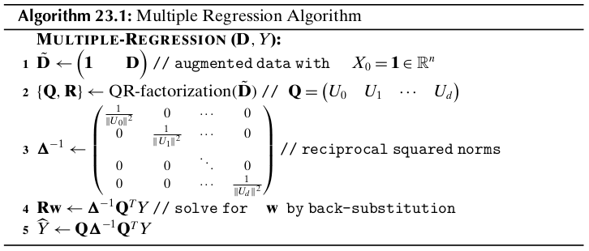
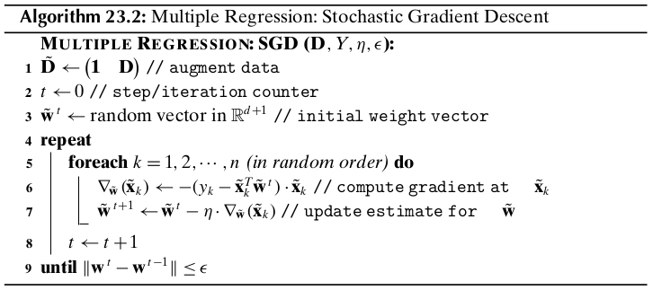
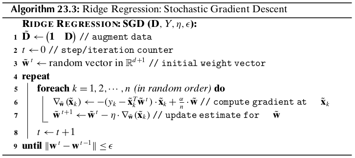
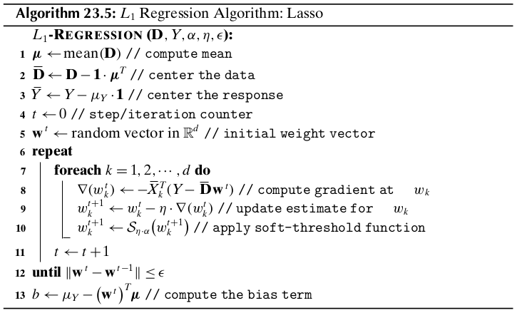

Chapter 23 Linear Regression
============================

Given a set of attributes or variables :math:`X_1,X_2,\cds,X_d`, called the 
*predictor*, *explanatory*, or *independent* variables, and given a real-valued 
attribute of interest :math:`Y`, called the *response* or *dependent* variable,
the aim of *regression* is to predict the response variable based on the 
independent variables.
That is, the goal is to learn a *regression function* :math:`f`, such that

.. math::

    Y=f(X_1,X_2,\cds,X_d)+\ve=f(\X)+\ve

where :math:`\X=(X_1,X_2,\cds,X_d)^T` is the multivariate random variable 
comprising the predictor attributes, and :math:`\ve` is a random *error term* 
that is assumed to be independent of :math:`\X`.
In other words, :math:`Y` is comrpised of two components, one dependent on the
observed predictor attributes, and the other, coming from the error term,
independent of the predictor attributes.
The error term encapsulates inherent uncertainty in :math:`Y`, as well as,
possibly the effect of unobserved, hidden or *latent* variables.

23.1 Linear Regression Model
----------------------------

In *linear regression* the function :math:`f` is assumed to be linear in its parameters, that is

.. note::

    :math:`\dp f(\X)=\beta+\omega_1X_1+\omega_2X_2+\cds+\omega_dX_d=\beta+\sum_{i=1}^d\omega_iX_i=\beta+\bs{\omega}^T\X`

Here, the parameter :math:`\beta` is the true (unknown) *bias* term, the 
parameter :math:`\omega_i` is the true (unknown) *regression coefficient* or
*weight* for attribute :math:`X_i`, and 
:math:`\bs{\omega}=(\omega_1,\omega_2,\cds,\omega_d)^T` is the true :math:`d`-
dimensional weight vector.
Observe that :math:`f` specifies a hyperplane in :math:`\R^{d+1}`, where 
:math:`\bs{\omega}` is the weight vector that is normal or orthogonal to the
hyperplane, and :math:`\beta` is the *intercept* or offset term.
We can see that :math:`f` is completely specified by the :math:`d+1` parameters
comprising :math:`\beta` and :math:`\omega_i`, for :math:`i=1,\cds,\d`.

The true bias and regression coefficients are unknown.
Therefore, we have to estimate them from the training dataset :math:`\D` 
comprising :math:`n` points :math:`\x_i\in\R^d` in a :math:`d`-dimensional 
space, and the corresponding response values :math:`y_i\in\R`, for 
:math:`i=1,2,\cds,n`.
Let :math:`b` denote the estimated value for the true bias :math:`\beta`, and 
let :math:`w_i` denote the estimated value for the true regression coefficient 
:math:`w_i`, for :math:`i=1,2,\cds,d`.
Let :math:`\w=(w_1,w_2,\cds,w_d)^T` denote the vector of estimated weights.
Given the estimated bias and weight values, we can predict the response for any 
given input or test point :math:`\x=(x_1,x_2,\cds,x_d)^T`, as follows:

.. math::

    \hat{y}=b+w_1x_1+\cds+w_dx_d=b+\w^T\x

The difference between the observed and predicted response, called the *residual error*, is given as

.. math::

    \epsilon=y-\hat{y}=y-b-\w^T\X

The residual error :math:`\epsilon` is an estimator of the random error term :math:`\ve`.

A common approach to predicting the bias and regression coefficients is to use the method of *least squares*.
That is, given the training data :math:`\D` with points :math:`\x_i` and 
response values :math:`y_i` (for :math:`i=1,\cds,n`), we seek values :math:`b`
and :math:`\w`, so as to minimize the sum of squared residual errors (SSE)

.. note::

    :math:`\dp SSE=\sum_{i=1}^n\epsilon_i^2=\sum_{i=1}^n(y_i-\hat{y_i})^2=\sum_{i=1}^n(y_i-b-\w^T\x_i)^2`

23.2 Bivariate Regression
-------------------------

Let us first consider the case where the input data :math:`\D` comprises a 
single predictor attribute, :math:`W=(x_1,x_2,\cds,x_n)^T`, along with the
response variable, :math:`Y=(y_1,y_2,\cds,y_n)^T`.
Since :math:`f` is linear, we have

.. note::

    :math:`\hat{y_i}=f(x_i)=b+w\cd x_i`

Thus, we seek the straight line :math:`f(x)` with slope :math:`w` and intercept :math:`b` that *best fits* the data.
The residual error, which is the difference between the predicted value (also
called *fitted value*) and the observed value of the response variable, is given
as

.. math::

    \epsilon_i=y_i-\hat{y_i}

Note that :math:`|\epsilon_i|` denotes the vertical distance between the fitted and observed response.
The best fitting line minimizes the sum of squared errors

.. note::

    :math:`\dp\min_{b,w}SSE=\sum_{i=1}^n\epsilon_i^2=\sum_{i=1}^n(y_i-\hat{y_i})^2=\sum_{i=1}^n(y_i-b-w\cd x_i)^2`

.. math::

    \frac{\pd}{\pd b}SSE&=-2\sum_{i=1}^n(y_i-b-w\cd x_i)=0

    &\Rightarrow\sum_{i=1}^n b=\sum_{i=1}^ny_i-w\sum_{i=1}^nx_i

    &\Rightarrow b=\frac{1}{n}\sum_{i=1}^ny_i-w\cd\frac{1}{n}\sum_{i=1}^nx_i

.. note::

    :math:`b=\mu_Y-w\cd\mu_X`

where :math:`\mu_Y` is the sample mean for the response and :math:`\mu_X` is the 
sample mean for the predictor attribute.

.. math::

    \frac{\pd}{\pd w}SSE&=-2\sum_{i=1}^nx_i(y_i-b-w\cd x_i)=0

    &\Rightarrow\sum_{i=1}^nx_i\cd y_i-b\sum_{i=1}^nx_i-w\sum_{i=1}^nx_i^2=0

    &\Rightarrow\sum_{i=1}^nx_i\cd y_i-\mu_Y\sum_{i=1}^nx_i+w\cd\mu_X\sum_{i=1}^nx_i-w\sum_{i=1}^nx_i^2=0

    &\Rightarrow w\bigg(\sum_{i=1}^nx_i^2-n\cd\mu_X^2\bigg)=\bigg(\sum_{i=1}^nx_i\cd y_i\bigg)-n\cd\mu_X\mu_Y

    &\Rightarrow w=\frac{(\sum_{i=1}^nx_i\cd y_i)-n\cd\mu_X\cd\mu_Y}{(\sum_{i=1}^nx_i^2)-n\cd\mu_X^2}

.. note::

    :math:`\dp w=\frac{\sum_{i=1}^n(x_i-\mu_X)(y_i-\mu_Y)}{\sum_{i=1}^n(x_i-\mu_X)^2}=`
    :math:`\dp\frac{\sg_{XY}}{\sg_X^2}=\frac{\rm{cov}(X,Y)}{\rm{var}(X)}`

where :math:`\sg_X^2` is the variance of :math:`X` and :math:`\sg_{XY}` is the 
covariance between :math:`X` and :math:`Y`.
Noting that the correlation between :math:`X` and :math:`Y` is given as 
:math:`\rho_{XY}=\frac{\sg_{XY}}{\sg_X\cd\sg_Y}`, we can also write :math:`w` as

.. math::

    w=\rho_{XY}=\frac{\sg_Y}{\sg_X}

.. math::

    \hat{y_i}=b+w\cd x_i=\mu_Y-w\cd\mu_X+w\cd x_i=\mu_Y+w(x_i-\mu_X)

Thus, the point :math:`(\mu_X,\mu_Y)` lins on the regression line.

23.2.1 Geometry of Bivariate Regression
^^^^^^^^^^^^^^^^^^^^^^^^^^^^^^^^^^^^^^^

Let :math:`X=(x_1,x_2,\cds,x_n)^T` be the :math:`n`-dimensional vector denoting 
the training data sample, :math:`Y=(y_1,y_2,\cds,y_n)^T` the sample vector for
the response variable, and 
:math:`\hat{Y}=(\hat{y_1},\hat{y_2},\cds,\hat{y_n})^T` the vector of predicted
values, then we can express the :math:`n` equations, :math:`y_i=b+w\cd x_i` for
:math:`i=1,2,\cds,n`, as a single vector equation:

.. math::

    \hat{Y}=b\cd\1+w\cd X

This equation indicates that the predicted vector :math:`\hat{Y}` is a linear
combination of :math:`\1` and :math:`X`, i.e., it must lie in the column space
spanned by :math:`\1` and :math:`X`, given as :math:`\rm{span}(\{\1,X\})`.
On the other hand, the response vector :math:`Y` will not usually lie in the same column space.
In fact, the residual error vector 
:math:`\bs{\epsilon}=(\epsilon_1,\epsilon_2,\cds,\epsilon_n)^T` captures the 
deviation between the response and predicted vectors

.. math::

    \bs{\epsilon}=Y-\hat{Y}

The geometry of the problem makes it clear that the optimal :math:`\hat{Y}` that
minimizes the error is the orthogonal projection of :math:`Y` onto the subspace
spanned by :math:`\1` and :math:`X`.
The residual error vector :math:`\bs{\epsilon}` is thus *orthogonal* to the 
subspace spanned by :math:`\1` and :math:`X`, and its squared length (or 
magnitude) equals the SSE value, Since

.. math::

    \lv\bs{\epsilon}\rv^2=\lv Y-\hat{Y}\rv^2=\sum_{i=1}^n(y_i-\hat{y_i})^2=\sum_{i=1}^n\epsilon_i=SSE

Even though :math:`\1` and :math:`X` are linearly independent and form a basis 
for the column space, they need not be orthogonal.
We can create an orthogonal basis by decomposing :math:`X` into a component 
along :math:`\1` and a component orthogonal to :math:`\1`.

.. math::

    \rm{proj}_\1(X)\cd\1=\bigg(\frac{X^T\1}{\1^T\1}\bigg)\cd\1=\bigg(\frac{\sum_{i=1}^nx_i}{n}\bigg)\cd\1=\mu_X\cd\1

.. math::

    X=\mu_X\cd\1+(X-\mu_X\cd\1)=\mu_X\cd\1+\bar{X}

where :math:`\bar{X}=X-\mu_X\cd\1` is the centered attribute vector, obtained by 
subtracting the mean :math:`\mu_X` from all points.

The two vectors :math:`\1` and :math:`\bar{X}` form an *orthogonal basis* for the subspace.
We can thus obtain the predicted vector :math:`\bar{Y}` by projecting :math:`Y` 
onto :math:`\1` and :math:`\bar{X}`, and summing up these two components.
That is,

.. math::

    \hat{Y}=\rm{proj}_\1(Y)\cd\1+\rm{proj}_{\bar{X}}(Y)\cd\bar{X}=
    \bigg(\frac{Y^T\1}{\1^T\1}\bigg)\1+
    \bigg(\frac{Y^T\bar{X}}{\bar{X}^T\bar{X}}\bigg)\bar{X}=
    \mu_Y\cd\1+\bigg(\frac{Y^T\bar{X}}{\bar{X}^T\bar{X}}\bigg)\bar{X}

.. math::

    \hat{Y}=b\cd\1+w\cd X=b\cd\1+w(\mu_X\cd\1+\bar{X})=(b+w\cd\mu_X)\cd\1+w\cd\bar{X}

Since both are expressions for :math:`\hat{Y}`, we can equate them to obtain

.. math::

    \mu_Y=b+w\cd\mu_X\quad\rm{or}\quad b=\mu_Y-w\cd\mu_X\quad\quad w=\frac{y^T\bar{X}}{\bar{X}^T\bar{X}}

.. math::

    w=\frac{y^T\bar{X}}{\bar{X}^T\bar{X}}=\frac{Y^T\bar{X}}{\lv\bar{X}\rv^2}=
    \frac{Y^T(X-\mu_X\cd\1)}{\lv X-\mu_X\cd\1\rv^2}=\frac{(\sum_{i=1}^nx_i\cd 
    y_i)-n\cd\mu_X\cd\mu_Y}{(\sum_{i=1}^nx_i^2)-n\cd\mu_X^2}

22.3 Multiple Regression
------------------------

We now consider the more general case called *multiple regression* where we have
multiple predictor attributes :math:`X_1,X_2,\cds,X_d` and a single response 
attribute :math:`Y`.
The training data sample :math:`\D\in\R^{n\times d}` comprises :math:`n` points
:math:`\x_i=(x_{i1},x_{i2},\cds,x_{id})^T` in a :math:`d`-dimensional space,
along with the corresponding observed response value :math:`y_i`.
The vector :math:`Y=(y_1,y_2,\cds,y_n)^T` denotes the observed response vector.
The predicted response value for input :math:`\x_i` is given as

.. math::

    \hat{y_i}=b+w_1x_{i1}+w_2x_{i2}+\cds+w_dx_{id}=b+\w^T\x_i

where :math:`\w=(w_1,w_2,\cds,w_d)^T` is the weight vector comprising the 
regression coefficients or weights :math:`w_j` along each attribute :math:`X_j`.

Instead of dealing with the bias :math:`b` separately from the weights 
:math:`w_i` for each attribute, we can introduce a new "constant" valued
attribute :math:`X_0` whose value is always fixed at 1, so that each input point
:math:`\x_i=(x_{i1},x_{i2},\cds,x_{id})^T\in\R^d` is mapped to an augmented
point :math:`\td{\x_i}=(x_{i0},x_{i1},x_{i2},\cds,x_{id})^T\in\R^{d+1}`, where
:math:`x_{i0}=1`.
Likewise, the weight vector :math:`\w=(w_1,w_2,\cds,w_d)^T` is mapped to an 
augmented weight vector :math:`\td{\w}=(w_0,w_1,w_2,\cds,w_d)^T`, where 
:math:`w_0=b`.
The predicted response value for an augmented :math:`(d+1)` dimensional point :math:`\td{\x_i}` can be written as

.. note::

    :math:`\hat{y_i}=w_0x_{i0}+w_1x_{i1}+w_2x_{i2}+\cds+w_dx_{id}=\td{\w}^T\td{\x_i}`

We can compactly write all thes :math:`n` equations as a single matrix equation, given as

.. math::

    \hat{Y}=\td{\D}\td{\w}

where :math:`\td{\D}\in\R^{n\times(d+1})` is the *augmented data matrix*, which
includes the constant attribute :math:`X_0` in addition to the predictor 
attributes :math:`X_1,X_2,\cds,X_d`, and 
:math:`\hat{Y}=(\hat{y_1},\hat{y_2},\cds,\hat{y_n})^T` is the vector of 
predicted responses.

The multiple regression task can now be stated as finding the *best fitting* 
*hyperplane* defined by the weight vector :math:`\td{\w}` that minimizes the sum
of squared errors

.. math::

    \min_{\td\w}SSE&=\sum_{i=1}^n\epsilon_i^2=\lv\bs\epsilon\rv^2=\lv Y-\hat{Y}\rv^2

    &=(Y-\hat{Y})^T(Y-\hat{Y})=Y^TY-2Y^T\hat{Y}+\hat{Y}^T\hat{Y}

    &=Y^TY-2Y^T(\td\D\td\w)+(\td\D\td\w)^T(\td\D\td\w)

    &=Y^TY-2\td\w^T(\td\D^TY)+\td\w^T(\td\D^T\td\D)\td\w

.. math::

    \frac{\pd}{\pd\td\w}SSE&=-2\td\D^TY+2(\td\D^T\td\D)\td\w=\0

    &\Rightarrow(\td\D^T\td\D)\td\w=\td\D^TY

.. note::

    :math:`\td\w=(\td\D^T\td\D)\im\td\D^TY`

.. math::

    \hat{Y}=\td\D\td\w=\td\D(\td\D^T\td\D)\im\td\D Y=\bs{\rm{H}}Y

23.3.1 Geometry of Multiple Regression
^^^^^^^^^^^^^^^^^^^^^^^^^^^^^^^^^^^^^^

Let :math:`\td\D` be the augmented data matrix comprising the :math:`d` 
independent attributes :math:`X_i`, along with the new constant attribute 
:math:`X_0=\1\in\R^n`, given as

.. math::

    \td\D=\bp |&|&|&&|\\X_0&X_1&X_2&\cds&X_d\\|&|&|&&| \ep

Let :math:`\td\w=(w_0,w_1,\cds,w_d)^T\in\R^(d+1)` be the augmented weight vector
that incorporates the bias term :math:`b=w_0`.

.. math::

    \hat{Y}=b\cd\1+w_1\cd X_1+w_2\cd X_2+\cds+w_d\cd X_d=\sum_{i=0}^dw_i\cd X_i=\td\D\td\w

This euqation makes it clear that the predicted vector must lie in the column 
space of the augmented data matrix :math:`\td\D`, denoted :math:`col(\td\D)`,
i.e., it must be a linear combination of the attribute vectors :math:`X_i`, 
:math:`i=0,\cds,d`.

To minimize the error in prediction, :math:`\hat{Y}` must be the orthogonal 
projection of :math:`Y` onto the subspace :math:`col(\td\D)`.
The residual error vector :math:`\bs\epsilon=Y-\hat{Y}` is thus orthogonal to 
the subspace :math:`col(\td\D)`, which means that it is orthogonal to each 
attribute vector :math:`X_i`.

.. math::

    &\ \ \ \ \ \ \ X_i^T\bs\epsilon=0

    &\Rightarrow X_i^T(Y-\hat{Y})=0

    &\Rightarrow X_i^T\hat{Y}=X_i^TY

    &\Rightarrow X_i^T(\td\D\td\w)=X_i^TY

    &\Rightarrow w_0\cd X_i^TX_0+w_1\cd X_i^TX_1+\cds+w_d\cd X_i^TX_d=X_i^TY

We thus have :math:`(d+1)` equations, called the *normal equations*, in 
:math:`(d+1)` unknowns, namely the regression coefficients or weights 
:math:`w_i` (including the bias term :math:`w_0`).

.. math::

    \bp X_0^TX_0&X_0^TX_1&\cds&X_0^TX_d\\X_1^TX_0&X_1^TX_1&\cds&X_1^TX_d\\
    \vds&\vds&\dds&\vds\\X_d^TX_0&X_d^TX_1&\cds&X_d^TX_d\ep\td\w=\td\D^TY

.. math::

    (\td\D^T\td\D)\td\w&=\td\D^TY

    \td\w&=(\td\D^T\td\D)\im(\td\D^TY)

More insight can be obtained by noting that the attribute vectors comprising the 
column space of :math:`\td\D` are not necessarily orthogonal, even if we assume
they are linearly independent.
To obtain the projected vector :math:`\hat{Y}`, we first need to construct an orthogonal basis for :math:`col(\td\D)`.

Let :math:`U_0,U_1,\cds,U_d` denote the set of orthogonal basis vectors for :math:`col(\td\D)`.
We construct these vectors in a step-wise manner via *Gram-Schmidt orthogonalization*, as follows

.. math::

    U_0&=X_0

    U_1&=X_1-p_{10}\cd U_0

    U_2&=X_2-p_{20}\cd U_0-p_{21}\cd U_1

    \vds&=\vds

    U_d&=X_d-p_{d0}\cd U_0-p_{d1}\cd U_1-\cd-p_{d,d-1}\cd U_{d-1}

where

.. math::

    p_{ji}=\rm{proj}_{U_i}(X_j)=\frac{X_j^TU_i}{\lv U_i\rv^2}

denotes the scalar projection of attribute :math:`X_j` onto the basis vector :math:`U_i`.

Rearranging the equations above, we get

.. math::

    X_0&=U_0

    X_1&=p_{10}\cd U_0+U_1

    X_2&=P_{20}\cd U_0+p_{21}\cd U_1+U_2

    \vds&=\vds

    X_d&=p_{d0}\cd U_0+p_{d1}\cd U_1+\cds+p_{d,d-1}\cd U_{d-1}+U_d

The Gram-Schmidt method thus results in the so-called *QR-factorization* of the 
data matrix, namely :math:`\td\D=\bs{\rm{Q}}\bs{\rm{R}}`, where by construction 
:math:`\bs{\rm{Q}}` is an :math:`n\times(d+1)` matrix with orthogonal columns

.. math::

    \bs{\rm{Q}}=\bp |&|&|&&|\\U_0&U_1&U_2&\cds&U_d\\|&|&|&&| \ep

and :math:`\bs{\rm{R}}` is the :math:`(d+1)\times(d+1)` upper-triangular matrix

.. math::

    \bs{\rm{R}}=\bp 1&p_{10}&p_{20}&\cds&p_{d0}\\0&1&p_{21}&\cds&p_{d1}\\0&0&1&
    \cds&p_{d2}\\\vds&\vds&\vds&\dds&\vds\\0&0&0&1&p_{d,d-1}\\0&0&0&0&1\ep

.. math::

    \hat{Y}=\rm{proj}_{U_0}(Y)\cd U_0+\rm{proj}_{U_1}(Y)\cd U_1+\cds+\rm{proj}_{U_d}(Y)\cd U_d

**Bias Term**

Defien :math:`\bar{X_i}` to be the centered attribute vector

.. math::

    \bar{X_i}=X_i-\mu_{X_i}\cd\1

.. math::

    \hat{Y}&=b\cd\1+w_1\cd X_1+w_2\cd X_2+\cds+2_d\cd X_d

    &=b\cd\1+w_1\cd(\bar{X_1}+\mu_{X_1}\cd\1)+\cds+w_d\cd(\bar{X_d}+\mu_{X_d}\cd\1)

    &=(b+w_1\cd\mu_{X_1}+\cds+w_d\cd\mu_{X_d})\cd\1+w_1\cd\bar{X_1}+\cds+w_d\cd\bar{X_d}

On the other hand, since :math:`\1` is orthogonal to all :math:`\bar{X_i}`, we 
can obtain another expression for :math:`\bar{Y}` in terms of the projection of 
:math:`Y` onto the subspace spanned by the vectors 
:math:`\{\1,\bar{X_1},\cds,\bar{X_d}\}`.
Let the new orthogonal basis for these centered attribute vectors be 
:math:`\{\bar{U_0},\bar{U_1},\cds,\bar{U_d}\}`, where :math:`\bar{U_0}=\1`.
Thus, :math:`\hat{Y}` can also be written as

.. math::

    \hat{Y}=\rm{proj}_{\bar{U_0}}(Y)\cd\bar{U_0}+\sum_{i=1}^d
    \rm{proj}_{\bar{U_i}}(Y)\cd\bar{U_i}=\rm{proj}_\1+\sum_{i=1}^d\rm{proj}_
    {\bar{U_i}}(Y)\cd\bar{U_i}

.. math::

    \rm{proj}_\1(Y)=\mu_Y&=(b+w_1\cd\mu_{X_1}+\cds+w_d\cd\mu_{X_d})

    \Rightarrow b&=\mu_Y-w_1\cd\mu_{X_1}-\cds-w_d\cd\mu_{X_d}=\mu_Y-\sum_{i=1}^dw_i\cd\mu_{X_i}

.. math::

    \rm{proj}_\1(Y)=\frac{Y^T\1}{\1^T\1}=\frac{1}{n}\sum_{i=1}^ny_i=\mu_Y

23.3.2 Multiple Regression Algorithm
^^^^^^^^^^^^^^^^^^^^^^^^^^^^^^^^^^^^

.. math::

    \Q^T\Q=\bp\lv U_0\rv^2&0&\cds&0\\0&\lv U_1\rv^2&\cds&0\\0&0&\dds&0\\0&0&\cds&\lv U_d\rv^2\ep=\Delta

.. math::

    (\td\D^T\td\D)\td\w&=\td\D^TY

    (\Q\bs{\rm{R}})^T(\Q\bs{\rm{R}})\td\w&=(\Q\bs{\rm{R}})^TY

    \bs{\rm{R}}^T(\Q^T\Q)\bs{\rm{R}}\td\w&=\bs{\rm{R}}^TQ^TY

    \bs{\rm{R}}^T\Delta\bs{\rm{R}}\td\w&=\bs{\rm{R}}^TQ^TY

    \Delta\bs{\rm{R}}\td\w&=\Q^TY

    \bs{\rm{R}}\td\w&=\Delta\im\Q^TY

.. math::

    \hat{Y}=\td\D\td\w=\Q\bs{\rm{R}}\bs{\rm{R}}\im\Delta\im\Q^TY=\Q(\Delta\im\Q^TY)

.. math::

    \Delta\im\Q^TY=\bp\rm{proj}_{U_0}(Y)\\\rm{proj}_{U_1}(Y)\\\vds\\\rm{proj}_{U_d}(Y)\ep

.. math::

    \hat{Y}=\Q\bp\rm{proj}_{U_0}(Y)\\\rm{proj}_{U_1}(Y)\\\vds\\
    \rm{proj}_{U_d}(Y)\ep=\rm{proj}_{U_0}(Y)\cd U_0+\rm{proj}_{U_1}(Y)\cd U_1+
    \cds+\rm{proj}_{U_d}(Y)\cd U_d

23.3.3 Multiple Regression: Stochastic Gradient Descent
^^^^^^^^^^^^^^^^^^^^^^^^^^^^^^^^^^^^^^^^^^^^^^^^^^^^^^^

Consider the SSE obejective

.. math::

    \min_{\td\w}SSE=\frac{1}{2}(Y^TY-2\td\w^T(\td\D^TY)+\td\w^T(\td\D^T\td\D)\td\w)

The gradient of the SSE objective is given as

.. math::

    \nabla_{\td\w}=\frac{\pd}{\pd\td\w}SSE=-\td\D^TY+(\td\D^T\td\D)\td\w

Using gradient descent, starting from an initial weight vector estimate 
:math:`\td\w^0`, we can iteratively update :math:`\td\w` as follows

.. math::

    \td\w^{t+1}=\td\w^t-\eta\cd\nabla_{\td\w}=\td\w^t+\eta\cd\td\D^T(Y-\td\D\cd\td\w^t)

In stochastic gradient descent (SGD), we update the weight vector by considering only one (random) point at each time.
Restricting to a single point :math:`\td\x_k` in the training data 
:math:`\td\D`, the gradient at the point :math:`\td\x_k` is given as

.. math::

    \nabla_{\td\w}(\td\x_k)=-\td\x_ky_k+\td\x_k\td\x_k^T\td\w=-(y_k-\td\x_k^T\td\w)\td\x_k

Therefore, the stochastic gradient update rule is given as

.. math::

    \td\w^{t+1}&=\td\w^t-\eta\cd\nabla_{\td\w}(\td\x_k)

    &=\td\w^t+\eta\cd(y_k-\td\x_k^T\td\w^t)\cd\td\x_k

23.4 Ridge Regression
---------------------

Instead of trying to simply minimize the squared residual error 
:math:`\lv Y-\hat{Y}\rv^2`, we add a regularization term involving the squared 
norm of the weight vector :math:`(\lv\w\rv^2)` as follows:

.. note::

    :math:`\min_{\td\w}J(\td\w)=\lv Y-\hat{Y}\rv^2+\alpha\cd\lv\td\w\rv^2=\lv Y-\td\D\td\w\rv^2+\alpha\cd\lv\td\w\rv^2`

Here :math:`\alpha\geq 0` is a regularization constant that controls the 
tradeoff between minimizing the squared norm of the weight vector and the 
squared error.
Recall that :math:`\lv\td\w\rv^2=\sum_{i=1}^dw_i^2` is the :math:`L_2`=norm of :math:`\td\w`.
For this reason ridge regression is also called :math:`L_2` regularized regression.
When :math:`\alpha=0`, there is no regularization, but as :math:`\alpha` 
increases there is more emphasis on minimizing the regression coefficients.

.. math::

    \frac{\pd}{\pd\td\w}&J(\td\w)=\frac{\pd}{\pd\td\w}\{\lv Y-\td\D\td\w\rv^2+\alpha\cd\lv\td\w\rv^2\}=\0

    &\Rightarrow\frac{\pd}{\pd\td\w}\{Y^TY-2\td\w^T(\td\D^TY)+\td\w^T(\td\D^T\td\D)\td\w+\alpha\cd\td\w^T\td\w\}=\0

    &\Rightarrow-2\td\D^TY+2(\td\D^T\td\D)\td\w+2\alpha\cd\td\w=\0

    &\Rightarrow(\td\D^T\td\D+\alpha\cd\I)\td\w=\td\D^TY

Therefore, the optimal solution is

.. math::

    \td\w=(\td\D^T\td\D+\alpha\cd\I)\im\td\D^TY

Regularized regression is also called *ridge regression* since we add a "ridge"
along the main diagonal of the :math:`\td\D^T\td\D` matrix, i.e., the optimal
solution depends on the regularized matrix :math:`(\td\D^T\td\D+\alpha\cd\I)`.
Another advantage of regularization is that if we choose a small positive 
:math:`\alpha` we are always guaranteed a solution.

**Unpenalized Bias Term**

To avoid panalizing the bias term, consider the new regulalrized objective with 
:math:`\w=(w_1,w_2,\cds,w_d)^T`, and without :math:`w_0` given as

.. math::

    \min_\w J(\w)&=\lv Y-w_0\cd\1-\D\w\rv^2+\alpha\cd\lv\w\rv^2

    &=\lv Y-w_0\cd\1-\sum_{i=1}^dw_i\cd X_i\rv^2+\alpha\cd\bigg(\sum_{i=1}^dw_i^2\bigg)

    &=\lv Y-w_0\cd\1-\D\w\rv^2+\alpha\cd\lv\w\rv^2

    &=\lv Y-(\mu_Y-\mmu^T\w)\cd\1-\D\w\rv^2+\alpha\cd\lv\w\rv^2

    &=\lv(Y-\mu_Y\cd\1)-(\D-\1\mmu^T)\w\rv^2+\alpha\cd\lv\w\rv^2

.. note::

    :math:`\dp\min_\w J(\w)=\lv\bar{Y}-\bar\D\bar\w\rv^2+\alpha\cd\lv\w\rv^2`

where :math:`\bar{Y}=Y-\mu_Y\cd\1` is the centered response vector, and 
:math:`\bar\D=\D-\1\mmu^T` is the centered data matrix.
In other words, we can exclude :math:`w_0` from the :math:`L_2` regularization 
obejctive by simply centering the response vector and the unaugmented data 
matrix.

23.4.1 Ridge Regression: Stochastic Gradient Descent
^^^^^^^^^^^^^^^^^^^^^^^^^^^^^^^^^^^^^^^^^^^^^^^^^^^^

.. math::

    \nabla_{\td\w}=\frac{\pd}{\pd\td\w}J(\td\w)=-\td\D^TY+(\td\D^T\td\D)\td\w+\alpha\cd\td\w

Using (batch) gradient descent, we can iteratively compute :math:`\td\w` as follows

.. math::

    \td\w^{t+1}=\td\w^T-\eta\cd\nabla_{\td\w}=(1-\eta\cd\alpha)\td\w^t+\eta\cd\td\D^T(Y-\td\D\cd\td\w^t)

In stochastic gradient descent (SGD), we update the weight vector by considering only one (random) point at each time.
The gradient at the point :math:`\td{\x_k}` is given as

.. math::

    \nabla_{\td\w}(\td{\x_k})=-\td{\x_k}y_k+\td{\x_k}\td{\x_k}^T\td\w+
    \frac{\alpha}{n}\td\w=-(y_k-\td{\x_k}^T\td\w)\td{\x_k}+\frac{\alpha}{n}\td\w

Here, we scale the regularization constant :math:`\alpha` by dividing it by 
:math:`n`, the number of points in the training data, since the original ridge 
value :math:`\alpha` is for all the :math:`n` points, whereas we are now 
considering only one point at a time.

.. math::

    \td\w^{t+1}=\td\w^t-\eta\cd\nabla_{\td\w}(\td{\x_k})=\bigg(1-
    \frac{\eta\cd\alpha}{n}\bigg)\td\w^t+\eta\cd(y_k-\td{\x_k}^T\td\w^t)\cd
    \td{\x_k}

23.5 Kernel Regression
----------------------

To avoid explicitly dealing with the bias term, we add the fixed value 1 as the 
first element of :math:`\phi(\x_i)` to obtain the *augmented transformed point*
:math:`\td\phi(\x_i)^T=\bp 1&\phi(\x_i)^T\ep`.
Let :math:`\td{\D_\phi}` denote the *augmented dataset in feature space*, 
comprising the transformed points :math:`\td\phi(\x_i)` for 
:math:`i=1,2,\cds,n`.
The *augmented kernel function* in feature space is given as

.. math::

    \td{K}(\x_i,\x_j)=\td\phi(\x_i)^T\td\phi(\x_j)=1+\phi(\x_i)^T\phi(\x_j)=1+K(\x_i,\x_j)

Let :math:`Y` denote the observed response vector.
We model the predicted response as

.. math::

    \hat{Y}=\td{\D_\phi}\td\w

where :math:`\td\w` is the augmented weight vector in feature space.
The first element of :math:`\td\w` denotes the bias in feature space.

For regularized regression, we have to solve the following objective in feature space:

.. note::

    :math:`\dp\min_{\td\w}J(\td\w)=\lv Y-\hat{Y}\rv^2+\alpha\cd\lv\td\w\rv^2=`
    :math:`\lv Y-\td{\D_\phi}\td\w\rv^2+\alpha\cd\lv\td\w\rv^2`

where :math:`\alpha\geq 0` is the regularization constant.

.. math::

    \frac{\pd}{\pd\td\w}&J(\td\w)=\frac{\pd}{\pd\td\w}\{\lv Y-\td{\D_\phi}\td\w\rv^2+\alpha\lv\td\w\rv^2\}=\0

    &\Rightarrow\frac{\pd}{\pd\td\w}\{Y^TY-2\td\w^T(\td{\D\phi}Y)+
    \td\w^T(\td{\D_\phi}^T\td{\D_\phi})\td\w+\alpha\cd\td\w^T\td\w\}=\0

    &\Rightarrow-2\td{\D_\phi}^TY+2(\td{\D_\phi}^T\td{\D_\phi})\td\w+2\alpha\cd\td\w=\0

    &\Rightarrow\alpha\cd\td\w=\td{\D_\phi}^TY-(\td{\D_\phi}^T\td{\D_\phi})\td\w

    &\Rightarrow\td\w=\td{\D_\phi}^T\bigg(\frac{1}{\alpha}(Y-\td{\D_\phi}\td\w)\bigg)

    &\Rightarrow\td\w=\td{\D_\phi}^T\c=\sum_{i=1}^nc_i\cd\td\phi(\x_i)

where :math:`\c=(c_1,c_2,\cds,c_n)^T=\frac{1}{\alpha}(Y-\td{\D_\phi}\td\w)`

.. math::

    \c&=\frac{1}{\alpha}(Y-\td{\D_\phi}\td\w)

    \alpha\cd\c&=Y-\td{\D_\phi}\td\w

    \alpha\cd\c&=Y-\td{\D_\phi}(\td{\D_\phi}\c)

    (\td{\D_\phi}\td{\D_\phi}^T+\alpha\cd\I)\c&=Y

    \c&=(\td{\D_\phi}\td{\D_\phi}^T+\alpha\cd\I)\im Y

.. note::

    :math:`\c=(\td\K+\alpha\cd\I)\im Y`

.. math::

    \hat{Y}&=\td{\D_\phi}\td\w

    &=\td{\D_\phi}\td{\D_\phi}^T\c

    &=(\td{\D_\phi}\td{\D_\phi}^T)(\td\K+\alpha\cd\I)\im Y

    &=\td\K(\td\K+\alpha\cd\I)\im Y

where :math:`\td\K(\td\K+\alpha\cd\I)\im` is the *kernel hat matrix*.

.. image:: ../_static/Algo23.4.png

.. math::

    \hat{y}&=\td\phi(\z)^T\td\w=\td\phi(\z)^T(\td{\D_\phi}^T\c)=\td\phi(\z)^T\bigg(\sum_{i=1}^nc_i\cd\td\phi(\x_i)\bigg)

    &=\sum_{i=1}^nc_i\cd\td\phi(\z)^T\td\phi(\x_i)=\sum_{i=1}^nc_i\cd\td{K}(\z,\x_i)=\c^T\td{\K_\z}

23.6 :math:`L_1` Regression: Lasso
^^^^^^^^^^^^^^^^^^^^^^^^^^^^^^^^^^

The *Lasso*, which stands for *least absolute selection and shrinkage operator*,
is a regularization method that aims to sparsify the regression weights.
Instead of using the :math:`L_2` or Euclidean norm for weight regularization as 
in ridge regression, the Lasso formulation uses the :math:`L_1` norm for 
regularization

.. note::

    :math:`\dp\min_\w J(\w)=\frac{1}{2}\cd\lv\bar{Y}-\bar\D\w\rv^2+\alpha\cd\lv\w\rv_1`

where :math:`\alpha\geq 0` is the regularization constant and

.. math::

    \lv\w\rv_1=\sum_{i=1}^d|w_i|

We asume that

.. math::

    \bar\D&=\D-\1\cd\mmu^T

    \bar{Y}&=Y-\mu_Y\cd\1

One benefit of centering is that we do not have to explicitly deal with the bias 
term :math:`b=w_0`, which is important since we usually do not want to penalize 
:math:`b`.
Once the regression coefficients have been estimated, we can obtain the bias term as follows:

.. math::

    b=w_0=\mu_Y-\sum_{j=1}^dw_j\cd\mu_{X_j}

The main advantage of using the :math:`L_1` norm is that it leads to *sparsity* in the solution vector.
That is, whereas ridge regression reduces the value of the regression 
coefficients :math:`w_i`, they may remains small but still non-zero.
On the other hand, :math:`L_1` regression can drive the coefficients to zero, 
resulting in a more interpretable model, especially when there are many 
predictor attributes.

The Lasso objective comprises two parts, the squared error term 
:math:`\lv\bar{Y}-\bar\D\w\rv^2` which is convex and differentiable, and the
:math:`L_1` penalty term :math:`\alpha\cd\lv\w\rv_1=\alpha\sum_{i=1}^d|w_i|`,
which is convex but unfortunately non-differentiable at :math:`w_i=0`.
This means we cannot simply compute the gradient and set it to zero, as we did in the case of ridge regression.
However, these kinds of problems can be colved via the generalized approach of *subgradients*.

23.6.1 Subgradients and Subdifferential
^^^^^^^^^^^^^^^^^^^^^^^^^^^^^^^^^^^^^^^

Consider the absolute value function :math:`f:\R\rightarrow\R`

.. math::

    f(w)=|w|

When :math:`w>0`, we can see that its derivative is :math:`f\pr(w)=+1`, and when 
:math:`w<0`, its derivative is :math:`f\pr(w)=-1`. 
On the other hand, there is a discontinuity at :math:`w=0` where the derivative does not exist.

We use the concept of a *subgradient* that generalizes the notion of a derivative.
For the absolute value function, the slope :math:`m` of any line that passes 
through :math:`w=0` that remains below or touches the graph of :math:`f` is 
called a subgradient of :math:`f` at :math:`w=0`.
The set of all the subgradients at :math:`w` is called the *subdifferential*, denoted as :math:`\pd|w|`.
Thus, the subdifferential at :math:`w=0` is given as

.. math::

    \pd|w|=[-1,1]

since only lines with slope between :math:`-1` and :math:`+1` remain below or 
(partially) coincide with the absolute value graph.

Considering all the cases, the subdifferential for the absolute value function is given as

.. math::

    \left\{\begin{array}{lr}1\quad\quad\quad\ \rm{iff\ }w>0\\
    -1\quad\quad\ \ \rm{iff\ }w<0\\ [-1,1]\quad\rm{iff\ }w=0\end{array}\right.

We can see that when the derivative exists, the subdifferential is unique and 
corresponds to the derivative (or gradient), and when the derivative does not
exist the subdifferential corresponds to a set of subgradients.

23.6.2 Bivariate :math:`L_1` Regression
^^^^^^^^^^^^^^^^^^^^^^^^^^^^^^^^^^^^^^^

The bivariate regression model is given as

.. math::

    \hat{y_i}=w\cd\bar{x_i}

The Lasso objective can then be written as

.. note::

    :math:`\dp\min_wJ(w)=\frac{1}{2}\sum_{i=1}^n(\bar{y_i}-w\cd\bar{x_i})^2+\alpha\cd|w|`

.. math::

    \pd J(w)&=\frac{1}{2}\cd\sum_{i=1}^n2\cd(\bar{y_i}-w\cd\bar{x_i})\cd(-\bar{x_i})+\alpha\cd\pd|w|

    &=-\sum_{i=1}^n\bar{x_i}\cd\bar{y_i}+w\cd\sum_{i=1}^n\bar{x_i}^2+\alpha\cd\pd|w|

    &=-\bar{X}^T\bar{Y}+w\cd\lv\bar{X}\rv^2+\alpha\cd\pd|w|

.. math::

    &\quad\ \ \pd J(w)=0

    &\Rightarrow w\cd\lv\bar{X}\rv^2+\alpha\cd\pd|w|=\bar{X}^T\bar{Y}

    &\Rightarrow w+\eta\cd\alpha\cd\pd|w|=\eta\cd\bar{X}^T\bar{Y}

where :math:`\eta=1/\lv\bar{X}\rv^2>0` is a scaling constant.

**Case I** (:math:`w>0` and :math:`\pd|w|=1`):

    .. math::

        w=\eta\cd\bar{X}^T\bar{Y}-\eta\cd\alpha

    Since :math:`w>0`, this implies :math:`\eta\cd\bar{X}^T\bar{Y}>\eta\cd\alpha` 
    or :math:`|\eta\cd\bar{X}^T\bar{Y}>\eta\cd\alpha`.

**Case II** (:math:`w<0` and :math:`\pd|w|=-1`):

    .. math::

        w=\eta\cd\bar{X}^T\bar{Y}+\eta\cd\alpha

    Since :math:`w<0`, this implies 
    :math:`\eta\cd\bar{X}^T\bar{Y}<-\eta\cd\alpha` or 
    :math:`|\eta\cd\bar{X}^T\bar{Y}|>\eta\cd\alpha`.

**Case III** (:math:`w=0` and :math:`\pd|w|\in[-1,1]`):

    .. math::

        w\in[\eta\cd\bar{X}^T\bar{Y}-\eta\cd\alpha,\eta\cd\bar{X}^T\bar{Y}+\eta\cd\alpha]

    However, since :math:`w=0`, this implies 
    :math:`\eta\cd\bar{X}^T\bar{Y}-\eta\cd\alpha\leq 0` and 
    :math:`\eta\cd\bar{X}^T\bar{Y}+\eta\cd\alpha\geq 0`.
    In other words, :math:`\eta\cd\bar{X}^T\bar{Y}\leq\eta\cd\alpha` and 
    :math:`\eta\cd\bar{X}^T\bar{Y}\geq-\eta\cd\alpha`.
    Therefore, :math:`|\eta\cd\bar{X}^T\bar{Y}|\leq\eta\cd\alpha`.

Let :math:`\tau\geq 0` be some fixed value.
Define the *soft-threshold* function :math:`S_\tau:\R\rightarrow\R` as follows:

.. math::

    S_\tau(z)=\rm{sign}(z)\cd\max\{0,(|z|-\tau)\}

The the above three cases can be written compactly as:

.. note::

    :math:`w=S_{\eta\cd\alpha}(\eta\cd\bar{X}^T\bar{Y})`

with :math:`\tau=\eta\cd\alpha`, where :math:`w` is the optimal solution to the 
bivariate :math:`L_1` regression problem.

23.6.3 Multiple :math:`L_1` Regression
^^^^^^^^^^^^^^^^^^^^^^^^^^^^^^^^^^^^^^

Consider the :math:`L_1` regression objective

.. math::

    \min_\w J(\w)&=\frac{1}{2}\cd\lv\bar{Y}-\sum_{i=1}^dw_i\cd\bar{X_i}\rv^2+\alpha\cd\lv\w\rv_1

    &=\frac{1}{2}\cd\bigg(\bar{Y}^T\bar{Y}-2\sum_{i=1}^dw_i\cd\bar{X_i}^T\bar{Y}
    +\sum_{i=1}^d\sum_{j=1}^dw_i\cd w_j\cd\bar{X_i}^T\bar{X_j})+\alpha\cd
    \sum_{i=1}^d|w_i|

We generalize the bivariate solution to the multiple :math:`L_1` formulation by 
optimizing for each :math:`w_k` individually, via the approach of 
*cyclical coordinate descent*. We rewrite the :math:`L_1` objective by focusing 
only on the :math:`w_k` terms, and ignoring all terms not involving :math:`w_k`, 
which are assumed to be fixed:

.. math::

    \min_{w_k}=J(w_k)=-w_k\cd\bar{X_k}^T\bar{Y}+\frac{1}{2}w_k^2\cd\lv\bar{X_k}
    \rv^2+w_k\cd\sum_{j\ne k}^dw_j\cd\bar{X_k}^T\bar{X_j}+\alpha\cd|w_k|

.. math::

    &\quad\ \ \pd J(w_k)=0

    &\Rightarrow w_k\cd\lv\bar{X_k}\rv^2+\alpha\cd\pd|w_k|=\bar{X_k}^T\bar{Y}-\sum_{j\ne k}^dw_j\cd\bar{X_k}^T\bar{X_j}

    &\Rightarrow w_k\cd\lv\bar{X_k}\rv^2+\alpha\cd\pd|w_k|=\bar{X_k}^T\bar{Y}-
    \sum_{j=1}^dw_j\cd\bar{X_k}^T\bar{X_j}+w_k\bar{X_k}^T\bar{X_k}

    &\Rightarrow w_k\cd\lv\bar{X_k}\rv^2+\alpha\cd\pd|w_k|=w_k\lv\bar{X_k}^T\rv^2+\bar{X_k}^T(\bar{Y}-\bar\D\w)

The new estimate for :math:`w_k` at step :math:`t+1` is then given as

.. math::

    w_k^{t+1}+\frac{1}{\bar{X_k}}^2\cd\alpha\cd\pd|w_k^{t+1}|&=w_k^t+
    \frac{1}{\lv\bar{X_k}\rv^2}\cd\bar{X_k}^T(\bar{Y}-\bar\D\w^t)

    w_k^{t+1}+\eta\cd\alpha\cd\pd|w_k^{t+1}|&=w_k^t+\eta\cd\bar{X_k}^T(Y-\bar\D\w^t)

where :math:`\eta=1/\lv\bar{X_k}\rv^2>0` is just a scaling constant.

.. note::

    :math:`w_k^{t+1}=S_{\eta\cd\alpha}(w_k^t+\eta\cd\bar{X_k}^T(\bar{Y}-\bar\D\w^t))`

