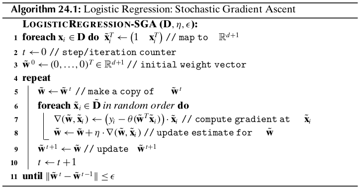

Chapter 24 Logistic Regression
==============================

Given a set of predictor attributes or independent variables 
:math:`X_1,X_2,\cds,X_d`, and given a *categorical* response or dependent 
variable :math:`Y`, the aim of *logistic regression* is to predict the 
probability of the response variable values based on the independent variables.
Logistic regression is in fact a classification technique, that given a point
:math:`\x_i\in\R^d` predicts :math:`P(c_i|\x_j)` for each class :math:`c_i` in
the domain of :math:`Y` (the set of possible classes or values for the response
variable).

24.1 Binary Logistic Regression
-------------------------------

In logistic regression, we are given a set of :math:`d` predictor or independent 
variables :math:`X_1,X_2,\cds,X_d`, and a *binary* or *Bernoulli* response 
variable :math:`Y` that takes on only two values, namely, 0 and 1.
Thus, we are given a training dataset :math:`\D` comprising :math:`n` points 
:math:`\x_i\in\R^d` and the corresponding observed values :math:`y_i\in\{0,1\}`.
We augment the data matrix :math:`\D` by adding a new attribute :math:`X_0` that 
is always fixed at the value 1 for each point, so that 
:math:`\td{\x_i}=(1,x_1,x_2,\cds,x_d)^T\in\R^{d+1}` denotes the augmented point, 
and the multivariate random vector :math:`\td\X`, comprising all the independent 
attributes is given as :math:`\td\X=(X_0,X_1,\cds,X_d)^T`.
The augmented training dataset is given as :math:`\td\D` comprising the 
:math:`n` augmented points :math:`\td{\x_i}` along with the class labels 
:math:`y_i` for :math:`i=1,2,\cds,n`.

Since there are only two outcomes for the response variable :math:`Y`, its 
probability mass function for :math:`\td\X=\td\x` is given as:

.. math::

    P(Y=1|\td\X=\td\x)=\pi(\td\x)\quad\quad P(Y=0|\td\X=\td\x)=1-\pi(\td\x)

where :math:`\pi(\td\x)` is the unknown true parameter value, denoting the 
probability of :math:`Y=1` given :math:`\td\X=\td\x`.

.. math::

    E[Y|\td\X=\td\x]&=1\cd P(Y=1|\td\X=\td\x)+0\cd P(Y=0|\td\X=\td\x)

    &=P(Y=1|\td\X=\td\x)=\pi(\td\x)

Therefore, in logistic regression, instead of directly predicting the response 
value, the goal is to learn the probability, :math:`P(Y=1|\td\X=\td\x)`, which
is also the expected value of :math:`Y` given :math:`\td\X=\td\x`.

Since :math:`P(Y=1|\td\X=\td\x)` is a probability, it is **not appropriate** to directly use the linear regression model

.. math::

    f(\td\x)=\omega_0\cd x_0+\omega_1\cd x_1+\omega_2\cd x_2+\cds+\omega_d\cd x_d=\td{\bs\omega}^T\td\x

where :math:`\td{\bs\omega}=(\omega_0,\omega_1,\cds,\omega_d)^T\in\R^{d+1}` is 
the true augmented weight vector, with :math:`\omega_0=\beta` the true unknown
bias term, and :math:`\omega_i` the true unknown regression coefficient or 
weight for attribute :math:`X_i`.
The reason we cannot simply use :math:`P(Y=1|\td\X=\td\x)=f(\td\x)` is due to 
the fact that :math:`f(\td\x)` can be arbitrarily large or arbitrarily small,
whereas for logistic regression, we require that the output represents a
probability value, and thus we need a model that results in an output that lies
in the interval :math:`[0,1]`.
The name "logistic regression" comes from the *logstic* function (also called 
the *sigmoid* function) that meets this requirement.

.. note::

    :math:`\dp\th(z)=\frac{1}{1+\exp\{-z\}}=\frac{\exp\{z\}}{1+\exp\{z\}}`

The logstic function "squashes" the output to be between 0 and 1 for any scalar input :math:`z`.

.. math::

    1-\th(z)=1-\frac{\exp\{z\}}{1+\exp\{z\}}=\frac{1+\exp\{z\}-\exp\{z\}}{1+\exp\{z\}}=\frac{1}{1+\exp\{z\}}=\th(-z)

Using the logistic function, we define the logistic regression model as follows:

.. math::

    P(Y=1|\td\X=\td\x)=\pi(\td\x)=\th(f(\td\x))=\th(\td{\bs\omega}^T\td\x)-
    \frac{\exp\{\td{\bs\omega}^T\td\x\}}{1+\exp\{\td{\bs\omega}^T\td\x\}}

On the other hand, the probability for :math:`Y=0` is given as

.. math::

    P(Y=0|\td\X=\td\x)=1-P(Y=1|\td\X=\td\x)=\th(-\td{\bs\omega}^T\td\x)=\frac{1}{1+\exp\{\td{\bs\omega}^T\td\x\}}

Combining these two cases the full logistic regression model is given as

.. note::

    :math:`P(Y|\td\X=\td\x)=\th(\td{\bs\omega}^T\td\x)^Y\cd\th(-\td{\bs\omega}^T\td\x)^{1-Y}`

**Log-Odds Ratio**

Define the *odds ratio* for the occurence of :math:`Y=1` as follows:

.. math::

    \rm{odds}(Y=1|\td\X=\td\x)&=\frac{P(Y=1|\td\X=\td\x)}{P(Y=0|\td\X=\td\x)}=
    \frac{\th(\td{\bs\omega}^T\td\x)}{\th(-\td{\bs\omega}^T\td\x)}

    &=\frac{\exp\{\td{\bs\omega}^T\td\x\}}{1+\exp\{\td{\bs\omega}^T\td\x\}}\cd(1+\exp\{\td{\bs\omega}^T\td\x\})

    &=\exp\{\td{\bs\omega}^T\td\x\}

The logarithm of the odds ratio, called the *log-odds ratio*, is therefore given as:

.. math::

    \ln(\rm{odds}(Y=1|\td\X=\td\x))&=\ln\bigg(\frac{P(Y=1|\td\X=\td\x)}
    {1-P(Y=1|\td\X=\td\x)}\bigg)=\ln(\exp\{\td{\bs\omega}^T\td\x\})=
    \td{\bs\omega}^T\td\x

    &=\omega_0\cd x_0+\omega_1\cd x_1+\cds+\omega_d\cd x_d

The log-odds ratio function is also called the *logit* function, defined as

.. math::

    \rm{logit}(z)=\ln\bigg(\frac{z}{1-z}\bigg)

It is the inverse of the logistic function.
We can see that

.. math::

    \ln(\rm{odds}(Y=1|\td\X=\td\x))=\rm{logit}(P(Y=1|\td\X=\td\x))

The logistic regression model is therefore based on the assumption that the log-
odds ratio for :math:`Y=1` given :math:`\td\X=\td\x` is a linear function (or a
weighted sum) of the independent attributes.
Let us consider the effect of attribute :math:`X_i` by fixing the values for all other attributes; we get

.. math::

    &\quad\ \ \ln(\rm{odds}(Y=1|\td\X=\td\x))=\omega_i\cd x_i+C

    &\Rightarrow\rm{odds}(Y=1|\td\X=\td\x)=\exp\{\omega_i\cd x_i+C\}=
    \exp\{\omega_i\cd x_i\}\cd\exp\{C\}\propto\exp\{\omega_i\cd x_i\}

where :math:`C` is a constant comprising the fixed attributes.
The regression coefficient :math:`\omega_i` can therefore be interpreted as the
change in the log-odds ratio for :math:`Y=1` for a unit change in :math:`X_i`,
or equivalently the odds ratio for :math:`Y=1` increases exponentially per unit
change in :math:`X_i`.

24.1.1 Maximum Likelihood Estimation
^^^^^^^^^^^^^^^^^^^^^^^^^^^^^^^^^^^^

Let :math:`\td\D` be the augmented training dataset comprising the :math:`n` 
augmented points :math:`\td{\x_i}` along with their lables :math:`y_i`.
Let :math:`\td\w=(w_0,w_1,\cds,w_d)^T` be the augmented weight vector for estimating :math:`\td\w`.
Note that :math:`w_0=b` denotes the estimated bias term, and :math:`w_i` the estimated weight for attribute :math:`X_i`.
*Likelihood* is defined as the probability of the obaserved data given the estimated parameters :math:`\td\w`.
We assume that the binary response variables :math:`y_i` are all independent.
Threfore, the likelihood of the observed responses is given as

.. math::

    L(\td\w)=P(Y|\td\w)=\prod_{i=1}^nP(y_i|\td{\x_i})=\prod_{i=1}^n
    \th(\td\w^T\td{\x_i})^{y_i}\cd\th(-\td\w^T\td{\x_i})^{1-y_i}

Instead of trying to maximize the likelihood, we can maximize the logarithm of 
the likelihood, called *log-likelihood*, to convert the product into a summation
as follows:

.. note::

    :math:`\dp\ln(L(\td\w))=\sum_{i=1}^ny_i\cd\ln(\th(\td\w^T\td{\x_i}))+(1-y_i)\cd\ln(\th(-\td\w^T\td{\x_i}))`

The negative of the log-likelihood can also be considered as an error function, 
the *cross-entropy error function*, given as follows:

.. note::

    :math:`\dp E(\td\w)=-\ln(L(\td\w))=\sum_{i=1}^ny_i\cd\ln\bigg(\frac{1}{\th(\td\w^T\td{\x_i})}\bigg)`
    :math:`\dp(1-y_i)\cd\ln\bigg(\frac{1}{1-\th(\td\w^T\td{\x_i})}\bigg)`

The task of maximizing the log-likelihood is therefore equivalent to minimizing the cross-entropy error.

We use an iterative *gradient ascent* method to compute the optimal value.
It can be obtained by taking its partial derivative with respect to :math:`\td\w`.

.. math::

    \nabla(\td\w)=\frac{\pd}{\pd\td\w}\{\ln(L(\td\w))\}=\frac{\pd}{\pd\td\w}
    \bigg\{\sum_{i=1}^ny_i\cd\ln(\th(z_i))+(1-y_i)\cd\ln(\th(-z-i))\bigg\}

where :math:`z_i=\td\w^T\td{\x_i}`.
We use the chain rule to obtain the derivative of :math:`\ln(\th(z_i))` with respect to :math:`\td\w`.

.. math::

    \frac{\pd}{\pd\th(z_i)}\{\ln(\th(z_i))\}&=\frac{1}{\th(z_i)}

    \frac{\pd}{\pd\th(z_i)}\{\ln(\th(-z_i))\}&=\frac{\pd}{\pd\th(z_i)}\{\ln(1-\th(z_i))\}=\frac{-1}{1-\th(z_i)}

    \frac{\pd\th(z_i)}{\pd z_i}&=\th(z_i)\cd(1-\th(z_i))=\th(z_i)\cd\th(-z_i)

    \frac{\pd z_i}{\pd\td\w}&=\frac{\pd\td\w^T\td{\x_i}}{\pd\td\w}=\td{\x_i}

As per the chain rule, we have

.. math::

    \frac{\ln(\th(z_i))}{\pd\td\w}&=\frac{\pd\ln(\th(z_i))}{\pd\th(z_i)}\cd
    \frac{\pd\th(z_i)}{\pd(z_i)}\cd\frac{\pd z_i}{\pd\td\w}

    &=\frac{1}{1-\th(z_i)}\cd(\th(z_i)\cd\th(z_i))\cd\td{\x_i}=\th(-z_i)\cd\td{\x_i}

.. math::

    \frac{\ln(\th(-z_i))}{\pd\td\w}&=\frac{\pd\ln(\th(-z_i))}{\pd\th(z_i)}\cd
    \frac{\pd\th(z_i)}{\pd(z_i)}\cd\frac{\pd z_i}{\pd\td\w}

    &=\frac{-1}{1-\th(z_i)}\cd(\th(z_i)\cd(1-\th(z_i)))\cd\td{\x_i}=-\th(z_i)\cd\td{\x_i}

Substituting the above equations, we get

.. math::

    \nabla(\td\w)&=\sum_{i=1}^ny_i\cd\th(-z_i)\cd\td{\x_i}-(1-y_i)\cd\th(z_i)\cd\td{\x_i}

    &=\sum_{i=1}^ny_i\cd(\th(-z_i)+\th(z_i))\cd\td{\x_i}-\th(z_i)\cd\td{\x_i}

    &=\sum_{i=1}^n(y_i-\th(z_i))\cd\td{\x_i}

    &=\sum_{i=1}^n(y_i-\th(\td\w^T\td{\x_i}))\cd\td{\x_i}

Given the current estimate :math:`\td\w^t`, we can obtain the next estimate as follows:

.. note::

    :math:`\td\w^{t+1}=\td\w^t+\eta\cd\nabla(\td\w^t)`

Here, :math:`\eta>0` is a user-specified parameter called the *learning rate*.
At the optimal value of :math:`\td\w`, the gradient will be zero, :math:`\nabla(\td\w)=\0`, as desired.

**Stochastic Gradient Ascent**

The gradient ascent method computes the gradient by considering all the data 
points, and it is therefore called batch gradient ascent. 
For large datasets, it is typically much faster to compute the gradient by 
considering only one (randomly chosen) point at a time. 
The weight vector is updated after each such partial gradient step, giving rise 
to *stochastic gradient ascent* (SGA) for computing the optimal weight vector 
:math:`\td\w`.

Given a randomly chosen point :math:`\td{\x_i}`, the point-specific gradient is given as

.. note::

    :math:`\nabla(\td\w,\td{\x_i})=(y_i-\th(\td\w^T\td{\x_i}))\cd\td{\x_i}`

Once the model has been trained, we can predict the response for any new augmented test point :math:`\td\z` as follows:

.. note::

    :math:`\dp\hat{y}=\left\{\begin{array}{lr}1\quad\rm{if\ }\th(\td\w^T\z)\geq 0.5\\0\quad\rm{if\ }\th(\td\w^T\z)<0.5\end{array}\right.`

24.2 Multiclass Logistic Regression
-----------------------------------

We model :math:`Y` as a :math:`K`-dimensional multivariate Bernoulli random variable.
Since :math:`Y` can assume only one of the :math:`K` values, we use the 
*one-hot encoding* approach to map each categorical value :math:`c_i` to the 
:math:`K`-dimensional binary vector

.. math::

    \e_i=(0,\cds,0,1,0,\cds,0)^T

whose :math:`i`\ th element :math:`e_{ii}=1`, and all other elements 
:math:`e_{ij}=0`, so that :math:`\sum_{j=1}^Ke_{ij}=1`.
Henceforth, we assume that the categorical response variable :math:`Y` is a 
multivariate Bernoulli variable :math:`\Y\in\{\e_1,\e_2,\cds,\e_K\}`,
with :math:`Y_j` referring to the :math:`j`\ th component of :math:`\Y`.

The probability mass function for :math:`\Y` given :math:`\td\X=\td\x` is

.. math::

    P(\Y=\e_i|\td\X=\td\x)=\pi_i(\td\x),\ \rm{for}\ i=1,2,\cds,K

Thus, there are :math:`K` unknown parameters, which must satisfy the following constraint:

.. math::

    \sum_{i=1}^K\pi_i(\td\x)=\sum_{i=1}^KP(\Y=\e_i|\td\X=\td\x)=1

Given that only one element of :math:`\Y` is 1, the probability mass function of :math:`\Y` can be written compactly as

.. note::

    :math:`\dp P(\Y|\td\X=\td\x)=\prod_{j=1}^K(\pi_j(\td\x))^{Y_j}`

The log-odds ratio of class :math:`c_i` with respect to class :math:`c_K` is assumed to satisfy

.. math::

    \ln(\rm{odds}(\Y=\e_i|\td\X=\td\x))&=\ln\bigg(\frac{P(\Y=\e_i|\td\X=\td\x)}
    {P(\Y=\e_K|\td\X=\td\x)}\bigg)=\ln\bigg(\frac{\pi_i(\td\x)}{\pi_K(\td\x)}
    \bigg)=\td{\bs\omega_i}^T\td\x

    &=\omega_{i0}\cd x_0+\omega_{i1}\cd x_1+\cds+\omega_{id}\cd x_d

where :math:`\omega_{i0}=\beta_i` is the true bias value for class :math:`c_i`.

.. math::

    &\quad\ \frac{\pi_i(\td\x)}{\pi_K(\td\x)}=\exp\{\td{\bs\omega_i}^T\td\x\}

    &\Rightarrow\pi_i(\td\x)=\exp\{\td{\bs\omega_i}^T\td\x\}\cd\pi_K(\td\x)

.. math::

    &\quad \ \sum_{j=1}^K\pi_j(\td\x)=1

    &\Rightarrow\bigg(\sum_{j\neq K}\exp\{\td{\bs\omega_j}^T\td\x\}\cd\pi_K(\td\x)\bigg)+\pi_K(\td\x)=1

    &\Rightarrow\pi_K(\td\x)=\frac{1}{1+\sum_{j\neq K}\exp\{\td{\bs\omega_j}^T\td\x\}}

.. math::

    \pi_i(\td\x)=\exp\{\td{\bs\omega_i}^T\td\x\}\cd\pi_K(\td\x)=\frac{\exp\{
    \td{\bs\omega_i}^T\td\x\}}{1+\sum_{j\neq K}\exp\{\td{\bs\omega_j}^T\td\x\}}

Finally, setting :math:`\td{\bs\omega_K}=\0`, we have 
:math:`\exp\{\td{\bs\omega_K}^T\td\x\}=1` and thus we can write the full model for
multiclass logistic regression as follows:

.. note::

    :math:`\dp\pi_i(\td\x)=\frac{\exp\{\td{\bs\omega_i}^T\td\x\}}{\sum_{j=1}^K\exp\{\td{\bs\omega_j}^T\td\x\}}`
    :math:`\ \rm{for\ all}\ i=1,2,\cds,K`

This function is also called the *softmax* function.
When :math:`K=2`, this formulation yields exactly the same model as in binary logistic regression.

.. math::

    \ln\bigg(\frac{\pi_i(\td\x)}{\pi_j(\td\x)}\bigg)&=\ln\bigg(\frac{\pi_i
    (\td\x)}{\pi_K(\td\x)}\cd\frac{\pi_K(\td\x)}{\pi_j(\td\x)}\bigg)

    &=\ln\bigg(\frac{\pi_i(\td\x)}{\pi_K(\td\x)}\bigg)+
    \ln\bigg(\frac{\pi_K(\td\x)}{\pi_j(\td\x)}\bigg)

    &=ln\bigg(\frac{\pi_i(\td\x)}{\pi_K(\td\x)}\bigg)-
    \ln\bigg(\frac{\pi_j(\td\x)}{\pi_K(\td\x)}\bigg)

    &=\td{\bs\omega_i}^T\td\x-\td{\bs\omega_j}^T\td\x

    &=(\td{\bs\omega_i}-\td{\bs\omega_j})^T\td\x

That is, the log-odds ratio between any two classes can be computed from the 
difference of the corresponding weight vectors.

24.2.1 Maximum Likelihood Estimation
^^^^^^^^^^^^^^^^^^^^^^^^^^^^^^^^^^^^