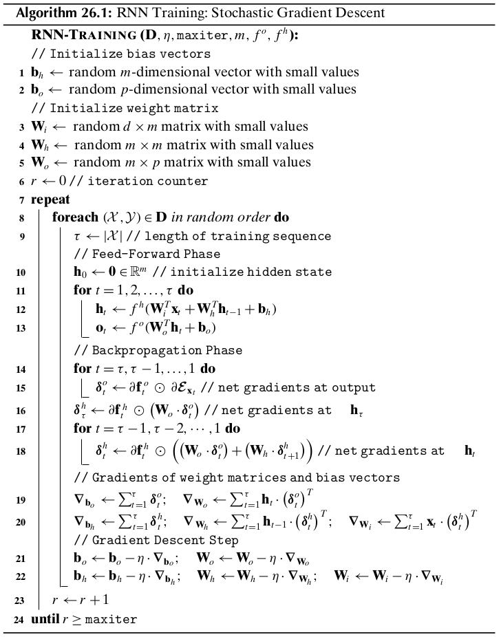

Chapter 26 Deep Learning
========================

26.1 Recurrent Neural Networks
------------------------------

Multilayer perceptrons are feed-forward networks in which the information flows 
in only one direction, namely from the input layer to the output layer via the 
hidden layers.
In constrast, recurrent neural networks (RNNs) are dynamically driven, with a 
*feedback* loop between two (or more) layers, which makes such networks ideal 
for learning from sequence data.

Let :math:`\cX=\lag\x_1,\x_2,\cds,\x_\tau\rag` denote a sequence of vectors,
where :math:`\x_t\in\R^d` is a :math:`d`-dimensional vector 
:math:`(t=1,2\,\cds,\tau)`.
Thus, :math:`\cX` is an input sequence of length :math:`\tau`, with 
:math:`\x_t` denoting the input at time step :math:`t`.
Let :math:`\cY=\lag\y_1,\y_2,\cds,\y_\tau\rag` denote a sequence of vectors,
with :math:`\y_t\in\R^p` a :math:`p`-dimensional vector.
Here :math:`\cY` is the desired target or response sequence, with 
:math:`\y_t` denoting the response vector at time :math:`t`.
Finally, let :math:`\cl{O}=\lag\o_1,\o_2,\cds,\o_\tau\rag` denote the predicted
or output sequence from the RNN.
Here :math:`\o_t\in\R^p` is also a :math:`p`-dimensional vector to match the corresponding true response :math:`\y_t`.
The task of an RNN is to learn a function that predicts the target sequence
:math:`\cY` given the input sequence :math:`\cX`.
That is, the predicted output :math:`\o_t` on input :math:`\x_t` should be 
similar or close to the target response :math:`\y_t`, for each time point 
:math:`t`.

To learn dependencies between elements of the input sequence, an RNN maintains a
sequence of :math:`m`-dimensional hidden state vectors :math:`\h_t\in\R^m`, 
where :math:`\h_t` captures the essential features of the input sequences up to
time :math:`t`.
The hidden vector :math:`\h_t` at time :math:`t` depends on the input vector 
:math:`\x_t` at time :math:`t` and the previous hidden state vector 
:math:`\h_{t-1}` from time :math:`t-1`, and it is computed as follows:

.. note::

    :math:`\h_t=f^h(\W_i^T\x_t+\W_h^T\h_{t-1}+\b_h)`

Here, :math:`f^h` is the hidden state activation function, typically tanh or ReLU.
Also, we need an initial hidden state vector :math:`\h_0` that serves as the prior state to compute :math:`\h_1`.
This is uaually set to the zero vector, or seeded from a prior RNN prediction step.
The matrix :math:`\W_i\in\R^{d\times m}` specifies the weights between the input vectors and the hidden state vectors.
The matrix :math:`\W_h\in\R^{m\times m}` specifies the weight matrix between the 
hidden state vectors at time :math:`t-1` and :math:`t`, with :math:`\b_h\in\R^m`
specifying the bias terms associated with the hidden states.
Note that we need only one bias vector :math:`\b_h` associated with the hidden 
state neurons; we do not need a separate bias vector between the input and 
hidden neurons.

Given the hidden state vector at time :math:`t`, the output vector :math:`\o_t` 
at time :math:`t` is computed as follows:

.. note::

    :math:`\o_y=f^o(\W_o^T\h_t+\b_o)`

Here, :math:`\W_o\in\R^{m\times \p}` specifies the weights between the hidden 
state and output vectors, with bias vector :math:`\b_o`.
The output activation function :math:`f^o` typically uses linear or identity 
activation, or a softmax activation for one-hot encoded categorical output 
values.

It is important to note that all the weight matrices and bias vectors are *independent* of the time :math:`t`.
For example, for the hidden layer, the same weight matrix :math:`\W_h` and bias 
vector :math:`\b_h` is used and updated while training the model, over all time
steps :math:`t`.
This is an exmaple of *parameter sharing* or *weight tying* between different layers or components of a neural network.
Likewise, the input weight matrix :math:`\W_i`, the output weight matrix 
:math:`\W_o` and the bias vector :math:`\b_o` are all shared across time.
This greatly reduces the number of parameters that need to be learned by the 
RNN, but it also relies on the assumption that all relevant sequential features 
can be captured by the shared parameters.

The training data for the RNN is given as :math:`\D=\{\cX_i,\cY_y\}_{i=1}^n`, 
comprising :math:`n` input sequences :math:`\cX_i` and the corresponding target 
response sequences :math:`\cY_i`, with sequence length :math:`\tau_i`.
Given each pair :math:`(\cX,\cY)\in\D`, with 
:math:`\cX=\lag\x_1,\x_2,\cds,\x_\tau\rag` and 
:math:`\cY=\lag\y_1,\y_2,\cds,\y_\tau\rag`, the RNN has to update the model 
parameters :math:`\W_i,\W_h,\b_h,\W_o,\b_o` for the input, hidden and output
layers, to learn the corresponding output sequence 
:math:`\cl{O}=\lag\o_1,\o_2,\cds,\o_\tau\rag`.
For training the network, we compute the error or *loss* between the predicted and response vectors over all time steps.
The squared error loss is given as

.. math::

    \cE_\cX=\sum_{t=1}^\tau\cE_{\x_t}=\frac{1}{2}\cd\sum_{t=1}^\tau\lv\y_t-\o_t\rv^2

If we use a softmax activation at the output layer, then we use the cross-entropy loss, given as

.. math::

    \cE_\cX=\sum_{t=1}^\tau\cE_{\x_t}=-\sum_{t=1}^\tau\sum_{i=1}^py_{ti}\cd\ln(o_{ti})

where :math:`\y_t=(y_{t1},y_{t2},\cds,y_{tp})^T\in\R^p` and :math:`\o_t=(o_{t1},o_{t2},\cds,o_{tp})^T\in\R^p`.
On training input of length :math:`\tau` we first unfold the RNN for 
:math:`\tau` steps, following which the parameters can be learned via the
standard feed-forward and backpropagation steps, keeping in mind the connections
between the layers.

26.1.1 Feed-forward in Time
^^^^^^^^^^^^^^^^^^^^^^^^^^^

The feed-forward process starts at time :math:`t=0`, taking as input the initial 
hidden state vector :math:`\h_0`, which us usually set to :math:`\0` or it can
be user-specified, say from a previous prediction step.

.. math::

    \o_t&=f^o(\W_o^T\h_t+\b_o)

    &=f^o(\W_o^Tf^h(\W_i^T\x_t+\W_h^T\h_{t-1}+\b_h)+\b_o)

    &=\vds

    &=f^o(\W_o^Tf^h(\W_i^T\x_t+\W_h^Tf^h(\cds f^h(\W_i^T\x_1+\W_h^T\h_0+\b_h)+\cds)+\b_h)+\b_o)

We can observe that the RNN implicitly makes a prediction for every prefix of 
the input sequence, since :math:`\o_t` depends on all the previous input vectors
:math:`\x_1,\x_2,\cds,\x_t` but not on any future inputs 
:math:`\x_{t+1},\cds,\x_\tau`.

26.1.2 backpropagation in Time
^^^^^^^^^^^^^^^^^^^^^^^^^^^^^^

For the backpropagation step it is easier to view the RNN in terms of the 
distinct layers based on the dependencies, as opposed to unfolding in time.

Let :math:`\cE_{\x_t}` denote the loss on input vector :math:`\x_t` from the 
input sequence :math:`\cX=\lag\x_1,\x_2,\cds,\x_\tau\rag`.
The unfolded feed-forward RNN for :math:`\cX` has :math:`l=\tau+1` layers.
Define :math:`\bs\delta_t^o` as the net gradient vector for the output vector 
:math:`\o_t`, i.e., the derivative of the error function :math:`\cE_{\x_t}` with 
respect to the net value at each neuron in :math:`\o_t`, given as

.. math::

    \bs\delta_t^o=\bigg(\frac{\pd\cE_{\x_t}}{\pd net_{t1}^o},
    \frac{\pd\cE_{\x_t}}{\pd net_{t2}^o},\cds,
    \frac{\pd\cE_{\x_t}}{\pd net_{tp}^o}\bigg)^T

where :math:`\o_t=(o_{t1},o_{t2},\cds,o_{tp})^T\in\R^p` is the :math:`p`-\
dimensional output vector at time :math:`t`, and :math:`net_{ti}^o` is the net
value at output neuron :math:`o_{ti}` at time :math:`t`.
Likewise, let :math:`\bs\delta_t^h` denote the net gradient vector for the 
hidden state neurons :math:`\h_t` at time :math:`t`

.. math::

    \bs\delta_t^h=\bigg(\frac{\pd\cE_{\x_t}}{\pd net_{t1}^h},
    \frac{\pd\cE_{\x_t}}{\pd net_{t2}^h},\cds,
    \frac{\pd\cE_{\x_t}}{\pd net_{tm}^h}\bigg)^T

where :math:`\h_t=(h_{t1},h_{t2},\cds,h_{tm})^T\in\R^m` is the :math:`m`-\
dimensional hidden state vector at time :math:`t`, and :math:`net_{ti}^h` is the
net value at hidden neuron :math:`h_{ti}` at time :math:`t`.
Let :math:`f^h` and :math:`f^o` denote the activation functions for the hidden
state and output neurons, and let :math:`\pd\f_t^h` and :math:`\pd\f_t^o` denote
the vector of the derivatives of the activation function with respect to the net
signal for the hidden and output neurons at time :math:`t`, given as

.. math::

    \pd\f_t^h\bigg(\frac{\pd f^h(net_{t1}^h)}{\pd net_{t1}^h}, 
    \frac{\pd f^h(net_{t2}^h)}{\pd net_{t2}^h},\cds,
    \frac{\pd f^h(net_{tm}^h)}{\pd net_{tm}^h}\bigg)^T

    \pd\f_t^o\bigg(\frac{\pd f^o(net_{t1}^o)}{\pd net_{t1}^o}, 
    \frac{\pd f^o(net_{t2}^o)}{\pd net_{t2}^o},\cds,
    \frac{\pd f^o(net_{tp}^o)}{\pd net_{tp}^o}\bigg)^T

Finally, let :math:`\pd\bs\cE_{\x_t}` denote the vector of partial derivatives 
of the error function with respect to :math:`\o_t`:

.. math::

    \pd\bs\cE_{\x_t}=\bigg(\frac{\pd\cE_{\x_t}}{\pd o_{t1}},\frac{\pd\cE_{\x_t}}
    {\pd o_{t2}},\cds,\frac{\pd\cE_{\x_t}}{\pd o_{tp}}\bigg)^T

**Computing Net Gradients**

The net gradient vector at the output :math:`\o_t` can be computed as follows:

.. note::

    :math:`\bs\delta_t^o=\pd\f_t^o\od\pd\bs\cE_{\x_t}`

For example, if :math:`\cE_{\x_t}` is the squared error function, and the output 
layer uses the identity funciton, then we have

.. math::

    \bs\delta_t^o=\1\od(\o_t-\y_t)

On the other hand, the net gradients at each of the hidden layers need to 
account for the incoming net gradients from :math:`\o_t` and from 
:math:`\h_{t+1}`.
The net gradient vector for :math:`\h_t(\rm{for\ }t=1,2,\cds,\tau-1)` is given as

.. note::

    :math:`\bs\delta_t^h=\pd\f_t^h\od((\W_o\cd\bs\delta_t^o)+(\W_h\cd\bs\delta_{t+1}^h))`

Note that for :math:`\h_\tau`, it depends only on :math:`\o_\tau`, therefore

.. math::

    \bs\delta_\tau^h=\pd\f_\tau^h\od(\W_o\cd\bs\delta_\tau^o)

For the tanh activation, which is commonly used in RNNs, the derivative of the
activation function with respect to the net values at :math:`\h_t` is given as

.. math::

    \pd\f_t^h=(\1-\h_t\od\h_t)

Finally, note that the net gradients do not have to be computed for :math:`\h_0`
or for any of the input neurons :math:`\x_t`, since these are leaf nodes in the
backpropagation graph, and thus do not backpropagate the gradients beyond those
neurons.

**Stochastic Gradient Descent**

The net gradients for the output :math:`\bs\delta_t^o` and hidden 
:math:`\bs\delta_t^h` at time :math:`t` can be used to compute the gradients for 
the weight matrices and bias vectors at each time point.
However, since an RNN uses parameter sharing across time, the gradients are 
obtained by summing up all of the contributions from each time step :math:`t`.
Define :math:`\nabla_{\w_o}^t` and :math:`\nabla_{\b_o}^t` as the gradients of
the weights and biases between the hidden neurons :math:`\h_t` and output 
neurons :math:`\o_t` for time :math:`t`.
Using the backpropagation equations, for deep multilayer perceptrons, these 
gradients are computed as follows:

.. math::

    \nabla_{\b_o}=\sum_{t=1}^\tau\nabla_{\b_o}^t=\sum_{t=1}^\tau\bs\delta_t^o
    \quad\quad\nabla_{\w_o}=\sum_{t=1}^\tau\nabla_{\w_o}^t=\sum_{t=1}^\tau\h_t
    \cd(\bs\delta_t^o)^T

Likewise, the gradients of the other shared parameters between hidden layers
:math:`\h_{t-1}` and :math:`\h_t`, and between the input layer :math:`\x_t` and
hidden layer :math:`\h_t`, are obtained as follows:

.. math::

    \nabla_{\b_h}&=\sum_{t=1}^\tau\nabla_{\b_h}^t=\sum_{t=1}^\tau\bs\delta_t^h
    \quad\quad\nabla_{\w_h}=\sum_{t=1}^\tau\nabla_{\W_h}^t=\sum_{t=1}^\tau
    \h_{t-1}\cd(\bs\delta_t^h)^T

    \nabla_{\w_i}&=\sum_{t=1}^\tau\nabla_{\w_i}^t=\sum_{t=1}^\tau\x_t\cd(\bs
    \delta_t^h)^T

.. note::

    :math:`\W_i=\W_i-\eta\cd\nabla_{\w_i}\quad\W_h=\W_h-\eta\cd\nabla_{\w_h}\quad\b_h=\b_h-\eta\cd\nabla_{\b_h}`

    :math:`\W_o=\W_o-\eta\cd\nabla_{\w_o}\quad\b_o=\b_o-\eta\cd\nabla_{\b_o}`

26.1.3 Training RNNs
^^^^^^^^^^^^^^^^^^^^

Note that Line 15 shows the case where the output layer neurons are independent;
if they are not independent we can replace it by 
:math:`\pd\bs{\rm{F}}^o\cd\pd\bs\cE_{\x_t}`.

In practice, RNNs are trained using subsets or *minibatches* of input sequences instead of single sequences.
This helps to speed up the computation and convergence of gradient descent, 
since minibatches provide better estimates of the bias and weight gradients and
allow the use of vectorized operations.

26.1.4 Bidirectional RNNs
^^^^^^^^^^^^^^^^^^^^^^^^^

A bidirectional RNN (BRNN) extends the RNN model to also include information from the future.
In particular, a BRNN maintains a backward hidden state vector 
:math:`\b_t\in\R^m` that depends on the next backward hidden state 
:math:`\b_{t+1}` and the current input :math:`\x_t`.
The output at time :math:`t` is a function of both :math:`\h_t` and :math:`\b_t`.

.. note::

    :math:`\h_t=f^h(\W_{ih}^T\x_t+\W_h^T\h_{t-1}+\b_h)`

    :math:`\b_t=f^b(\W_{ib}^T\x_t+\W_b^T\b_{t+1}+\b_b)`

Also, a BRNN needs two initial state vectors :math:`\h_0` and 
:math:`\b_{\tau+1}` to compute :math:`\b_1` and :math:`\b_\tau`, respectively.
These are usually set to :math:`\0\in\R^m`.
The forward and backward hidden states are computed independently, with the
forward hidden states omputed by considering the input sequence in the forward
direction, and with the backward hidden states computed by considering the 
sequence in reverse order.
The output at time :math:`t` is computed only when both :math:`\h_t` and :math:`\b_t` are available, and is given as

.. math::

    \o_t=f^o(\W_{ho}^T\h_t+\W_{bo}^T\b_t+\b_o)

26.2 Gated RNNs: Long Short-Term Memory Networks
------------------------------------------------

One of the problems in training RNNs is their susceptibility to either the 
*vanishing gradient* or *exploding gradient* problem.
For example, consider the task of computing the net gradient vector 
:math:`\bs\delta_t^h` for the hidden layer at time :math:`t`, given as

.. math::

    \bs\delta_t^h=\pd\f_t^h\od((\W_o\cd\bs\delta_t^o)+(\W_h\cd\bs\delta_{t+1}^h))

Assume for simplicity that we use a linear activation function, i.e.,
:math:`\pd\f_t^h=\1`, and let us ignore the net gradient vector for the output
layer, focusing only on the dependence on the hidden layers.
Then for an input sequence of length :math:`\tau`, we have

.. math::

    \bs\delta_t^h=\W_h\cd\bs\delta_{t+1}^h=\W_h(\W_h\cd\bs\delta_{t+2}^h)=
    \W_h^2\cd\bs\delta_{t+2}^h=\cds=\W_h^{\tau-t}\cd\bs\delta_\tau^h

We can observe that the net gradient from time :math:`\tau` affects the net
gradient vector at time :math:`t` as a function of :math:`\W_h^{\tau-t}`, i.e.,
as powers of the hidden weight matrix :math:`\W_h`.
Let the *spectral radius* of :math:`\W_h`, defined as the absolute value of its 
largest eigenvalue, be given as :math:`|\ld_1|`.
It turns out that if :math:`|\ld_1|<1`, then :math:`\lv\W_h^k\rv\ra 0` as 
:math:`k\ra\infty`, that is, the gradients vanish as we train on long sequences.
On the other hand, if :math:`|\ld_1|>1`, the nat least one element of 
:math:`\W_h^k` becomes unbounded and thus :math:`\lv\W_h^k\rv\ra\infty` as
:math:`k\ra\infty`, that is, the gradients explode as we train on long 
sequences.
Therefore, for the error to neither vanish nor explode, the spectral radius of 
:math:`\W_h` should remian 1 or very close to it.

Long short-term memory (LSTM) networks alleviate the vanishing gradients problem
by using *gate neurons* to control access to the hidden states.
Consider the :math:`m`-dimensional hidden state vector :math:`\h_t\in\R^m` at time :math:`t`.
In a regular RNN, we update the hidden state as follows:

.. math::

    \h_t=f^h(\W_i^T\x_t+\W_h^T\h_{t-1}+\b_h)

Let :math:`\g\in\{0,1\}^m` be a binary vector.
If we take the element-wise product of :math:`\g` and :math:`\h_t`, namely, 
:math:`\g\od\h_t`, then elements of :math:`\g` act as gates that either allow 
the corresponding element of :math:`\h_t` to be retained or set to zero.
The vector :math:`\g` thus acts as logical gate that allows selected elements of 
:math:`\h_t` to be remembered or fogotten.
However, for backpropagation we need *differentiable gates*, for which we use 
sigmoid activation on the gate neurons so that their value lies in the range 
:math:`[0,1]`.
Like a logical gate, such neurons allow the inputs to be completely remembered
if the value is 1, or forgotten if the value is 0.
In addition, they allow a weighted memory, allowing partial remembrance of the 
elements of :math:`\h_t`, for values between 0 and 1.

26.2.1 Forget Gate
^^^^^^^^^^^^^^^^^^

We consider an RNN with a *forget gate*.
Let :math:`\h_t\in\R^m` be the hidden state vector, and let :math:`\bs\phi_t\in\R^m` be a forget gate vector.
Both these vectors have the same number of neurons, :math:`m`.

In a regular RNN, assuming tanh activation, the hidden state vector is updated unconditionally, as follows:

.. math::

    \h_t=\tanh(\W_i^T\x_t+\W_h^T\h_{t-1}+\b_h)

Instead of directly updating :math:`\h_t`, we will employ the forget gate 
neurons to control how much of the prvious hidden state vector to forget when 
computing its new value, and also to control how to update it in light of the
new input :math:`\x_t`.

Given input :math:`\x_t` and previous hidden state :math:`\h_{t-1}`, we first 
compute a candidate update vector :math:`\u_t`, as follows:

.. note::

    :math:`\u_t=\tanh(\W_u^T\x_t+\W_{hu}^T\h_{t-1}+\b_u)`

The candidate update vector :math:`\u_t` is essentially the unmodified hidden state vector, as in a regular RNN.

Using the forget gate, we can compute the new hidden state vector as follows:

.. note::

    :math:`\h_t=\bs\phi_t\od\h_{t-1}+(1-\bs\phi_t)\od\u_t`

We can see that the new hidden state vector retains a fraction of the previous 
hidden state values, and a (complementary) fraction of the candidate update 
values.
Observe that if :math:`\bs\phi_t=\0`, i.e., if we want to entirely forget the
previous hidden state, then :math:`\1-\bs\phi_t=\1`, which means that the hidden
state will be updated completely at each time step just like in a regular RNN.
Finally, given the hidden state :math:`\h_t`, we can compute the output vector :math:`\o_t` as follows

.. math::

    \o_t=f^o(\W_o^T\h_t+\b_o)

.. note::

    :math:`\bs\phi_t=\sg(\W_\phi^T\x_t+\W_{h\phi}^T\h_{t-1}+\b_\phi)`

where we use a sigmoid activation function, denoted :math:`\sg`, to ensure that 
all the neuron values are in the range :math:`[0,1]`, denoting the extent to 
which the corresponding previous hidden state values should be forgotten.

A forget gate vector :math:`\bs\phi_t` is a layer that depends on the previous
hidden state layer :math:`\h_{t-1}` and the current input layer :math:`\x_t`;
these connections are fully connected, and are specified by the corresponding 
weight matrices :math:`\W_{h\phi}` and :math:`\W_{\phi}`, and the bias vector 
:math:`\b_\phi`.
On the other hand, the output of the forget gate layer :math:`\bs\phi_t` needs 
to modify the previous hidden state layer :math:`\h_{t-1}`, and therefore, both
:math:`\bs\phi_t` and :math:`\h_{t-1}` feed into what is essentially a new 
*element-wise* product layer.
Finally, the output of this element-wise product layer is used as input to the 
new hidden layer :math:`\h_t` that also takes input from another element-wise 
gate that computes the output from the candidate update vector :math:`\u_t` and
the complemented forget gate, :math:`\1-\bs\phi_t`.
Thus, unlike regular layers that are fully connected and have a weight matrix 
and bias vector between the layers, the connections between :math:`\bs\phi_t`
and :math:`\h_t` via the element-wise layer are all one-to-one, and the weights
are fixed at the value 1 with bias 0.
Likewise the connections between :math:`\u_t` and :math:`\h_t` via the other
element-wise layer are also one-to-one, with weights fixed at 1 and bias at 0.

Computing Net Gradients
^^^^^^^^^^^^^^^^^^^^^^^

An RNN with a forget gate has the following parameters it needs to learn, namely
the weight matrices :math:`\W_u,\W_{hu},\W_\phi,\W_{h\phi},\W_o`, and the bias
vectors :math:`\b_u,\b_\phi,\b_o`.

Let :math:`\bs\delta_t^o, \bs\delta_t^h, \bs\delta_t^\phi, \bs\delta_t^u` denote
the net gradient vectors at the output, hidden, forget gate, and candidate 
update layers, respectively.
During backpropagation, we need to compute the net gradients at each layer.
The net gradients at the outputs are computed by considering the partial 
derivatives of the activation function :math:`\pd\f_t^o` and the error function
:math:`\pd\bs\cE_{\x_t}`:

.. math::

    \bs\delta_t^o=\pd\f_t^o\od\pd\bs\cE_{\x_t}

For the other layers, we can reverse all the arrows to determine the dependencies between the layers.
Therefore, to compute the net gradient for the update layer 
:math:`\bs\delta_t^u`, notice that in backpropagation it has only one incoming 
edge from :math:`\h_t` via the element-wise product 
:math:`(\1-\bs\phi_t)\od\u_t`.
The net gradient :math:`\delta_{ti}^u` at update layer neuron :math:`i` at time :math:`t` is given as

.. math::

    \delta_{ti}^u=\frac{\pd\cE_\x}{\pd net_{ti}^u}=\frac{\pd\cE_\x}
    {\pd net_{ti}h}\cd\frac{\pd net_{ti}^h}{\pd u_{ti}}\cd\frac{\pd u_{ti}}
    {\pd net_{ti}^u}=\delta_{ti}^h\cd(1-\phi_{ti})\cd(1-u_{ti}^2)

where :math:`\frac{\pd net_{ti}^h}{\pd u_{ti}}=\frac{\pd}{\pd u_{ti}}`
:math:`\{\phi_{ti}\cd h_{t-1,i}+(1-\phi_{ti})\cd u_{ti}\}=1-\phi_{ti}`, and we
use the fact that the update layer uses a tanh activation function.
Across all neurons, we obtain the net gradient at :math:`\u_t` as follows:

.. math::

    \bs\delta_t^u=\bs\delta_t^h\od(\1-\bs\phi_t)\od(\1-\u_t\od\u_t)

To compute the net gradient vector for the forget gate, we observe that there 
are two incoming flows into :math:`\bs\phi_t` during backpropagation-one from
:math:`\h_t` via the element-wise product :math:`\bs\phi_t\od\h_{t-1}`, and the 
other also from :math:`\bs\h_t` via the element-wise product 
:math:`(\1-\bs\phi_t)\od\u_t`.
Therefore, the net gradient :math:`\delta_{ti}^\phi` at forget gate neuron :math:`i` at time :math:`t` is given as

.. math::

    \delta_{ti}^\phi=\frac{\pd\cE_\x}{\pd net_{ti}^\phi}=\frac{\pd\cE_\x}
    {\pd net_{ti}^h}\cd\frac{\pd net_{ti}^h}{\pd\phi_{ti}}\cd\frac{\pd\phi_{ti}}
    {\pd net_{ti}^\phi}=\delta_{ti}^h\cd(h_{t-1,i}-u_{ti})\cd\phi_{ti}
    (1-\phi_{ti})

where :math:`\frac{\pd net_{ti}^h}{\pd\phi_{ti}}=\frac{\pd}{\pd\phi_{ti}}`
:math:`\{\phi_{ti}\cd h_{t-1,i}+(1-\phi_{ti})\cd u_{ti}\}=h_{t-1,i}-u_{ti}`, and
we use the fact that the forget gate uses a sigmoid activation function.
Across all neurons, we obtain the net gradient at :math:`\bs\phi_t` as follows:

.. math::

    \bs\delta_t^\phi=\bs\delta_t^h\od(\h_{t-1}-\u_t)\od\bs\phi_t\od(\1-\bs\phi_t)

We can observe that if we reverse the arrows, :math:`\bs\delta_t^h` depends on
the gradients at the output layer :math:`\o_t`, the forget gate layer 
:math:`\bs\phi_{t+1}`, the update layer :math:`\u_{t+1}`, and on the hidden
layer :math:`\h_{t+1}` via the element-wise product 
:math:`\h_{t+1}\od\bs\phi_{t+1}`.
The output, forget and update layers are treated as in a regular RNN.
However, due to the element-wise layer, the flow from :math:`\h_{t+1}` is handled as follows:

.. math::

    \frac{\pd\cE_{\x_t}}{\pd net_{t+1,i}^h}\cd\frac{\pd net_{t+1,i}^h}
    {\pd h_{ti}}\cd\frac{\pd h_{ti}}{\pd net_{ti}^h}=\delta_{t+1,i}^h\cd
    \phi_{t+1,i}\cd 1=\delta_{t+1,i}^h\cd\phi_{t+1,i}

where :math:`\frac{\pd net_{t+1,i}^h}{\pd h_{ti}}=\frac{\pd}{\pd h_{ti}}`
:math:`\{\phi_{t+1,i}\cd h_{ti}+(1-\phi_{t+1,i})\cd u_{t+1,i}\}=\phi_{t+1,i}`,
and we used the fact that :math:`\h_t` implicitly uses an identity activation 
function.
Across all the hidden neurons at time :math:`t`, the net gradient vector 
component from :math:`\h_{t+1}` is given as 
:math:`\bs\delta_{t+1}^h\od\bs\phi_{t+1}`.
Considering all the layers, including the output, forget, update and element-\
wise layers, the complete net gradient vector at the hidden layer at time 
:math:`t` is given as:

.. math::

    \bs\delta_t^h=\W_o\bs\delta_t^o+\W_{h\phi}\bs\delta_{t+1}^\phi+\W_{hu}\bs
    \delta_{t+1}^u+(\bs\delta_{t+1}^h\od\bs\phi_{t+1})

26.2.2 Long Short-Term Memory (LSTM) Networks
^^^^^^^^^^^^^^^^^^^^^^^^^^^^^^^^^^^^^^^^^^^^^

LSTMs use differentiable gate vectors to control the hidden state vector 
:math:`\h_t`, as well as another vector :math:`\c_t\in\R^m` called the 
*internal memory* vector.
In particular, LSTMs utilize three *gate vectors*: an input gate vector
:math:`\bs\kappa_t\in\R^m`, a forget gate vector :math:`\bs\phi_t\in\R^m`, and
an output get vector :math:`\bs\omega_t\in\R^m`.
Like a regular RNN, an  LSTM also maintains a hidden state vecftor for each time step.
However, the content of the hidden vector is selectively copied from the 
internal memory vector via the output gate, with the internal memory being
updated via the input gate and parts of it forgotten via the forget gate.

Let :math:`\cX=\lag\x_1,\x_2,\cds,\x_\tau\rag` denote a sequence of :math:`d`-\
dimensional input vectors of length :math:`\tau`, 
:math:`\cY=\lag\y_1,\y_2,\cds,\y_\tau\rag` the sequence of :math:`p`-dimensional
response vectors, and :math:`\cl{O}=\lag\o_1,\o_2,\cds,\o_\tau\rag` the 
:math:`p`-dimensional output sequence from an LSTM.
At each time step :math:`t`, the three gate vectors are updated as follows:

.. note::

    :math:`\bs\kappa_t=\sigma(\W_\kappa^T\x_t+\W_{h\kappa}^T\h_{t-1}+\b_\kappa)`

    :math:`\bs\phi_t=\sigma(\W_\phi^T\x_t+\W_{h\phi}^T\h_{t-1}+\b_\phi)`

    :math:`\bs\omega_t=\sigma(\W_\omega^T\x_t+\W_{h\omega}^T\h_{t-1}+\b_\omega)`

Here :math:`\sigma(\cd)` denotes the sigmoid activation function.
The input gate vector :math:`\bs\kappa_t` controls how much of the input vector,
via the candidate update vector :math:`\u_t`, is allowed to influence the memory
vector :math:`\c_t`.
The forget gate vector :math:`\bs\phi_t` controls how much of the previous
memory vector to feget, and finally the output gate vector :math:`\bs\omega_t`
controls how much of the memory state is retained for the hidden state.

Given the current input :math:`\x_t` and the previous hidden state 
:math:`\h_{t-1}`, an LSTM first computes a candidate update vector :math:`\u_t`
after applying the tanh activation:

.. note::

    :math:`\u_t=\tanh(\W_u^T\x_t+\W_{hu}^T\h_{t-1}+\b_u)`

It then applies the different gates to compute the internal memory and hidden state vectors:

.. note::

    :math:`\c_t=\bs\kappa_t\od\u_t+\bs\phi_t\od\c_{t-1}`

    :math:`\h_t=\bs\omega_t\od\tanh(\c_t)`

Finally, the output of the network :math:`\o_t` is obtained by applying the 
output activaton function :math:`f^o` to an affine combination of the hidden 
state neuron values:

.. math::

    \o_t=f^o(\W_o^T\h_t+\b_o)

LSTMs can typically handle long sequences since the net gradients for the 
internal memory states do not vanish over long time steps.
This is because, by design, the memory state :math:`\c_{t-1}` at time 
:math:`t-1` is linked to the memory state :math:`\c_t` at time :math:`t` via
implicit weights fixed at 1 and biases fixed at 0, with linear activation.
This allows the error to flow across time steps without vanishing or exploding.

26.2.3 Training LSTMs
^^^^^^^^^^^^^^^^^^^^^

During backpropagation the net gradient vector at the output layer at time
:math:`t` is computed by considering the partial derivatives of the activation 
funciton, :math:`\pd\f_t^o` and the error function, :math:`\pd\bs\cE_{\x_t}` as
follows:

.. math::

    \bs\delta_t^o=\pd\f_t^o\od\pd\bs\cE_{\x_t}

where we assume that the output neurons are independent.

In backpropagation there are two incoming connections to the internal memory
vector :math:`\c_t`, one from :math:`\h_t` and the other from :math:`\c_{t+1}`.
Therefore, the net gradient :math:`\delta_{ti}^c` at the internal memory neuron
:math:`i` at time :math:`t` is given as

.. math::

    \delta_{ti}^c=\frac{\pd\cE_\x}{\pd net_{ti}^c}&=\frac{\pd\cE_\x}
    {\pd net_{ti}^h}\cd\frac{\pd net_{ti}^h}{\pd c_{ti}}\cd\frac{\pd c_{ti}}
    {\pd net_{ti}^c}+\frac{\pd\cE_\x}{\pd net_{t+1,i}^c}\cd
    \frac{\pd net_{t+1,i}^c}{\pd c_{ti}}\cd\frac{\pd c_{ti}}{\pd net_{ti}^c}
    
    &=\delta_{ti}^h\cd\omega_{ti}(1-c_{ti}^2)+\delta_{t+1,i}^c\cd\phi_{t+1,i}

where we use the fact that the internal memory vector implicitly uses an identity activation function, and furthermore

.. math::

    \frac{\pd net_{ti}^h}{\pd c_{ti}}&=\frac{\pd}{\pd c_{ti}}\{\omega_{ti}\cd\tanh(c_{ti})\}=\omega_{ti}(1-c_{ti}^2)

    \frac{\pd net_{t+1,i}^c}{\pd c_{ti}}&=\frac{\pd}{\pd c_{ti}}\{\kappa_{t+1,i}
    \cd u_{t+1,i}+\phi_{t+1,i}\cd c_{ti}\}=\phi_{t+1,i}

The net gradient vector :math:`\bs\delta_t^c` at :math:`\bs\c_t` is therefore given as:

.. math::

    \bs\delta_t^c=\bs\delta_t^h\od\omega_t\od(\1-\c_t\od\c_t)+\bs\delta_{t+1}^c\od\bs\phi_{t+1}

The forget gate has only one incoming edge in backpropagation, from 
:math:`\c_t`, via the element-wise multiplication :math:`\bs\phi_t\od\c_{t-1}`,
with sigmoid activation, therefore the net gradient is:

.. math::

    \delta_{ti}^\phi=\frac{\pd\cE_\x}{\pd net_{ti}^\phi}=\frac{\pd\cE_\x}
    {\pd net_{ti}^c}\cd\frac{\pd net_{ti}^c}{\pd\phi_{ti}}\cd\frac{\pd\phi_{ti}}
    {\pd net_{ti}^\phi}=\delta_{ti}^c\cd c_{t-1,i}\cd\phi_{ti}(1-\phi_{ti})

where we used the fact that the forget gate uses sigmoid activation and

.. math::

    \frac{\pd net_{ti}^c}{\pd\phi_{ti}}=\frac{\pd}{\pd\phi_{ti}}\{\kappa_{ti}\cd 
    u_{ti}+\phi_{ti}\cd c_{t-1,i}\}=c_{t-1,i}

Across all forget gate neurons, the net gradient vector is therefore given as

.. math::

    \bs\delta_t^phi=\bs\delta_t^c\od\c_{t-1}\od(\1-\bs\phi_t)\od\bs\phi_t

The input gate also has only one incoming edge in backpropagation, from 
:math:`\c_t`, via the element-wise multiplication :math:`\bs\kappa_t\od\u_t`,
with sigmoid activation.
In a similar manner, as outlined above for :math:`\bs\delta_t^\phi`, the net
gradient :math:`\bs\delta_t^\kappa` at the input gate :math:`\bs\kappa_t` is
given as:

.. math::

    \bs\delta_t^\kappa=\bs\delta_t^c\od\u_t\od(\1-\bs\kappa_t)\od\bs\kappa_t

The same reasoning applies to the update candidate :math:`\u_t`, which also has
an incoming edge from :math:`\c_t` via :math:`\bs\kappa_t\od\u_t` and tanh
activation, so the net gradient vector :math:`\bs\delta_t^u` at the update layer
is

.. math::

    \bs\delta_t^u=\bs\delta_t^c\od\bs\kappa_t\od(\1-\u_t\od\u_t)

Likewise, in backpropagation, there is one incoming connection to the output 
gate from :math:`\h_t` via :math:`\bs\omega_t\od\tanh(\c)` with sigmoid 
activation, therefore

.. math::

    \bs\delta_t^\omega=\bs\delta_t^h\od\tanh(\c_t)\od(\1-\omega_t)\od\omega_t

Finally, to compute the net gradients at the hidden layer, note that gradients
flow back to :math:`\h_t` from the following layers: 
:math:`\bs\u_{t+1},\bs\kappa_{t+1},\bs\phi_{t+1},\bs\omega_{t+1},\o_t`.
Therefore, the net gradient vector at the hidden state vector :math:`\bs\delta_t^h` is given as

.. math::

    \bs\delta_t^h=\W_o\bs\delta_t^o+\W_{h\kappa}\delta_{t+1}^\kappa+\W_{h\phi}
    \bs\delta_{t+1}^\phi+\W_{h\omega}\bs\delta_{t+1}^\omega+\W_{hu}\bs
    \delta_{t+1}^u

The gradients for the weight matrix and bias vector at the output layer are given as:

.. math::

    \nabla_{\b_o}=\sum_{t=1}^\tau\bs\delta_t^o\quad\quad\nabla_{\w_o}=\sum_{t=1}^\tau\h_t\cd(\bs\delta_t^o)^T

Likewise, the gradients for the weight matrices and bias vectors for the other layers are given as follows:

.. math::

    \nabla_{\b_\kappa}=\sum_{t=1}^\tau\bs\delta_t^\kappa\quad\quad
    \nabla_{\W_\kappa}=\sum_{t=1}^\tau\x_t\cd(\bs\delta_t^\kappa)^T\quad\quad
    \nabla_{\W_{h\kappa}}=\sum_{t=1}^\tau\h_{t-1}\cd(\bs\delta_t^\kappa)^T

    \nabla_{\b_\phi}=\sum_{t=1}^\tau\bs\delta_t^\phi\quad\quad
    \nabla_{\W_\phi}=\sum_{t=1}^\tau\x_t\cd(\bs\delta_t^\phi)^T\quad\quad
    \nabla_{\W_{h\phi}}=\sum_{t=1}^\tau\h_{t-1}\cd(\bs\delta_t^\phi)^T

    \nabla_{\b_\omega}=\sum_{t=1}^\tau\bs\delta_t^\omega\quad\quad
    \nabla_{\W_\omega}=\sum_{t=1}^\tau\x_t\cd(\bs\delta_t^\omega)^T\quad\quad
    \nabla_{\W_{h\omega}}=\sum_{t=1}^\tau\h_{t-1}\cd(\bs\delta_t^\omega)^T

    \nabla_{\b_u}=\sum_{t=1}^\tau\bs\delta_t^u\quad\quad
    \nabla_{\W_u}=\sum_{t=1}^\tau\x_t\cd(\bs\delta_t^u)^T\quad\quad
    \nabla_{\W_{hu}}=\sum_{t=1}^\tau\h_{t-1}\cd(\bs\delta_t^u)^T

Given these gradients, we can use the stochastic gradient descent approach to train the network.

26.3 Convolutional Neural Networks
----------------------------------

A convolutional neural network (CNN) is essentially a *localized* and sparse 
feedforward MLP that is designed to exploit spatial and/or temporal structure in 
the input data. 
In a regular MLP all of the neurons in layer :math:`l` are connected to all of the neurons in layer :math:`l+1`. 
In contrast, a CNN connects a contiguous or adjacent subset of neurons in layer 
:math:`l` to a single neuron in the next layer :math:`l+1`. 
Different sliding windows comprising contiguous subsets of neurons in layer 
:math:`l` connect to different neurons in layer :math:`l+1`.
Furthermore, all of these sliding windows use *parameter sharing*, that is, the 
same set of weights, called a *filter*, is used for all sliding windows. 
Finally, different filters are used to automatically extract features from layer :math:`l` for use by layer :math:`l+1`.

26.3.1 Convolutions
^^^^^^^^^^^^^^^^^^^

**1D Convolution**

Let :math:`\x=(x_1,x_2,\cds,x_n)^T` be an input vector (a one-way or 1D input) with :math:`n` points.
It is assumed that the input points :math:`x_i` are not independent, but rather, 
there are dependencies between successive points.
Let :math:`\w=(w_1,w_2,\cds,w_k)^T` be a vector of weights, called a *1D filter*, with :math:`k\leq n`.
Here :math:`k` is also called the *window size*. 
Let :math:`\x_k(i)` denote the window of :math:`\x` of length :math:`k` starting at position :math:`i`, given as

.. math::

    \x_k(i)=(x_i,x_{i+1},x_{i+2},\cds,x_{i+k-1})^T

with :math:`1\leq i\leq n-k+1`.
Given a vector :math:`\a\in\R^k`, define the summation operator as one that adds all the elements of the vector.
That is,

.. math::

    \rm{sum}(\a)=\sum_{i=1}^ka_i

A *1D convolution* between :math:`\x` and :math:`\w`, denoted by the asterisk symbol :math:`*`, is defined as

.. math::

    \x*\w=\bp\rm{sum}(\x_k(1)\od\w)&\cds&\rm{sum}(\x_k(n-k+1)\od\w)\ep^T

.. note::

    :math:`\dp\sum(\x_k(i)\od\w)=\sum_{j=1}^kx_{i+j-1}\cd w_j`

for :math:`i=1,2,\cds,n-k+1`.
We can see that the convolution of :math:`\x\in\R^n` and :math:`\w\in\R^k` results in a vector of length :math:`n-k+1`.

**2D Convolution**

Let :math:`\X` be an :math:`n\times n` input matrix, and let :math:`\W` be a 
:math:`k\times k` matrix of weights, called a *2D filter*, with :math:`k\leq n`.
Here :math:`k` is called the window size.
Let :math:`\X_k(i,j)` denote the :math:`k\times k` submatrix of :math:`\X` 
starting at row :math:`i` and column :math:`j`, defined as follows:

.. math::

    \X_k(i,j)=\bp x_{i,j}&x_{i,j+1}&\cds&x_{i,j+k-1}\\x_{i+1,j}&x_{i+1,j+1}&\cds
    &x_{i+1,j+k-1}\\\vds&\vds&\dds&\vds\\x_{i+k-1,j}&x_{i+k-1,j+1}&\cds&
    x_{i+k-1,j+k-1}\ep

with :math:`1\leq i,j\leq n-k+1`.
Given a :math:`k\times k` matrix :math:`\A\in\R^{k\times k}`, define the 
summation operator as one that adds all the elements of the matrix.

.. math::

    \rm{sum}(\A)=\sum_{i=1}^k\sum_{j=1}^ka_{i,j}

where :math:`a_{i,j}` is the element of :math:`\A` at row :math:`i` and column :math:`j`.
The *2D convolution* of :math:`\X` and :math:`\W`, denoted :math:`\X*\W`, is defined as

.. math::

    \X*\W=\bp\rm{sum}(\X_k(1,1)\od\W)&\cds&\rm{sum}(\X_k(1,n-k+1)\od\W)\\
    \rm{sum}(\X_k(2,1)\od\W)&\cds&\rm{sum}(\X_k(2,n-k+1)\od\W)\\\vds&\dds&\vds\\
    \rm{sum}(\X_k(n-k+1,1)\od\W)&\cds&\rm{sum}(\X_k(n-k+1,n-k+1)\od\W)\ep

.. note::

    :math:`\dp\rm{\sum}(\X_k(i,j)\od\W)=\sum_{a=1}^k\sum_{b=1}^kx_{i+a-1,j+b-1}\cd w_{a,b}`

for :math:`i,j=1,2,\cds,n-k+1`.
The convolution of :math:`\X\in\R^{n\times n}` and :math:`\W\in\R^{k\times k}` 
results in a :math:`(n-k+1)\times(n-k+1)` matrix.

**3D Convolution**

The three-dimensional matrix is also called a *3D tensor*.
The first dimension comprises the rows, the second the columns, and the third the *channels*.
Let :math:`\X` be an :math:`n\times n\times m` tensor, with :math:`n` rows, :math:`n` columns and :math:`m` channels.
The assumption is that the input :math:`\X` is a collection of :math:`n\times n` 
matrices obtained by applying :math:`m` *filters*, which specify the :math:`m` 
channels.

Let :math:`\W` be a :math:`k\times k\times r` tensor of weights, called a 
*3D filter*, with :math:`k\leq n` and :math:`r\leq m`.
Let :math:`\X_k(i,j,q)` denote the :math:`k\times k\times r` subtensor of 
:math:`\X` starting at row :math:`i`, column :math:`j` and channel :math:`q`,
with :math:`1\leq i,j\leq n-k+1` and :math:`1\leq q\leq m-r+1`.

Given a :math:`k\times k\times r` tensor :math:`\A\in\R^{k\times k\times r}`,
define the summation operator as one that adds all the elements of the tensor.

.. math::

    \rm{sum}(\A)=\sum_{i=1}^k\sum_{j=1}^k\sum_{q=1}^ra_{i,j,q}

where :math:`a_{i,j,q}` is the element of :math:`\A` at row :math:`i`, column :math:`j` and channel :math:`q`.
The *3D convolution* of :math:`\X` and :math:`\W`, denoted :math:`\X*\W`, is defined as:

.. math::
    \scriptsize
    \X*\W=\left(\begin{array}{ccc}
    \rm{sum}(\X_k(1,1,1)\od\W)&\cds&\rm{sum}(\X_k(1,n-k+1,1)\od\W)\\
    \rm{sum}(\X_k(2,1,1)\od\W)&\cds&\rm{sum}(\X_k(2,n-k+1,1)\od\W)\\
    \vds&\dds&\vds\\
    \rm{sum}(\X_k(n-k+1,1,1)\od\W)&\cds&\rm{sum}(\X_k(n-k+1,n-k+1,1)\od\W)\\
    \hline
    \rm{sum}(\X_k(1,1,2)\od\W)&\cds&\rm{sum}(\X_k(1,n-k+1,2)\od\W)\\
    \rm{sum}(\X_k(2,1,2)\od\W)&\cds&\rm{sum}(\X_k(2,n-k+1,2)\od\W)\\
    \vds&\dds&\vds\\
    \rm{sum}(\X_k(n-k+1,1,2)\od\W)&\cds&\rm{sum}(\X_k(n-k+1,n-k+1,2)\od\W)\\
    \hline
    \vds&\vds&\vds\\\hline
    \rm{sum}(\X_k(1,1,m-r+1)\od\W)&\cds&\rm{sum}(\X_k(1,n-k+1,m-r+1)\od\W)\\
    \rm{sum}(\X_k(2,1,m-r+1)\od\W)&\cds&\rm{sum}(\X_k(2,n-k+1,m-r+1)\od\W)\\
    \vds&\dds&\vds\\
    \rm{sum}(\X_k(n-k+1,1,m-r+1)\od\W)&\cds&\rm{sum}(\X_k(n-k+1,n-k+1,m-r+1)
    \od\W)\\\hline
    \end{array}\right)

.. note::

    :math:`\dp\rm{\sum}(\X_k(i,j,q)\od\W)=\sum_{a=1}^k\sum_{b=1}^k\sum_{c=1}^rx_{i+a-1,j+b-1,q+c-1}\cd w_{a,b,c}`

for :math:`i,j=1,2,\cds,n-k+1` and :math:`q=1,2,\cds,m-r+1`.
We can see that the convolution of :math:`\X\in\R^{n\times n\times m}` and
:math:`\W\in\R^{k\times k\times r}` results in a 
:math:`(n-k+1)\times(n-k+1)\times(m-r+1)` tensor.

**3D Convolutions in CNNs**

Typically in CNNs, we use a 3D filter :math:`\W` of size 
:math:`k\times k\times m`, with the number of channels :math:`r=m`, the same as
the number of channels in :math:`\X\in\R^{n\times n\times m}`.
Let :math:`\X_k(i,j)` be the :math:`k\times k\times m` subtensor of :math:`\X`
starting at row :math:`i` and column :math:`j`.
Then the 3D convolution of :math:`\X` and :math:`\W` is given as:

.. math::

    \X*\W=\bp\rm{sum}(\X_k(1,1)\od\W)&\cds&\rm{sum}(\X_k(1,n-k+1)\od\W)\\
    \rm{sum}(\X_k(2,1)\od\W)&\cds&\rm{sum}(\X_k(2,n-k+1)\od\W)\\\vds&\dds&\vds\\
    \rm{sum}(\X_k(n-k+1,1)\od\W)&\cds&\rm{sum}(\X_k(n-k+1,n-k+1)\od\W)\ep

We can see that when :math:`\W\in\R^{k\times k\times m`, its 3D convolution with
:math:`\X\in\R^{n\times n\times m}` results in a :math:`(n-k+1)\times(n-k+1)`
matrix, since there is no freedom to move in the third dimension.
Henceforth, we will always assume that a 3D filter 
:math:`\W\in\R^{k\times k\times m}` has the same number of channels as the 
tensor :math:`\X` on which it is applied.
Since the number of channels is fixed based on :math:`\X`, the only parameter 
needed to fully specify :math:`\W` is the window size :math:`k`.

26.3.2 Bias and Activation Functions
^^^^^^^^^^^^^^^^^^^^^^^^^^^^^^^^^^^^

Let :math:`\Z^l` be an :math:`n_l\times n_l\times m_l` tensor of neurons at 
layer :math:`l` so that :math:`z_{i,j,q}^l` denotes the value of the neuron at 
row :math:`i`, column :math:`j` and channel :math:`q` for layer :math:`l`, with 
:math:`1\leq i,j\leq n_l` and :math:`1\leq q\leq m_l`.

**Filter Bias**

Let :math:`\W` be a :math:`k\times k\times m_l` 3D filter.
Let :math:`b\in\R` be a scalar bias value for :math:`\W`, and let 
:math:`\Z_k^l(i,j)` denote the :math:`k\times k\times m_l` subtensor of 
:math:`\Z^l` at position :math:`(i,j)`.
Then, the net signal at neuron :math:`z_{i,j}^{l+1}` in layer :math:`l+1` is given as

.. math::

    net_{i,j}^{l+1}=\rm{sum}(\Z_k^l(i,j)\od\W+b)

and the value of the neuron :math:`\z_{i,j}^{l+1}` is obtained by applying some
activation function :math:`f` to the net signal

.. math::

    z_{i,j}^{l+1}=f(\rm{sum}(\Z_k^l(i,j)\od\W+b))

The activation function can be any of the ones typically used in neural networks.
In the language of convolutions, the values of the neurons in layer :math:`l+1` is given as follows:

.. math::

    \Z^{l+1}=f((\Z^l*\W)\oplus b)

**Multiple 3D Filters**

We can observe that one 3D filter :math:`\W` with a corresponding bias term 
:math:`b` results in a :math:`(n_l-k+1)\times(n_l-k+1)` matrix of neurons in 
layer :math:`l+1`.
Therefore, if we desire :math:`m_{k+1}` channels in layer :math:`l+1`, then we
need :math:`m_{l+1}` different :math:`k\times k\times m_l` filters :math:`\W_q`
with a corresponding bias term :math:`b_q`, to obtain the 
:math:`(n_l-k+1)\times(n_l-k+1)\times m_{l+1}` tensor of neuron values at layer
:math:`l+1`, given as

.. math::

    \Z^{l+1}=\{z_{i,j,q}^{l+1}=f(\rm{sum}(\Z_k^l(i,j)\od\W_q)+b_q)\}_{i,j=1,2,
    \cds,n_l-k+1\rm{\ and\ }q=1,2,\cds,m_{l+1}}

which can be written more compactly as

.. math::

    \Z^{l+1}=f((\Z^l*\W_1)\oplus b_1,(\Z^l*\W_2)\oplus b_2,\cds,(\Z^l*\W_{m_{l+1}})\oplus b_{m_{l+1}})

where the activation function :math:`f` distributes over all of its arguments.

In summary, a convolution layer takes as input the 
:math:`n_l\times n_l\times m_l` tensor :math:`\Z^l` of neurons from layer 
:math:`l`, and then computes the :math:`n_{l+1}\times n_{l+1}\times m_{l+1}` 
tensor :math:`\Z^{l+1}` of neurons for the next layer :math:`l+1` via the
convolution of :math:`\Z^l` with a set of :math:`m_{l+1}` different 3D filters
of size :math:`k\times k\times m_l`, followed by adding the bias and applying 
some non-linear activation function :math:`f`.
Note that each 3D filter applied to :math:`\Z^l` results in a new channel in layer :math:`l+1`.
Therefore, :math:`m_{l+1}` filters are used to yield :math:`m_{l+1}` channels at layer :math:`l+1`.

26.3.3 Padding and Striding
^^^^^^^^^^^^^^^^^^^^^^^^^^^

One of the issues with the convolution operation is that the size of the tensors 
will necessarily decrease in each successive CNN layer.
If layer :math:`l` has size :math:`n_l\times n_l\times m_l`, and we use filters
of size :math:`k\times k\times m_l`, then each channel in layer :math:`l+1` will
have size :math:`(n_l-k+1)\times(n_l-k+1)`.
That is the number of rows and columns for each successive tensor will shrink by
:math:`k-1` and that will limit the number of layers the CNN can have.

**Padding**

To get around this limitation, a simple solution is to pad each tensor along 
both the rows and columns in each channel by some default value, typically zero.
Assume that we add :math:`p` rows both on top and bottom, and :math:`p` columns both on the left and right.
With padding :math:`p`, the implicit size of layer :math:`l` tensor is then :math:`(n_l+2p)\times(n_l+2p)\times m_l`.
Assume that each filter is of size :math:`k\times k\times m_l`, and assume there 
are :math:`m_{l+1}` filters, then the size of the layer :math:`l+1` tensor will
be :math:`(n_l+2p-k+1)\times(n_l+2p-k+1)\times m_{l+1}`.
Since we want to preserve the size of the resulting tensor, we need to have

.. math::

    n_l+2p-k+1\geq n_l\Rightarrow p=\lceil\frac{k-1}{2}\rceil

With padding, we can have arbitrarily deep convolutional layers in a CNN.

**Striding**

Striding is often used to sparsify the number of sliding windows used in the convolutions.
That is, instead of considering all possible windows we increment the index 
along both rows and columns by an integer value :math:`s\geq 1` called the 
*stride*.
A 3D convolution of :math:`\Z_l` of size :math:`n_l\times n_l\times m_l` with a 
filter :math:`\W` of size :math:`k\times k\times m_l`, using stride :math:`s`,
is given as:

.. math::

    \scriptsize
    \Z^l*\W=\bp\rm{sum}(\Z_k^l(1,1)\od\W)&\rm{sum}(\Z_k^l(1,1+s)\od\W)&\cds&
    \rm{sum}(\Z_k^l(1,1+t\cd s)\od\W)\\\rm{sum}(\Z_k^l(1+s,1)\od\W)&\rm{sum}
    (\Z_k^l(1+s,1+s)\od\W)&\cds&\rm{sum}(\Z_k^l(1+s,1+t\cd s)\od\W)\\
    \vds&\vds&\dds&\vds\\\rm{sum}(\Z_k^l(1+t\cd s,1)\od\W)&\rm{sum}
    (\Z_k^l(1+t\cd s,1+s)\od\W)&\cds&\rm{sum}(\Z_k^l(1+t\cd s,1+t\cd s)\od\W)\ep

where :math:`t=\lfloor\frac{n_l-k}{s}\rfloor`.
We can observe that using stride :math:`s`, the convolution of 
:math:`\Z_l\in\R^{n_l\times n_l\times m_l}` with 
:math:`\W\in\R^{k\times k\times m_l}` results in a :math:`(t+1)\times(t+1)` 
matrix.

26.3.4 Generalized Aggregation Functions: Pooling
^^^^^^^^^^^^^^^^^^^^^^^^^^^^^^^^^^^^^^^^^^^^^^^^^

Let :math:`\Z^l` be a :math:`n_l\times n_l\times m_l` tensor at layer :math:`l`.

**Avg-Pooling**

If we replace the summation with the average value over the element-wise product 
of :math:`\Z_k^l(i,j,q)` and :math:`\W`, we get

.. math::

    \avg(\Z_k^l(i,j,q)\od\W)=\avg\{